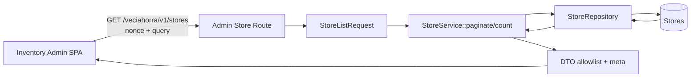
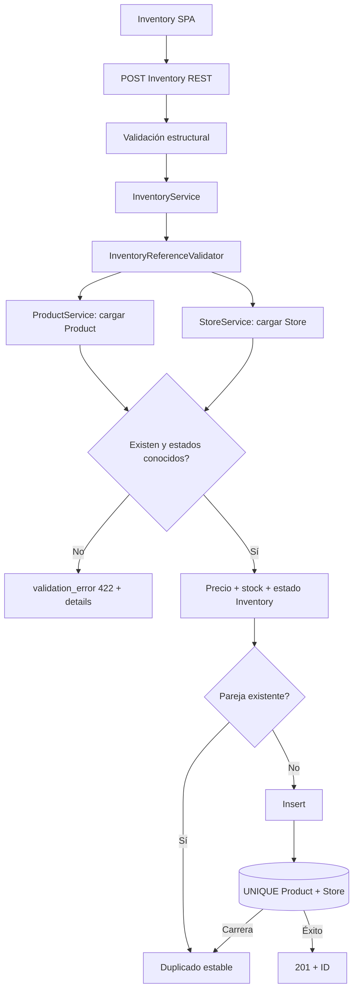
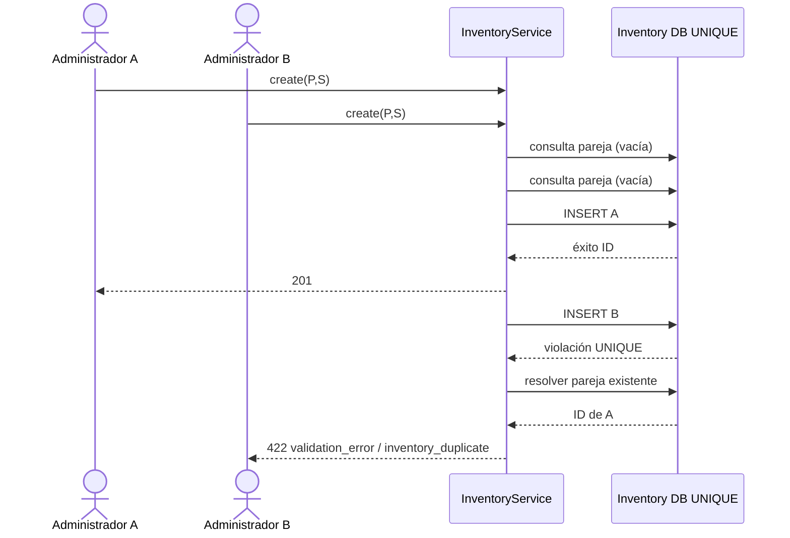
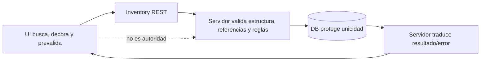
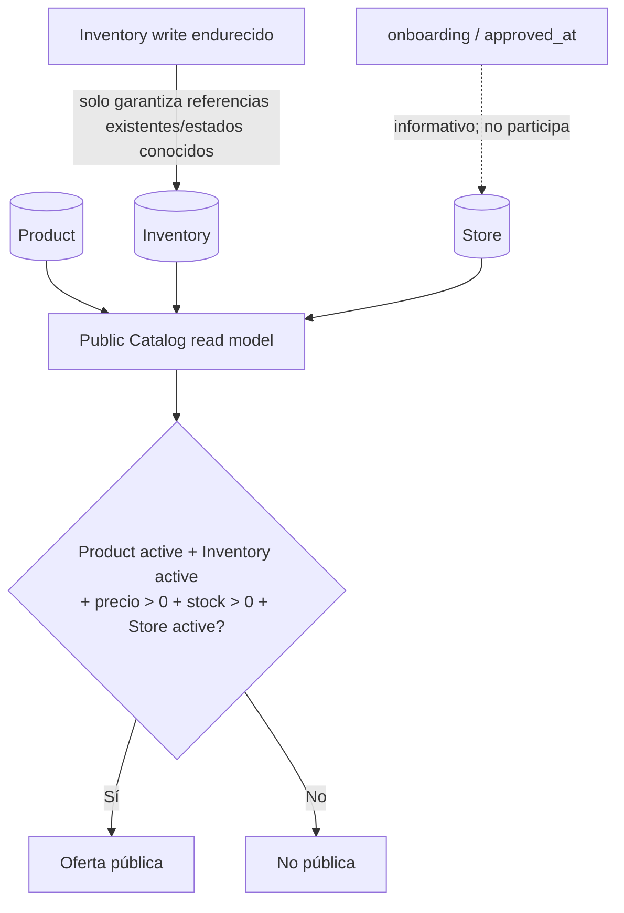

# Microhito 34.1.0.2 — Transporte administrativo de Store e integridad referencial de Inventory

**Estado:** diseño propuesto; decisiones funcionales cerradas y listo para aprobación previa a código

**Fecha:** 2026-07-20

## 1. Objetivo y alcance

Este documento diseña las dos dependencias que bloquean el flujo administrativo Product → Inventory:

1. un transporte REST administrativo, paginado y de solo lectura para buscar Stores desde Inventory Admin SPA;
2. validación definitiva, reutilizable y ejecutada en servidor de las referencias Product/Store de Inventory.

Es un diseño, no una implementación. Distingue comportamiento actual, brecha, propuesta, cambio futuro y exclusiones. No modifica el catálogo público ni convierte “publicación” en estado o entidad.

## 2. Fuentes auditadas

### 2.1 Store

- Entidad/esquema: `app/Modules/Stores/Models/Store.php`, `app/Database/Tables/StoresTable.php`.
- Acceso: `StoreRepository.php`, `StoreService.php`, `StoresController.php`, `StoreRequest.php`.
- UI: `StoresTable.php`, vistas `Stores/Views/index.php` y `form.php`, menú administrativo.
- Consumidores públicos: `CatalogService::publicStores()` y `StoreRepository::findActiveByIds()`.

### 2.2 Product

- `Product`, `ProductRepository`, `ProductService`, `ProductRequest`, `ProductListRequest`, `ProductController` y `ProductRoutes`.
- SPA y transporte en `assets/admin/products/*`.
- Pruebas manuales de rutas, búsqueda, detalle, catálogos, formulario, medios y cambios sin guardar.

### 2.3 Inventory

- `InventorySchema`, migración, `InventoryRepository`, `InventoryService`, requests, controller y routes.
- `InventoryPage` y `assets/admin/js/modules/inventory/*`.
- Pruebas `inventory-{migration,repository,service,controller,routes}-test.php`, requests y admin list/form.

### 2.4 Publicación y arquitectura

- `CatalogService`, rutas/controlador/requests de Catalog y pruebas públicas de listado, detalle, categorías, marketplace y selección de ofertas.
- `docs/catalog-admin-audit.md`, `docs/catalog-product-inventory-admin-flow-design.md`, auditorías públicas y arquitectura v1.

## 3. Principios arquitectónicos

1. Product continúa como autoridad del catálogo maestro.
2. Inventory continúa como autoridad de la oferta comercial.
3. Store continúa como autoridad del minimarket.
4. `ProductService` y `StoreService` son accesos de aplicación; no son autoridades nuevas.
5. Inventory Admin SPA es un cliente. Puede anticipar errores, pero no garantiza integridad.
6. Toda escritura Inventory valida definitivamente las referencias en servidor.
7. La base de datos conserva la defensa durable de unicidad Product + Store.
8. El catálogo público deriva visibilidad desde las tres autoridades; no persiste una publicación.
9. Store onboarding/aprobación no participa en la regla pública ni se convierte incidentalmente en precondición administrativa.
10. No se crean copias de Store, tablas de selector, cachés durables, `StoreOption` persistido ni autoridad de “oferta publicable”.
11. Inventory no depende de la UI. Cualquier escritor que use `InventoryService` recibe las mismas comprobaciones.

## 4. Estado actual auditado

### 4.1 Store

| Aspecto | Contrato actual |
|---|---|
| Identidad | `id`; nombre legible `business_name` (máximo de esquema 150). No existe slug Store. |
| Datos | `legal_name`, `owner_name`, RUT, email, teléfonos, dirección, comuna, ciudad, región, estado, onboarding, aprobación y timestamps. |
| Estados | `pending`, `active`, `inactive`, `rejected`; alta fuerza `pending`. |
| Onboarding | `onboarding_status`, alta `draft`; no hay enum central auditado en StoreRequest. |
| Aprobación | `approved_at` nullable; no equivale por sí solo a un estado Store. |
| Búsqueda repositorio | `business_name`, `owner_name`, `email`, `phone` mediante `LIKE`. No busca slug, razón social, RUT, dirección, comuna, ciudad, región ni ID. |
| Paginación | `StoreRepository::paginate(page, perPage, term, status, orderBy, direction)` usa LIMIT/OFFSET. |
| Orden permitido | `id`, `business_name`, `owner_name`, `status`; fallback `id`, dirección fallback `DESC`. No agrega desempate explícito. |
| Conteo | `count(term,status)` con los mismos filtros de búsqueda/estado. |
| UI actual | `WP_List_Table`, búsqueda/filtro/orden servidor, 2 registros por página. CRUD PHP y nonce propio. |
| Transporte SPA | No existe endpoint Store REST ni admin-AJAX. |
| Serialización | No existe serializer/read model administrativo Store. Catalog solo proyecta `business_name` como `minimarket` dentro de cada oferta pública. |
| Permiso | Pantallas Store bajo administración; operaciones verifican `manage_options` y nonces WordPress. |
| Uso público | Solo Stores `status=active` por lotes; no lee onboarding ni `approved_at`. |

`search()` sin término llama `all()` y con término devuelve todos los matches ordenados por ID DESC, sin límite. No es adecuado para un combobox. `paginate()` sí es la capacidad a reutilizar mediante un adaptador de aplicación/HTTP.

No se encontraron pruebas manuales dedicadas a una ruta Store REST ni a un DTO Store administrativo, coherentemente con su ausencia. Store se ejercita indirectamente en pruebas públicas y mediante los fixtures/repositorios usados por Catalog; el transporte futuro necesita una suite contractual nueva.

### 4.2 Product

- Product posee estados `draft`, `active`, `inactive`.
- GET administrativo `/wp-json/veciahorra/v1/products/search` usa el mismo listado paginado: página 1, 20 por defecto, máximo 100, nombre ASC por defecto.
- `ProductRepository::buildFilters()` busca por nombre, slug y SKU.
- Cada fila serializada desde el modelo incluye sus campos persistidos; la SPA valida la forma de respuesta y GET `/products/{id}` resuelve detalle/inexistencia.
- `ProductService::find(id)` es el acceso reutilizable; ProductRequest/CatalogValidator no validan referencias de Inventory.

### 4.3 Inventory

| Aspecto | Contrato actual |
|---|---|
| Alta | Request exige IDs positivos y precio; stock default `0`, estado default `active`. |
| Precio | Request acepta valor numérico finito `>=0`; service recibe int/float finito `>=0`; DB `DECIMAL(10,2)`. |
| Stock | Entero PHP `>=0`; DB integer, default 0. |
| Estado | `active`, `inactive`. |
| Referencias | `product_id`, `minimarket_id`; positivas, pero existencia/estado no se comprueban. |
| Edición | `product_id` y `minimarket_id` son inmutables; PATCH permite precio, stock y/o estado. |
| Duplicado | Preconsulta `findByProductAndMinimarket()` y UNIQUE DB `inventory_product_minimarket_unique`. |
| Foreign keys | No existen. IDs son referencias lógicas. |
| Transacción | No hay transacción específica en create/update; cada escritura DB es individual. |
| Carrera | Dos preconsultas pueden ver vacío; UNIQUE decide. La colisión tardía puede salir como `persistence_error`/error interno, no duplicado estable. |
| Errores | `validation_error` 422, `inventory_not_found` 404; persistencia y otros terminan 500. |

Las pruebas de servicio crean Inventory con IDs aleatorios sin crear Product/Store, evidencia ejecutable de la brecha. Product o Store inactivos no bloquean create/update. La UI actual escribe IDs y, tras crear, recupera el detalle y permanece en modo edición.

### 4.4 SPA Inventory

- `InventoryPage` inyecta `restUrl`, nonce y versión; el cliente envía `X-WP-Nonce`, JSON y credenciales same-origin.
- Carga lista al iniciar; páginas 20/50/100 y filtros actuales por texto, IDs y estado.
- Estado de store descarta respuestas antiguas del listado por secuencia, pero no tiene combobox Product/Store.
- Maneja red, JSON inválido, formato inválido y errores API; deshabilita guardado mientras hay solicitud.
- Las rutas Inventory requieren `manage_options`.

## 5. Parte A — Transporte REST administrativo paginado de Store

### 5.1 Decisión

Crear en un microhito posterior un transporte REST administrativo semántico:

```text
GET /wp-json/veciahorra/v1/stores
```

La ruta representa Stores, no un componente `store-options` ni una asociación Inventory. Es de solo lectura y adapta `StoreService::paginate()`/`count()` a un DTO mínimo. Su consumidor inicial es Inventory Admin SPA; podrá reutilizarse por otra UI administrativa bajo el mismo permiso, sin ampliar ahora consumidores ni operaciones.

No se usará `/catalog/*`: el catálogo omite Stores no activas y tiene semántica/datos públicos distintos.

### 5.2 Responsabilidades y límites

El transporte puede localizar y describir una referencia Store. No crea, modifica, activa, aprueba ni cambia onboarding; no crea Inventory, no calcula publicación y no autoriza la escritura. Devolver una Store en resultados no garantiza que siga existiendo al guardar.

### 5.3 Seguridad, nonce y caché

| Elemento | Contrato propuesto |
|---|---|
| Namespace/versión | `veciahorra/v1`, coherente con Product/Inventory administrativos. |
| Método | GET exclusivamente. |
| Permiso | `current_user_can('manage_options')`. |
| Autenticación | Cookie WordPress + `X-WP-Nonce` de acción `wp_rest`; same-origin. |
| Sin permiso | Respuesta estándar WordPress REST `rest_forbidden`, HTTP 401/403 según autenticación. |
| Nonce inválido | Respuesta estándar `rest_cookie_invalid_nonce`, HTTP 403. |
| Caché | `Cache-Control: no-store, private`; no caché compartida, durable ni transusuario. |
| Datos | DTO allowlist; nunca serializar `Store::toArray()` completo. |

### 5.4 Request propuesto

Un futuro `StoreListRequest` administrativo valida antes de llamar al servicio:

| Parámetro | Tipo/default | Normalización y límite | Error/omisión |
|---|---|---|---|
| `search` | string opcional, `null` | `wp_unslash`, trim, `sanitize_text_field`; 1–100 caracteres si no vacío | No string o >100: `validation_error` 422; vacío equivale omitido |
| `page` | entero, `1` | mínimo 1, máximo 1,000,000, siguiendo límite público defensivo | Inválido: `validation_error` 422 |
| `per_page` | entero, `20` | mínimo 1, máximo 100 | Inválido: `validation_error` 422 |
| `status` | string opcional | lowercase/trim; `pending|active|inactive|rejected` | Otro: `validation_error` 422; omitido incluye todos |
| `order_by` | string, `business_name` | `business_name|id|status` | Otro: `validation_error` 422 |
| `direction` | string, `ASC` | uppercase; `ASC|DESC` | Otro: `validation_error` 422 |

Los límites son del transporte, no reglas Store. `20` favorece el selector; `100` coincide con Product/Inventory y evita respuestas sin cota. Debounce no pertenece al request.

No se admiten en v1:

- `exclude`, porque la selección debe poder explicar una Store ya asociada;
- `product_id`, porque mezclaría asociaciones Inventory en el read model Store;
- búsqueda por ID dedicada, slug inexistente, razón social, RUT, dirección o ubicación, pues `StoreService::paginate()` no los busca;
- campos arbitrarios, includes o selección de columnas por cliente.

### 5.5 Búsqueda y adaptación

`search` se pasa como `term` a `StoreService::paginate()` y `count()`. Los campos reales son:

```text
business_name OR owner_name OR email OR phone
```

El selector comunica “Buscar minimarket” y presenta coincidencias por nombre; no promete al usuario todos los campos internos buscados. Buscar por `legal_name`, RUT o ubicación requeriría ampliar `StoreRepository::paginate()` y pruebas en otro alcance. No existe slug Store.

Aunque propietario, email y teléfono participan hoy en el filtro, **no se devuelven**: permiten localizar una Store conocida sin exponer esos datos en la respuesta. La respuesta solo evidencia identidad mínima.

### 5.6 Orden estable

Orden predeterminado objetivo:

```sql
ORDER BY business_name ASC, id ASC
```

Para `id` o `status`, el objetivo es `ORDER BY <campo> <dirección>, id ASC`, omitiendo el segundo ID cuando el campo ya sea `id`. El repositorio actual solo ordena por una columna; agregar el desempate es una adaptación futura mínima necesaria para que OFFSET no repita/salte Stores con valores iguales. No es una regla de dominio.

### 5.7 Paginación y respuesta

Respuesta exitosa HTTP 200:

```json
{
  "success": true,
  "data": [
    {
      "id": 42,
      "name": "Minimarket Central",
      "status": "active",
      "onboarding_status": "draft",
      "approved_at": null,
      "location": {
        "commune": "Santiago",
        "city": "Santiago",
        "region": "Metropolitana"
      }
    }
  ],
  "meta": {
    "page": 1,
    "per_page": 20,
    "total": 37,
    "total_pages": 2,
    "has_next": true
  }
}
```

- `id`, `name` (alias de `business_name`) y `status` son necesarios para seleccionar.
- `onboarding_status` y `approved_at` son informativos para no inventar un booleano “approved”. No gobiernan selección ni publicación.
- Ubicación resumida desambigua; se omiten claves cuyo valor sea vacío/null o se conservan como null de forma uniforme a decidir en serializador. Se recomienda forma fija con null para contrato estable.
- No se exponen razón social, propietario, RUT, email, teléfonos, dirección exacta, timestamps ni campos futuros desconocidos.
- No existen secretos bancarios en el esquema auditado; una allowlist previene exposición si aparecen después.

`total` procede de `StoreService::count()` con el mismo término/estado; `total_pages` es 0 cuando total es 0; `has_next = page < total_pages`. Una página válida fuera de rango devuelve `data: []`, metadatos solicitados y `has_next:false`, no redirige ni cambia el término. La SPA preserva request y solicita la siguiente página solo si `has_next`.

### 5.8 Estado, onboarding y aprobación

| Store | Selector | Crear/activar Inventory | Catálogo vigente |
|---|---|---|---|
| `active` | Visible/seleccionable | Permitido | Puede contribuir si las demás condiciones cumplen |
| `pending` | Visible/seleccionable con badge | Permitido por política compatible | No contribuye |
| `inactive` | Visible/seleccionable con advertencia | Permitido | No contribuye |
| `rejected` | Visible/seleccionable con advertencia explícita | Permitido por compatibilidad; requiere confirmación UI | No contribuye |
| Onboarding incompleto | Informativo | No bloquea | No participa |
| `approved_at=null` | Informativo “sin fecha de aprobación” | No bloquea | No participa |
| Desaparecida | No seleccionable/revalidación falla | Escritura bloqueada | No contribuye |

No se deriva `approved=true/false`: no existe contrato ejecutable que lo defina. Si negocio quiere prohibir Stores `rejected` o no aprobadas, será una decisión funcional futura independiente; este diseño preserva el comportamiento actual y evita introducirla incidentalmente.

### 5.9 Stores ya asociadas: alternativa elegida

**Alternativa A — elegida.** `/stores` devuelve Store pura. Cuando existe Product seleccionado, la SPA pagina GET `/inventory?product_id=<ID>&page=N&per_page=100`, construye un set de `minimarket_id → inventory_id` y decora resultados “Oferta existente”. Antes de guardar puede consultar la pareja con los filtros existentes. El servidor y UNIQUE siguen siendo definitivos.

Ventajas: separación de autoridades, reutiliza Inventory REST, no filtra asociación comercial a consumidores Store y no introduce `has_inventory_for_product` dependiente de contexto.

Costo: una consulta Inventory paginada adicional; debe completarse o consultarse por pareja antes de afirmar disponibilidad. Para Product con más de 100 ofertas se recorren páginas según `meta`, sin descargar Inventory global.

**Alternativa B — descartada ahora.** `product_id` y `has_inventory_for_product` acoplan el read model Store a Inventory, complica caché/paginación y duplica una consulta ya disponible. Podría reevaluarse solo con evidencia de rendimiento.

### 5.10 Errores del transporte

| Condición | Código/HTTP | Respuesta/recuperación |
|---|---|---|
| Sin permiso | WordPress `rest_forbidden`, 401/403 | SPA detiene búsqueda y comunica permisos |
| Nonce inválido | `rest_cookie_invalid_nonce`, 403 | Recargar sesión; no repetir en bucle |
| Query inválida | `validation_error`, 422 + `details.field` | Corregir parámetro; conservar término válido |
| Repositorio/DB | `store_admin_unavailable`, 503 | Mensaje genérico, reintentar; registrar servidor |
| Timeout/red | Código cliente `network_error` | Reintento manual y descarte de respuesta vieja |
| Cero resultados | Éxito 200, `data:[]`, total 0 | “No se encontraron minimarkets” |
| Store borrada tras seleccionar | No es error del GET previo | Inventory POST devuelve validación referencial; limpiar selección |

No se exponen SQL, excepciones, stack traces ni datos crudos.

## 6. Parte B — Integridad referencial definitiva de Inventory

### 6.1 Política administrativa elegida

La política compatible y mínima es:

- Product debe **existir** y su estado debe pertenecer a `draft|active|inactive`.
- Store debe **existir** y su estado debe pertenecer a `pending|active|inactive|rejected`.
- Todos esos estados conocidos permiten crear Inventory `active` o `inactive`, editarla y activarla.
- Estados no activos generan advertencias UI/diagnóstico, no rechazo servidor.
- Onboarding y `approved_at` no bloquean.
- Solo Product active + Store active puede contribuir públicamente, sujeto a Inventory/stock/precio.

Justificación: es la única política derivable sin romper cargas actualmente exitosas. Endurecer inactivos sería una nueva regla de negocio; forzar Inventory inactiva crearía una transición automática no existente. El servidor carga y valida estados conocidos para detectar datos corruptos, pero no confunde administración con elegibilidad pública.

### 6.2 Matriz de estados

Asume Product/Store existentes y precio/stock válidos. “Publicable” además requiere precio >0 y stock >0.

| Product | Store | Inventory solicitada | ¿Crear? | ¿Activar? | ¿Publicable potencialmente? |
|---|---|---|:---:|:---:|:---:|
| active | active | active | Sí | Sí | Sí |
| active | active | inactive | Sí | No (queda inactiva) | No |
| active | pending | active | Sí + advertencia | Sí | No |
| active | inactive | active | Sí + advertencia | Sí | No |
| active | rejected | active | Sí + advertencia fuerte | Sí | No |
| draft | active | active | Sí + advertencia | Sí | No |
| inactive | active | active | Sí + advertencia | Sí | No |
| inactive | inactive | inactive | Sí + advertencia | No | No |
| cualquier conocido | cualquier conocido | inactive | Sí | No | No |
| inexistente | cualquiera | cualquiera | No | No | No |
| cualquiera | inexistente | cualquiera | No | No | No |
| estado desconocido | cualquiera | cualquiera | No | No | No |

“Activar” significa aceptar `Inventory.status=active`, no activar Product/Store. Ninguna escritura Inventory cambia las otras autoridades.

### 6.3 Ubicación recomendada: validador reutilizable

**Alternativa B elegida:** componente de aplicación `InventoryReferenceValidator`, llamado por `InventoryService`, con dependencias explícitas en `ProductService` y `StoreService`.

Responsabilidades:

```text
validate(product_id, minimarket_id)
  → cargar Product por ProductService::find()
  → cargar Store por StoreService::find()
  → exigir existencia
  → exigir estados pertenecientes a enums conocidos
  → devolver contexto validado (IDs/estados), sin DTO público
```

El validador no consulta publicación, precio, stock, duplicados ni UI. `InventoryService` conserva reglas de Inventory y duplicado. Requests conservan estructura/normalización. Repositorio persiste y UNIQUE arbitra carreras.

Esto minimiza cambios en `InventoryService`, evita duplicar carga entre create/update y protege cualquier escritor que use el servicio.

### 6.4 Alternativas evaluadas

| Alternativa | Evaluación |
|---|---|
| A. Todo en `InventoryService` | Correcta para protección, pero mezcla carga/estado de dos autoridades y dificulta pruebas/reutilización. Aceptable como primera implementación pequeña, inferior a B. |
| B. `InventoryReferenceValidator` | **Recomendada.** Responsabilidad acotada, inyectable, reutilizable y sin autoridad nueva. |
| C. Solo controlador | Descartada: llamadas directas a service y otros escritores eluden la regla. |
| D. Solo DB | Descartada: no hay FK; aun con FK no valida estados, no produce mensajes de campo ni gobierna Store/Product activos. UNIQUE solo cubre pareja. |

No se recomienda un domain service: la política elegida es coordinación/referencia entre módulos, no una nueva entidad o agregado.

### 6.5 Secuencia de creación

1. `InventoryCreateRequest` exige objeto JSON y valida/normaliza IDs, precio, stock y estado.
2. `InventoryService::create()` recibe tipos normalizados y vuelve a defender invariantes propias.
3. `InventoryReferenceValidator` carga Product por ID; si falta, termina con validación referencial.
4. Carga Store por ID; si falta, termina igual.
5. Comprueba que ambos estados pertenezcan a conjuntos conocidos; estados conocidos inactivos se permiten.
6. Service confirma precio finito `>=0`, stock entero `>=0`, estado Inventory permitido.
7. Repositorio consulta Product + Store; si existe, error duplicado estable.
8. Service arma payload/timestamps y persiste.
9. UNIQUE arbitra una carrera después de la preconsulta.
10. Una colisión del índice se reconoce por la restricción/consulta posterior y se traduce al mismo duplicado; otros fallos siguen como persistencia.
11. REST devuelve ID 201; la SPA recupera detalle.

La validación request ocurre antes de consultas para rechazar barato. La segunda defensa de service permanece por llamadas no REST. No hace falta una transacción para una sola inserción; la corrección concurrente depende de UNIQUE, no de “check then insert”.

### 6.6 Actualización

- `product_id` y `minimarket_id` continúan inmutables; recibirlos es `validation_error` como hoy.
- `InventoryService::update()` carga Inventory y obtiene sus referencias persistidas.
- Antes de editar precio, stock o estado, el validador carga Product/Store y comprueba existencia/estado conocido.
- Si Product/Store existe pero está draft/pending/inactive/rejected, se permite cualquier PATCH válido, incluida activación Inventory; el resultado no será público mientras una autoridad no esté active.
- Si una referencia fue borrada, PATCH se rechaza con error referencial. DELETE Inventory sigue disponible como recuperación porque solo exige que Inventory exista; no se modifica en este diseño.
- No se reparan ni reasignan referencias silenciosamente. Crear otra pareja requiere nueva Inventory y respeta UNIQUE.

Esta decisión hace visible un huérfano histórico en vez de continuar editándolo como si fuera íntegro. No se crean FKs retroactivas ni migraciones.

### 6.7 Precio, stock y estado

| Campo | Administración actual/objetivo | Efecto público |
|---|---|---|
| Precio | Int/float normalizado, finito, `>=0`; DB `DECIMAL(10,2)`, capacidad máxima 99,999,999.99. Debe rechazarse overflow y más de 2 decimales o normalizarse explícitamente antes de persistir; se recomienda rechazo para evitar redondeo silencioso. | Solo precio finito `>0`. Cero se guarda y excluye. |
| Stock | Entero PHP `>=0`; cero permitido. Límite superior efectivo depende de integer PHP/columna DB y debe comprobarse sin overflow. | Solo `>0`. |
| Estado | `active|inactive`, default active; PATCH permite ambos sin workflow. | Solo active. |

El control de precisión/overflow es un endurecimiento técnico futuro. No convierte precio >0 en regla administrativa: cero sigue siendo válido.

### 6.8 Contrato de errores recomendado

Para máxima compatibilidad, se conserva `error.code = validation_error` y HTTP 422 en errores de entrada/negocio ya representados así. Se agrega un objeto opcional `details` con `reason` y `field`; consumidores actuales que solo leen code/message siguen funcionando.

| Condición | Código estable | `details.reason` | HTTP | Campo | Mensaje administrativo | Recuperación |
|---|---|---|---:|---|---|---|
| Product inexistente | `validation_error` | `inventory_product_not_found` | 422 | `product_id` | “El producto seleccionado ya no existe.” | Elegir otro/volver; preservar resto |
| Product estado desconocido | `validation_error` | `inventory_product_incompatible` | 422 | `product_id` | “El producto tiene un estado no compatible con esta operación.” | Recargar/escalar; no guardar |
| Store inexistente | `validation_error` | `inventory_store_not_found` | 422 | `minimarket_id` | “El minimarket seleccionado ya no existe.” | Buscar otro; preservar resto |
| Store estado desconocido | `validation_error` | `inventory_store_incompatible` | 422 | `minimarket_id` | “El minimarket tiene un estado no compatible con esta operación.” | Recargar/escalar |
| Duplicado/preconsulta | `validation_error` | `inventory_duplicate` | 422 | `minimarket_id` | “Ya existe una oferta para este producto y minimarket.” | Abrir existente/cambiar Store |
| Duplicado por carrera | `validation_error` | `inventory_duplicate` | 422 | `minimarket_id` | Mismo mensaje | Consultar Inventory existente; no reintentar POST |
| Precio inválido | `validation_error` | `inventory_invalid_price` | 422 | `price` | “Ingresa un precio válido mayor o igual a 0, con hasta 2 decimales.” | Corregir; conservar resto |
| Stock inválido | `validation_error` | `inventory_invalid_stock` | 422 | `stock` | “Ingresa stock como entero mayor o igual a 0.” | Corregir |
| Estado inválido | `validation_error` | `inventory_invalid_status` | 422 | `status` | “Selecciona Activo o Inactivo.” | Corregir |
| Referencias inmutables en PATCH | `validation_error` | `inventory_reference_immutable` | 422 | referencia | “El producto y minimarket de una oferta existente no se pueden cambiar.” | Crear otra oferta |
| Inventory inexistente | `inventory_not_found` | — | 404 | — | Mensaje vigente | Volver a lista |
| Persistencia no duplicada | `persistence_error` | — | 500 | — | “No fue posible completar la operación.” | Reintentar/soporte |

Los `reason` son valores futuros aditivos dentro de `details`, no códigos implementados ahora. El controller no inspecciona texto para decidirlos: excepciones tipadas de validación deben transportar razón/campo. No se exponen IDs como explicación única ni errores SQL.

### 6.9 Concurrencia y duplicado

La estrategia tiene tres niveles:

1. SPA decora Stores asociadas y puede preconsultar la pareja; solo UX.
2. `InventoryService` consulta antes de insertar para mensaje temprano.
3. UNIQUE DB decide la carrera inevitable.

El adaptador de persistencia debe distinguir la violación de `inventory_product_minimarket_unique` de otros fallos. Si el driver no entrega nombre portable, tras una falla de insert puede consultar la pareja: si existe, traduce duplicado; si no, conserva `persistence_error`. Nunca hace PATCH automático. Si puede resolver Inventory existente bajo `manage_options`, `details.existing_inventory_id` es aditivo y opcional; la SPA genera el enlace, no recibe URL arbitraria.

## 7. Relación con catálogo público

No cambia:

```text
Product.status = active
AND Inventory.status = active
AND Inventory.price numérico finito > 0
AND Inventory.stock > 0
AND Store existe y status = active
```

Onboarding y `approved_at` permanecen ausentes de `CatalogService::publicStores()`. Lista, detalle, relacionados, ofertas y mínimo continúan usando el mismo universo. La validación administrativa de existencia evita nuevos huérfanos, pero no persiste ni decide publicación.

## 8. Impacto REST futuro

### 8.1 Transporte Store

| Cambio | Clasificación | Compatibilidad/versionado | Consumidor/riesgo |
|---|---|---|---|
| GET `/veciahorra/v1/stores` | Nuevo, aditivo, administrativo | Compatible; misma v1, sin romper rutas existentes | Inventory SPA; riesgo de datos privados mitigado por allowlist/permiso |
| `StoreListRequest` y DTO | Nuevos internos | Aditivos; contract tests fijan forma | Riesgo de drift con repository/count |
| Desempate ID en paginate | Adaptación interna observable en orden | Compatible y determinista | Tests de orden/páginas |

### 8.2 Escritura Inventory

| Cambio | Clasificación | Compatibilidad/versionado | Riesgo |
|---|---|---|---|
| Rechazar IDs inexistentes | Endurecimiento de escritura | Modifica cargas antes exitosas pero inválidas; no requiere v2 si se anuncia como corrección de integridad administrativa | Fixtures/tests que usan IDs aleatorios deben crear Product/Store reales |
| Validar estados conocidos | Endurecimiento compatible con datos válidos | Misma v1; solo rechaza corrupción | Registros legacy con estado desconocido |
| `error.details` | Aditivo | Misma v1; `error.code`/HTTP se preservan | Clientes estrictos deben tolerar campo extra |
| Carrera UNIQUE → duplicado 422 | Corrección de error | Cambia 500 ambiguo por 422 existente semántico | Reconocimiento fiable de constraint |
| Precisión/overflow precio | Endurecimiento técnico | Puede rechazar entradas antes redondeadas; documentar y probar | Compatibilidad de clientes internos |

No cambian payload exitoso Create/Update, mutabilidad de referencias, estados Inventory ni endpoints públicos.

## 9. Plan de pruebas futuras

### 9.1 Transporte Store

- Permiso `manage_options`, usuario anónimo, usuario autenticado sin capability y nonce inválido.
- Defaults, límites 1/100, page inválida/fuera de rango, total/pages/has_next.
- Búsqueda efectiva por business_name/owner/email/phone y certificación de campos no prometidos.
- Filtros de cuatro estados, orden business_name/id/status y desempate estable.
- Store active/pending/inactive/rejected; onboarding draft/otros valores y `approved_at` null/no null.
- DTO no contiene legal_name, owner_name, RUT, email, teléfonos, dirección exacta ni timestamps.
- Cero resultados, repositorio fallido, respuesta JSON/HTTP estable y cache `no-store, private`.
- Contract test del adapter `StoreService::paginate()`/`count()` con mismos filtros.

### 9.2 Inventory

- Crear con Product/Store existentes para cada combinación de estado conocida y verificar política permisiva.
- Product/Store inexistente; estado desconocido/corrupto; Store no aprobada/onboarding incompleto permitido.
- Update con referencias existentes/inactivas, referencia borrada y referencias recibidas en payload.
- Duplicado normal y dos workers concurrentes; ambos caminos entregan reason `inventory_duplicate`, exactamente una fila.
- Precio NaN/INF/negativo/cero, 2 decimales, exceso de precisión y overflow decimal.
- Stock negativo/cero, decimal, overflow; estado inválido; default active/stock 0.
- Persistencia no duplicada sigue 500 genérico; no filtra DB.
- Doble envío UI consulta resultado antes de reintentar; create/update exitosos conservan respuesta.
- Actualizar pruebas actuales que fabrican IDs aleatorios para crear fixtures Product/Store, no debilitar el validador.

### 9.3 Regresión pública

- Matriz exacta de Product/Inventory/precio/stock/Store.
- Store active con onboarding draft y `approved_at=null` sigue elegible.
- Store no active con aprobación sigue no elegible.
- Mínimo, orden de ofertas y relacionados solo desde ofertas válidas.
- Ningún campo administrativo Store nuevo aparece en DTO público.

## 10. Descomposición recomendada

Para mantener commits/revisiones acotados:

1. **34.1.0.3 — Implementar transporte Store:** request, ruta GET, permission/nonce, DTO allowlist, paginación/orden estable y pruebas exclusivas.
2. **34.1.0.4 — Implementar integridad Inventory:** validador, inyección en service, excepciones/detalles, política de estados, carrera UNIQUE y actualización de fixtures/pruebas.
3. **34.1.0.5 — Auditoría ejecutable:** contrato combinado, permisos, concurrencia y regresión pública; decidir aprobación del gate.
4. **34.1.1.1 — Navegación contextual:** query args y retornos seguros.
5. **34.1.1.2 — Continuación Product:** acciones `Crear oferta` y éxito.
6. **34.1.1.3 — Selector Product:** adapter existente y accesibilidad.
7. **34.1.1.4 — Selector Store:** consumir nuevo GET, asociaciones por alternativa A.
8. **34.1.1.5 — Create Inventory contextual/general:** formulario, prevalidación, doble envío y errores por campo.
9. **34.1.1.6 — Diagnóstico de publicación:** read model y enlace canónico condicional.
10. **34.1.1.7 — Auditoría integral:** autoridades, contratos, matriz y seguridad.
11. **34.1.1.8 — Certificación navegador:** flujo completo, carreras de búsqueda, Media Library y caché de assets.

No se mezcla endpoint, endurecimiento de escritura, SPA, navegación y diagnóstico en un solo cambio.

## 11. Diagramas

### 11.1 Búsqueda paginada Store



### 11.2 Creación segura Inventory



### 11.3 Carrera duplicada



### 11.4 UI versus servidor



### 11.5 Integridad versus publicación



## 12. Decisiones cerradas y aprobación requerida

### 12.1 Cerradas por este diseño

1. Transporte: GET administrativo `/veciahorra/v1/stores`.
2. Fuente: `StoreService::paginate()`/`count()` mediante request/serializer administrativo.
3. Datos: ID, nombre comercial, status, onboarding, fecha aprobación y ubicación resumida; allowlist estricta.
4. Búsqueda: capacidades reales business_name/owner/email/phone; sin prometer slug/legal name/ubicación.
5. Paginación: 1/20, máximo 100; orden estable business_name ASC + ID.
6. Asociaciones: alternativa A, consultadas a Inventory; Store endpoint permanece puro.
7. Integridad: `InventoryReferenceValidator` usado dentro de `InventoryService`.
8. Estados: política permisiva compatible para todos los estados conocidos; inactivos no publican.
9. Onboarding/aprobación: informativos, nunca bloqueo ni regla pública.
10. Duplicado: precheck + UNIQUE + traducción estable; jamás actualización implícita.
11. Errores: conservar `validation_error` 422 y agregar `details.reason/field`.

### 12.2 Aprobación previa al código

Debe aprobarse como paquete de alcance técnico:

- creación aditiva del endpoint Store administrativo;
- adaptación del orden estable en StoreRepository;
- endurecimiento de Inventory que rechazará nuevas referencias inexistentes;
- validador reutilizable y detalles de error aditivos;
- política explícita de permitir Inventory activa para Product/Store no activos, sin publicación;
- actualización de fixtures que hoy dependen de IDs huérfanos.

No queda una elección arquitectónica interna después de esa aprobación. Si se rechaza la política permisiva y se desea bloquear estados, se requiere una nueva decisión funcional y matriz antes de implementar.

## 13. Alcance negativo

No incluye implementar endpoint/request/serializer/validador; modificar StoreService, InventoryService, repositorios, controladores, rutas, SPA, Product, Store, catálogo público, pruebas o permisos; crear selectores/navegación; cambiar onboarding/aprobación; crear tablas, FKs, migraciones, autoridades o cachés; procesar imágenes; implementar 34.1.1; commit o push.

No incluye exponer Stores por rutas públicas, CRUD Store REST, filtro Product en Store, aprobación automática, transición automática de estados ni reparación de huérfanos existentes.

## 14. Criterios de aceptación futuros

- GET Store requiere `manage_options`/nonce, pagina de forma estable y solo expone allowlist.
- Búsqueda/orden/conteo usan filtros coherentes; límite máximo ejecutable.
- Store DTO no incorpora datos privados innecesarios.
- Todo create/update Inventory pasa por validador servidor; UI no puede eludirlo.
- Referencias inmutables y estados conocidos se conservan; IDs inexistentes fallan por campo.
- Product/Store no activos se permiten administrativamente y se advierten, sin publicarse.
- Onboarding/aprobación no bloquean ni aparecen en consultas públicas.
- Carrera duplicada produce una fila y error 422 estable para el perdedor.
- Precio cero y stock cero siguen válidos administrativamente y no públicos.
- Suites públicas certifican la regla sin modificaciones.

## 15. Conclusión

Las dos dependencias quedan diseñadas sin crear autoridades ni mezclar dominios. Inventory Admin SPA obtendrá Stores mediante un GET administrativo paginado y mínimo; InventoryService protegerá cualquier escritor mediante un validador referencial reutilizable. La política de estados preserva compatibilidad: existencia y estados conocidos son obligatorios, pero inactividad, onboarding o aprobación no impiden administrar una oferta. La base de datos continúa decidiendo la carrera UNIQUE y el servidor traduce su resultado.

La implementación puede dividirse en 34.1.0.3, 34.1.0.4 y 34.1.0.5 antes de retomar 34.1.1. El único gate restante es la aprobación explícita del paquete técnico y de la política permisiva descritos en 12.2; no queda una decisión de diseño para quien implemente después de esa aprobación.
