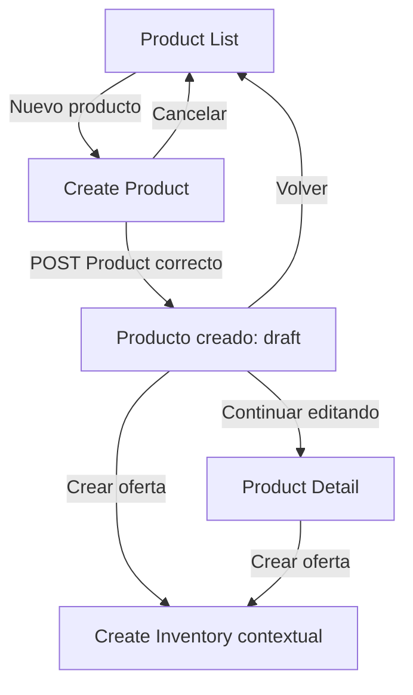
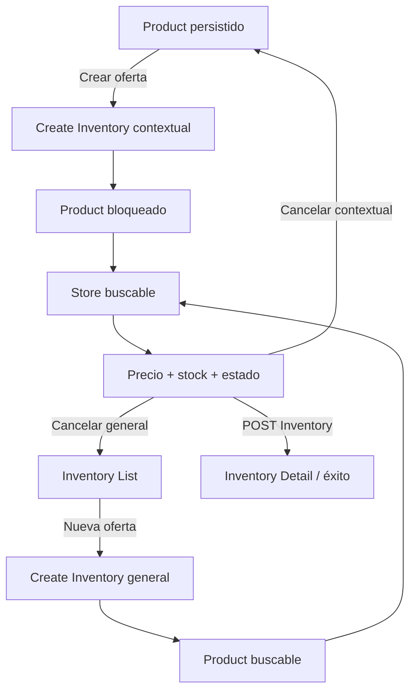
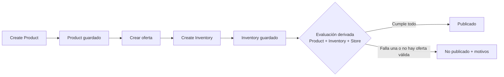
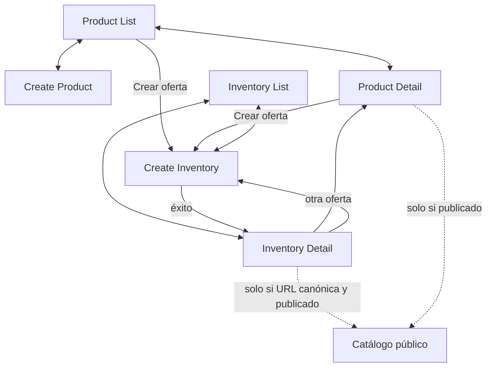
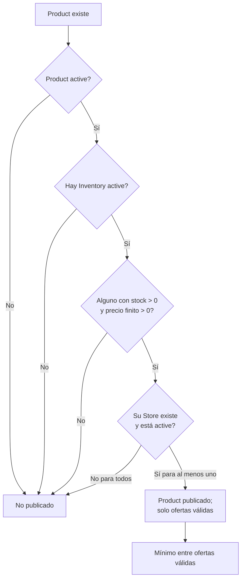

# Microhito 34.1.0 — Diseño del flujo administrativo Product → Inventory

**Estado:** auditado en 34.1.0.1 — no aprobado para implementación integral hasta resolver la brecha de transporte Store

**Fecha de auditoría:** 2026-07-20

**Alcance:** experiencia administrativa; sin cambios de código, datos, REST ni autoridades

## 1. Objetivo

Definir el flujo oficial para crear un `Product` y continuar, de forma explícita y natural, con la creación de una oferta `Inventory` para una `Store`, sin pedir al administrador que escriba identificadores internos. El diseño termina en la evaluación derivada del catálogo público: guardar una entidad no equivale a publicarla.

La continuidad es visual y de navegación. No es una operación atómica: Product e Inventory conservan formularios, validaciones, persistencia y contratos separados.

## 2. Alcance y método

Este documento especifica pantallas, navegación, selectores, mensajes, accesibilidad, concurrencia y decisiones de implementación. Audita el estado vigente antes de proponer 34.1.1 y distingue siempre:

1. **Actual:** comportamiento respaldado por código/pruebas.
2. **Problema:** fricción observable en administración.
3. **Objetivo 34.1.1:** cambio de interfaz o integración propuesto.
4. **Sin cambio contractual:** autoridad, modelo, REST o regla pública que se conserva.

No se ejecutaron mutaciones funcionales. Las referencias a validación futura no autorizan cambios de endpoint ni reglas de dominio.

## 3. Fuentes auditadas

### 3.1 Implementación

- Product: `app/Modules/Products/{Admin,Controllers,Models,Repositories,Requests,Routes,Services,Views}` y `assets/admin/products/*`.
- Catálogos administrativos: `app/Modules/ProductCatalogs/*`.
- Inventory: `app/Modules/Inventory/{Admin,Controllers,Models,Repositories,Requests,Routes,Services,Views}` y `assets/admin/js/modules/inventory/*`.
- Store: `app/Modules/Stores/*`, `app/Admin/Tables/StoresTable.php` y `app/Database/Tables/StoresTable.php`.
- Persistencia: `ProductsTable.php`, `InventorySchema.php` y `CreateInventoryTable.php`.
- Lectura pública: `app/Modules/Catalog/{Service,Controller,Requests,Routes}`, `app/Modules/Frontend/*` y assets públicos del catálogo/ofertas.
- Menú, permisos, nonce y assets: `app/Admin/Menu.php`, `ProductsPage.php`, `InventoryPage.php`, `app/Core/Config.php` y `veciahorra.php`.

### 3.2 Documentación vigente

- `docs/catalog-admin-audit.md` (auditoría inmediatamente anterior y principal).
- `docs/public-product-offer-comparison-audit.md`.
- `docs/public-catalog-category-minimarket-audit.md`.
- `docs/marketplace-visible-audit.md`.
- `docs/veciahorra-architecture-inventory.md` y `docs/veciahorra-architecture-v1.md`.
- `app/Modules/Catalog/README.md`, `README.md` y documentos de navegación pública.

### 3.3 Contratos ejecutables revisados

- Product: `product-catalog-routes-test.php`, `product-detail-route-test.php`, `product-search-route-test.php`, `product-list-request-test.php`, `product-catalog-validation-test.php`, `product-catalog-selects-test.html`, `product-form-save-ux-test.html`, `product-unsaved-changes-test.html` y `product-media-selector-test.html`.
- Inventory: `inventory-*-request-test.php`, `inventory-{repository,service,controller,routes}-test.php`, `inventory-admin-{list,form}-test.php` e `inventory-migration-test.php`.
- Público: `catalog-public-{api,detail,categories}-test.php`, `public-catalog-marketplace-visibility-test.php`, `public-offer-selection-test.php` y su harness de navegador.

No se atribuye a este microhito evidencia dinámica nueva: la recertificación de navegador real de Media Library indicada por la auditoría 34.0 sigue siendo una prueba futura de 34.1.1.

## 4. Estado actual auditado

### 4.1 Contratos reales

| Tema | Comportamiento actual confirmado |
|---|---|
| Product | Campos persistidos: `name`, `slug`, `sku`, `description`, `woo_product_id`, `category_id`, `brand_id`, `unit_id`, `image_id`, `status` y timestamps. |
| Alta Product | `name` obligatorio; el resto del payload de alta es opcional. Slug y estado no vienen del formulario: el servicio crea slug único y fuerza `draft`. |
| Estados Product | `draft`, `active`, `inactive`; la ruta de cambio expone `active`/`inactive`. |
| Slug | `sanitize_title(name)`, máximo 200, sufijos `-2`, `-3`… ante colisión; se regenera al cambiar nombre. No es editable. |
| Clasificación | Categoría `product_cat`, marca `product_brand` y unidad `pa_unidad`; selects de solo lectura `{id,name}`, ordenados por nombre; opcionales. |
| Imagen | `image_id` opcional; UI usa `wp.media`, una imagen y preview. Backend confirma attachment existente, pero no verifica MIME de imagen. |
| Inventory | `product_id`, `minimarket_id`, `price`, `stock`, `status`; relación única Product + Store. No hay foreign keys. |
| Alta Inventory | Product, Store y precio obligatorios; stock predetermina `0`; estado predetermina `active`. |
| Precio | Numérico finito `>= 0`; persistencia `DECIMAL(10,2)`. Cero es válido para administrar, no para publicar. No hay máximo explícito de request aparte de capacidad de persistencia. |
| Stock | Entero PHP `>= 0`; cero es válido, pero no publica. Sin máximo de dominio explícito. |
| Estados Inventory | `active`, `inactive`; referencias inmutables al editar. |
| Referencias Inventory | El servicio actual solo exige IDs positivos: no comprueba existencia ni estado de Product/Store. Puede persistir huérfanos lógicos. |
| Store | `business_name` es nombre legible. Estado: `pending`, `active`, `inactive`, `rejected`. `onboarding_status` y `approved_at` son datos separados. |
| Permiso | Pantallas y REST administrativos requieren `manage_options`; REST usa nonce `wp_rest`, `X-WP-Nonce` y same-origin. |
| Assets | CSS/JS se cargan solo en su pantalla y se versionan con `Config::PLUGIN_VERSION`; no hay cache busting manual por imagen. |

### 4.2 Pantallas y navegación actuales

- **Products** (`admin.php?page=veciahorra-products`): una SPA con lista, búsqueda, paginación, alta, detalle/edición, cambio de estado, catálogos e imagen. Lista ID, nombre, SKU, estado y actualización. No muestra ofertas ni enlaza a Inventory.
- **Inventory** (`admin.php?page=veciahorra-inventory`): lista, búsqueda, filtros por Product ID, Minimarket ID y estado, paginación 20/50/100, alta y edición. Lista IDs, precio, stock y estado. Su formulario pide IDs numéricos. En edición bloquea ambas referencias.
- **Minimarkets** (`admin.php?page=veciahorra-stores`): lista y formularios PHP oficiales de alta/edición. Por ello Inventory puede enlazar a una Store existente, pero no editarla inline.
- No hay pantallas propias para CRUD de categorías, marcas o unidades; unidad incluso registra su taxonomía sin UI.
- Al guardar Product, la SPA recupera `GET /products/{id}` y permanece en el mismo formulario convertido a modo edición con “Producto creado correctamente”. Al guardar Inventory, recupera `GET /inventory/{id}` y también permanece en formulario modo edición con “Inventario creado correctamente”. Solo vuelven a sus listas mediante la acción explícita correspondiente. No existe estado encadenado Product → Inventory ni diagnóstico público contextual.

### 4.3 Problemas administrativos

| Actual | Problema | Objetivo 34.1.1 | Sin cambio contractual |
|---|---|---|---|
| Inventory pide dos IDs | Obliga a buscar/copiar claves y facilita errores | Selectores por nombre; Product contextual preseleccionado | Se envían `product_id` y `minimarket_id` al REST existente |
| Product guardado permanece en edición sin continuación comercial | La confirmación no conduce a Inventory | Enriquecer ese estado de éxito con `Crear oferta` | Product se guarda solo y queda `draft` |
| Listas muestran referencias técnicas | No permiten reconocer la relación | Mostrar nombres/estado y dejar ID como dato secundario | Inventory sigue materializando Product + Store |
| Inventory no valida referencias reales | Selector puede prometer más que el servidor | Revalidar con capacidades existentes; brecha señalada para integración | No se endurece REST en este documento |
| No se muestra publicabilidad | “Guardado” puede confundirse con “publicado” | Mensaje derivado y motivo concreto | Catálogo sigue calculándolo en lectura |
| Store tiene datos de aprobación no consumidos | Encargo sugiere aprobación como condición | Mostrar el dato solo si está disponible y etiquetar que hoy no gobierna publicación | Catálogo vigente solo exige Store `active` |

## 5. Principios arquitectónicos y autoridades

1. `Product` sigue siendo la autoridad del catálogo maestro.
2. `Inventory` sigue siendo la autoridad de precio, stock y estado de la oferta.
3. `Store` sigue siendo la autoridad del minimarket.
4. Ninguna autoridad absorbe datos o decisiones de otra.
5. El administrador puede ver un flujo unificado sin fusionar modelos.
6. Crear Product no crea Inventory; crear Inventory no modifica Product.
7. La relación comercial es `Product + Store`, materializada por Inventory y única por pareja.
8. Los nombres, búsquedas y resúmenes son facilidades de UI; el transporte canónico continúa usando IDs existentes.
9. La visibilidad es un read model derivado. No se crea “publicación”, “oferta publicada”, “producto comercial” ni entidad equivalente.
10. No hay una transacción conjunta Product + Inventory ni rollback de Product si se cancela/falla Inventory.

| Dato | Autoridad |
|---|---|
| Nombre, descripción, slug, SKU, imagen y clasificación | Product |
| Identidad, nombre, ubicación, estado y onboarding del minimarket | Store |
| Precio, stock, estado y pareja referencial | Inventory |
| Elegibilidad, oferta inicial, mínimo/máximo y cantidad de minimarkets | Cálculo derivado desde Product, Inventory y Store |

## 6. Flujo objetivo

1. El administrador abre Product List y elige **Nuevo producto**.
2. Completa Create Product y guarda. La operación Product termina cuando `POST /products` responde con ID; el Product existe como `draft` aunque luego falle toda continuación.
3. El estado posterior muestra nombre, SKU/slug si ayudan, estado `Borrador` y: “Producto creado. Todavía no es visible en el catálogo: debe estar activo y tener al menos una oferta publicable.”
4. Acción primaria **Crear oferta** abre Create Inventory en modo contextual. **Volver a productos** y **Continuar editando** son secundarias.
5. Si no crea oferta, Product permanece guardado sin Inventory. Puede retomarse desde Product List/Detail.
6. Create Inventory muestra Product bloqueado por nombre y metadatos, permite buscar Store y solicita precio, stock y estado.
7. Al guardar, Inventory termina independientemente. Se abre Inventory Detail/estado de éxito, opción principal elegida por conservar una evidencia inequívoca de qué oferta se creó.
8. La UI consulta/reutiliza el read model público para determinar el resultado, nunca lo infiere solo del formulario:
   - **Oferta creada y publicada** si el Product aparece y la oferta pertenece al conjunto público.
   - **Oferta creada, pero el producto aún no es visible** con motivos verificables.
9. Product inactivo/draft, Inventory inactivo, stock cero, precio cero o Store no activa producen creación válida cuando el contrato actual la permite, pero no publicación.

“Producto creado” significa fila Product persistida. “Producto publicado” significa que la lectura pública vigente encuentra al menos una oferta elegible; no son equivalentes.

## 7. Mapa de pantallas

### 7.1 Contrato común

Todas las pantallas requieren `manage_options`, preservan el foco, evitan doble envío, anuncian resultados mediante `aria-live`, mantienen valores tras errores corregibles y no muestran excepciones/SQL. Carga inicial usa estado `status`; vacío explica la acción siguiente; error ofrece **Reintentar**. Cancelar con cambios conserva el aviso actual de cambios sin guardar.

### 7.2 Responsabilidad por pantalla

| Pantalla | Propósito/autoridad | Datos y acciones | Entrada/salida | No debe hacer |
|---|---|---|---|---|
| Product List | Explorar Product | Nombre, SKU, estado, actualización; crear, abrir/editar, `Crear oferta`, ver ofertas | Menú/retornos → Create/Detail/Inventory filtrado | Crear Inventory automáticamente; bulk nuevo; editar Store |
| Create Product | Crear Product | Campos reales; Guardar/Cancelar | List → éxito o List | Crear taxonomías/Inventory; editar slug |
| Product Detail | Ver/editar Product | Todos sus campos, estado y resumen de ofertas; Guardar, `Crear oferta`, volver | List/Inventory → Detail/Create Inventory | Editar oferta inline |
| Éxito Product | Confirmar operación terminada | Nombre, estado, explicación; `Crear oferta`, editar, lista | Create Product → Create Inventory/Detail/List | Simular publicación |
| Inventory List | Explorar ofertas | Product/Store legibles, precio CLP, stock, estado; filtros, crear, editar | Menú/retornos → Create/Detail/Product/Store | Exigir IDs; CRUD inline |
| Create Inventory | Crear Inventory | Selectores, precio, stock, estado | Product o List → éxito/origen | Cambiar autoridades referidas; duplicar silenciosamente |
| Inventory Detail | Ver/editar Inventory | Product/Store de solo lectura; precio, stock, estado; guardar, volver, Product, Store, otra oferta | List/éxito → List/Product/Create | Cambiar Product/Store en edición |
| Éxito Inventory | Confirmar y evaluar | Oferta creada, estado público/motivos; ver oferta, Product, otra oferta, lista, catálogo si procede | Create → Detail/otros | Construir URL pública hardcodeada |

En listas, durante carga se conserva el armazón y controles no aplicables quedan deshabilitados. Un Product sin resultados muestra “No hay productos”; Inventory vacío muestra “No hay ofertas. Crea una oferta seleccionando un producto y un minimarket”. Permisos/sesión se resuelven antes de formularios utilizables.

## 8. Navegación detallada

### 8.1 Desde Product List

- **Nuevo producto** es el botón primario del encabezado.
- Nombre o **Editar** abre Product Detail.
- **Crear oferta** es contextual por fila. Se habilita para cualquier Product existente, incluidos `draft`/`inactive`, porque el backend actual permite asociarlos; en esos estados muestra advertencia “La oferta podrá guardarse, pero no será pública hasta activar el producto”. No se inventa bloqueo.
- Si ya hay ofertas, mantiene **Crear oferta** (una Store distinta) y muestra **Ver ofertas (N)** abriendo Inventory List filtrado por el ID transportado internamente.
- Al volver de Create Product/Inventory se restaura razonablemente búsqueda, página y foco mediante estado interno controlado; no se aceptan URLs de retorno arbitrarias.

### 8.2 Desde Product Detail

- **Crear oferta** se ubica en encabezado de acciones, secundaria mientras hay cambios sin guardar y primaria después de guardado/si el propósito es comercializar.
- Solo se habilita con Product persistido. En alta aún no guardada: deshabilitado, ayuda “Guarda el producto antes de crear una oferta”.
- Resumen: cantidad de Inventory si puede obtenerse con filtro actual; la etiqueta no afirma cuántas son públicas sin consultar catálogo.
- Al abrir Create Inventory se registra un contexto de retorno interno a Product. Cancelar y guardar ofrecen retorno al Product; no se pierden cambios porque el botón exige resolverlos antes de navegar.

### 8.3 Desde Inventory List

- **Nueva oferta** abre modo general.
- **Editar** abre Inventory Detail; Product legible enlaza al Product oficial.
- Store legible enlaza a la pantalla oficial de edición Store existente, solo mediante URL generada por WordPress y capability; nunca hay edición inline.
- Se mantienen búsqueda textual, estado y paginación 20/50/100. Los filtros por ID pueden conservarse como capacidad técnica avanzada/interna, pero la UI ordinaria los reemplaza por Product/Store buscables.
- Tras alta/edición, volver restaura filtros y página cuando sigan siendo válidos.

### 8.4 Desde Inventory Detail

- Breadcrumb/acciones: **Inventario**, Product relacionado, Store oficial y **Crear otra oferta para este producto**.
- Product y Store permanecen inmutables en edición, igual que el servicio vigente; precio, stock y estado son editables mediante PATCH.
- Cancelar vuelve al origen seguro (List o Product); sin contexto, Inventory List.
- “Otra oferta” abre modo contextual con el mismo Product y excluye/advierte Stores ya asociadas.

### 8.5 Navegación inexistente

No habrá creación automática de Inventory, wizard transaccional, IDs escritos, Product/Store/taxonomías inline, creación Store desde Inventory, flujo ordinario por WooCommerce, slugs públicos hardcodeados, rutas paralelas, retorno cliente arbitrario ni edición de referencias de Inventory existente.

## 9. Create Product

### 9.1 Campos y orden

El formulario conserva el contrato real y presenta:

1. **Identidad:** Nombre (obligatorio, texto sanitizado, 1–180), SKU (opcional, texto de una línea, máximo 100, único) y referencia WooCommerce opcional (ID positivo; técnica, secundaria).
2. **Descripción:** opcional, texto plano sanitizado como textarea; sin promesa de HTML.
3. **Clasificación:** Categoría, Marca, Unidad; IDs positivos o vacío, todos opcionales.
4. **Imagen:** attachment opcional seleccionado con Media Library.
5. **Estado:** en alta se muestra informativamente “Borrador”; no se envía una elección que contradiga el servicio. En edición se ofrecen `active`/`inactive` mediante la ruta vigente; `draft` es el inicial real.
6. **Acciones:** Guardar y Cancelar.

El orden agrupa primero la identidad necesaria, luego contenido, referencias, medio y decisión de estado. No se inventan precio, stock ni Store en Product.

### 9.2 Slug

- Automático y no editable. Se crea al guardar desde nombre mediante `sanitize_title` y unicidad con sufijo.
- Al cambiar nombre en edición, el servicio vigente regenera slug; la UI advierte antes de guardar que el enlace/identificador legible puede cambiar.
- En edición sin cambio de nombre se preserva.
- Una colisión resuelta automáticamente no es error; agotamiento o persistencia se muestra como error general existente.
- No se debe generar en cliente como autoridad ni enviar un slug silencioso.

### 9.3 Taxonomías

- Fuente: GET `/categories`, `/brands`, `/units`; `{id,name}`, orden por nombre.
- Placeholder: “Sin categoría/marca/unidad”; vacío es `null` y válido.
- No existe estado activo de términos. Un término borrado/inexistente produce validación al guardar; la UI conserva campos y pide recargar catálogo/seleccionar otro.
- Durante carga: “Cargando categorías…” y selector deshabilitado. Vacío: “No hay valores disponibles”; error: “No fue posible cargar… Reintentar”.
- No hay CRUD inline. Cambios externos requieren recarga.

### 9.4 Resultado

Tras `POST /products`, mostrar:

> Producto creado: «{nombre}» — Estado: Borrador. Aún no es visible: actívalo y crea al menos una oferta que cumpla las reglas públicas.

**Crear oferta** es primaria; **Continuar editando** y **Volver a productos** secundarias. Si el administrador sale, el Product persiste. No se crea Inventory ni se presenta éxito público.

## 10. Acción `Crear oferta`

### 10.1 Botón y ubicación

- Texto exacto: **Crear oferta**. Usa icono solo si el set existente posee uno equivalente; el texto nunca se oculta.
- Product List: acción contextual secundaria por fila.
- Product Detail: acción secundaria en encabezado; primaria cuando no compite con Guardar.
- Éxito Product: primaria.
- Deshabilitado únicamente si Product no está persistido, está cargando o ya navega. `aria-disabled`, tooltip/ayuda visible y foco no atrapado.
- Al activarse, se deshabilita hasta resolver la navegación para evitar doble apertura.

### 10.2 Contrato contextual

Destino definitivo de interfaz: URL generada con `admin_url()` para `admin.php?page=veciahorra-inventory&view=create&product_id=<ID>&from=product`. Inventory debe aceptar exclusivamente `view=create`, `product_id` entero positivo y `from=product`; cualquier otro `from` se descarta. El modo general usa `admin.php?page=veciahorra-inventory&view=create`, sin Product. No es un endpoint REST nuevo: es un contrato de entrada de la SPA administrativa existente, que 34.1.1 deberá leer desde `window.location.search`. El ID:

1. se normaliza como entero positivo;
2. se resuelve con GET `/products/{id}` bajo permiso/nonce;
3. nunca se confía solo por aparecer en URL;
4. se envía como `product_id` canónico al POST existente.

Falta de parámetro abre modo general. Valor malformado, inexistente o no accesible muestra “No fue posible usar el producto indicado”; ofrece volver al Product/List seguro. `draft`/`inactive` no es “incompatible” en el contrato actual: se muestra y advierte que no publicará.

En modo contextual, el selector se reemplaza por resumen bloqueado: nombre, estado, SKU/slug y clasificación disponible; ID solo como texto técnico secundario. Para cambiar Product, el camino preferido es **Elegir otro producto**, que confirma pérdida de contexto y cambia explícitamente a modo general; no hay edición accidental dentro del control.

### 10.3 Cancelación y éxito

El origen se representa mediante el valor cerrado `from=product` y el Product validado, nunca con `return_url`. El retorno contextual definitivo se genera con `admin_url('admin.php?page=veciahorra-products&view=detail&product_id=<ID>')`; el retorno general es `admin_url('admin.php?page=veciahorra-inventory')`. Product deberá aceptar `view=detail` más ID positivo y resolverlo por su GET vigente. Inventory Detail usa `admin.php?page=veciahorra-inventory&view=detail&inventory_id=<ID>`. Cancelar vuelve a Product si el contexto completo fue validado; ante ausencia/manipulación, a Inventory List. Solo se aceptan `view`/`from` de listas cerradas y se construyen destinos con `admin_url()`, por lo que no existe superficie de open redirect.

Tras éxito se muestra Inventory Detail/estado de éxito. Acciones: **Ver producto**, **Ver oferta**, **Crear otra oferta**, **Volver a inventario** y, únicamente si el read model confirma publicación y el resolvedor canónico entrega URL, **Ver en catálogo**.

## 11. Create Inventory

### 11.1 Campos y modos

Orden: Product, Store, Precio, Stock, Estado, acciones.

| Campo | Modo contextual | Modo general | Contrato |
|---|---|---|---|
| Product | Preseleccionado y bloqueado | Buscable y obligatorio | ID positivo enviado como `product_id` |
| Store | Buscable | Buscable | ID positivo enviado como `minimarket_id` |
| Precio | Obligatorio | Obligatorio | Numérico finito `>=0`; CLP; persistencia a 2 decimales |
| Stock | Visible, inicial `0` | Igual | Entero `>=0` |
| Estado | Inicial `active` | Igual | `active`/`inactive` |

Precio usa etiqueta **Precio (CLP)**. Entrada administrativa acepta dígitos y separador que la UI normaliza inequívocamente a formato REST con punto decimal; rechaza símbolos incrustados, negativos, NaN/Infinity y exceso de capacidad antes de enviar. CLP se muestra con `Intl.NumberFormat('es-CL', {style:'currency',currency:'CLP'})`, pero no se cambia el contrato decimal existente. Como el request no define máximo, el límite de `DECIMAL(10,2)` debe tratarse como capacidad técnica a comprobar y error de persistencia, no como nueva regla de dominio silenciosa.

Stock no acepta signo, decimales, exponentes ni overflow de entero PHP. Cero muestra: “La oferta se guardará sin stock visible y no aparecerá públicamente”. Precio cero: “La oferta se guardará, pero no es comercializable públicamente”. Inventory inactivo: advertencia equivalente.

No se permite crear/editar Product o Store inline. Guardar deshabilita todos los controles, cambia a “Guardando…” y solo se rehabilita al recibir resultado.

### 11.2 Resultado esperado

La creación exitosa no altera Product ni Store. Después de guardar, reconsultar Inventory y el catálogo/read model:

- si la oferta aparece: **Oferta creada y publicada**;
- si Product es público pero esta oferta no: **Oferta creada; esta oferta no es pública: {motivo}**;
- si Product no aparece: **Oferta creada, pero el producto aún no es visible: {motivos}**.

Si la evaluación pública falla por red, no se deshace Inventory: “Oferta creada. No fue posible verificar ahora su visibilidad”; ofrece reintento.

## 12. Selectores buscables

### 12.1 Contrato común de interacción

- Combobox accesible (`role=combobox`, `aria-expanded`, `aria-controls`, listbox/options), etiqueta persistente, instrucciones y estado por `aria-live=polite`.
- Búsqueda desde **1 carácter** para Product, porque su endpoint admite cualquier término no vacío y no existe mínimo de backend. Para Store es una decisión de interfaz condicionada al transporte que se apruebe. La lista inicial puede cargar una primera página: es decisión UI, no dominio.
- Debounce propuesto **300 ms**, marcado como decisión de interfaz ajustable por pruebas de usabilidad. Cada solicitud lleva secuencia/`AbortController`; solo la última respuesta actualiza resultados.
- Product usa página inicial 20 y máximo 100, límites reales de `ProductListRequest`. Store propone 20 por página como decisión UI; su list table actual usa 2 y su servicio no fija máximo. Carga perezosa solicita páginas sucesivas; nunca descarga todo el catálogo.
- Flechas recorren, Enter selecciona, Escape cierra, Tab continúa; el foco queda en combobox. Selección se representa como tarjeta/chip legible con acción **Cambiar**/**Quitar** cuando proceda.
- Estados: inicial, esperando texto, cargando, resultados, sin resultados, error recuperable, seleccionado, selección inválida, deshabilitado, sincronizando, obsoleto y reintento.
- Al limpiar se elimina el ID interno. Al guardar se revalida. Un resultado que cambia/desaparece queda inválido y no se sustituye silenciosamente.

### 12.2 Selector Product

- **Etiqueta:** Producto. **Placeholder:** “Buscar por nombre, slug o SKU”. **Ayuda:** “Selecciona el producto maestro de la oferta”.
- Reutiliza GET `/products/search` paginado. `ProductRepository::buildFilters()` confirma búsqueda `LIKE` por nombre, slug y SKU. 34.1.1 debe mostrar nombre, estado, SKU y slug disponibles; categoría/marca/unidad/thumbnail solo si el resultado ya los entrega o el detalle seleccionado se recupera sin producir una solicitud por cada opción.
- Orden inicial contractual: nombre ASC; desempate de repositorio. 20 por página.
- Nombre, slug y SKU son capacidades ejecutables actuales. La búsqueda por ID no forma parte de `buildFilters()`; puede resolverse técnicamente con GET detalle cuando el texto sea un entero, pero no debe exponerse como flujo principal ni prometerse como búsqueda paginada vigente.
- Products `draft`/`inactive` se muestran con badge y pueden seleccionarse porque el servidor vigente no los prohíbe; advertencia de no publicación. No se inventa “deshabilitado”.
- En modo contextual queda bloqueado. Inexistente/manipulado invalida contexto. Si cambia de estado antes de guardar, la revalidación actualiza advertencia; el contrato permite guardar.

### 12.3 Selector Store

- **Etiqueta:** Minimarket. **Placeholder:** “Buscar minimarket por nombre”. **Ayuda:** “Solo una oferta por producto y minimarket”.
- Resultado: `business_name`, estado, comuna/ciudad/región si están disponibles y, como secundario, ID. `onboarding_status`/`approved_at` se muestran solo si una capacidad de lectura segura los entrega; no se interpretan como elegibilidad vigente.
- Orden inicial propuesto: `business_name ASC`, 20 por página. Ambos son decisiones UI soportadas por `StoreRepository::paginate()`, no los valores actuales de Stores (`id DESC`, 2 por página) ni reglas de dominio.
- **Capacidad interna confirmada y brecha de transporte:** `StoreRepository::paginate()`/`StoreService::paginate()` ya filtran por nombre comercial, propietario, email y teléfono, admiten estado, orden y `LIMIT/OFFSET`; `search()` devuelve resultados sin límite. Sin embargo, no existe endpoint REST/admin-AJAX que transporte esa capacidad a la SPA Inventory. La pantalla Stores la consume en servidor mediante `WP_List_Table`, actualmente con 2 filas por página. Localizar todas las Stores en HTML/JS o raspar la pantalla no satisface paginación ni lazy loading. Por tanto, el selector Store integral está **bloqueado** bajo la prohibición vigente de crear/modificar REST: antes de implementar ese tramo debe aprobarse explícitamente un transporte administrativo paginado (REST u otro mecanismo WordPress con nonce/capability) o ampliarse el alcance. Este documento no elige ni diseña en secreto ese contrato.
- Stores no `active` pueden mostrarse con badge y seleccionarse porque Inventory actual las acepta; se advierte que no publicarán. `pending`, `inactive` y `rejected` no son “aprobadas” por inferencia.
- “Aprobación”: hoy no interviene en Catalog. Store `active` es suficiente aunque `onboarding_status=draft` o `approved_at` sea nulo. Cambiar eso sería cambio público fuera de alcance.
- Al elegir Product + Store se consulta Inventory filtrado por ambos IDs. Store ya asociada se marca “Oferta existente” y no permite alta; ofrece enlace a la oferta si su ID se resolvió de forma segura.

### 12.4 Estados y textos

| Estado | Texto/acción |
|---|---|
| Inicial | “Escribe para buscar” o primera página disponible |
| Espera | Sin anuncio repetitivo; mantiene ayuda |
| Cargando | “Buscando…”; `aria-busy=true` |
| Resultados | “{N} resultados”; opciones legibles |
| Vacío | “No se encontraron resultados”; ajustar búsqueda |
| Error | “No fue posible buscar”; **Reintentar** |
| Seleccionado | Resumen con nombre/estado y cambiar/quitar |
| Inválido | “La selección ya no está disponible”; foco y nueva búsqueda |
| Deshabilitado | Razón visible, no solo color |
| Obsoleto | Respuesta descartada sin reemplazar resultados actuales |

## 13. Validaciones

Cliente anticipa formato y experiencia. El servidor es definitivo solo para lo que hoy implementa: forma/tipo/rango, estados de Inventory, unicidad consultada y restricción UNIQUE. `InventoryService` **no** revalida existencia ni estado de Product/Store; una comprobación desde la SPA antes del POST sigue siendo vulnerable a carrera y no sustituye una invariante servidor. Por ello la validación referencial definitiva solicitada es una segunda brecha bloqueante si 34.1.1 mantiene prohibidos los cambios REST/backend. El documento no la presenta como garantía existente.

| Condición | Actual/autoridad | Momento y campo | Mensaje recomendado/recuperación |
|---|---|---|---|
| Product inexistente | Inventory no lo comprueba; Product GET permite prevalidar, no cerrar la carrera | Contexto, selección y antes de POST; servidor definitivo pendiente de alcance | “El producto ya no existe o no está disponible.” General: elegir otro; contextual: volver seguro. Preservar Store/precio/stock. |
| Product draft/inactivo | Product gobierna estado; Inventory permite asociación; Catalog excluye | Selección y postguardado | “Puedes guardar la oferta, pero no será pública hasta activar el producto.” |
| Store inexistente | Inventory no lo comprueba y no hay transporte Store para prevalidar desde SPA | Selección/preguardado cuando exista transporte; servidor definitivo pendiente de alcance | “El minimarket ya no existe.” Invalidar Store, conservar resto y reintentar. |
| Store no activa | Store gobierna; Inventory permite; Catalog excluye | Selección/postguardado | “La oferta se guardará, pero no será pública mientras el minimarket no esté activo.” |
| Store no aprobada | No existe regla pública de aprobación | Mostrar dato, nunca bloquear por inferencia | “El estado de onboarding no gobierna la publicación vigente.” No inventar error. |
| Product + Store duplicado | Servicio y UNIQUE DB | Al elegir ambos y definitivamente en POST | “Ya existe una oferta para este producto y minimarket.” Con enlace seguro; conservar precio/stock; no convertir a edición. Código actual `validation_error`; carrera puede ser `persistence_error`. |
| Precio ausente/no numérico/negativo/no finito | Request + servicio | input/submit | “Ingresa un precio numérico mayor o igual a 0.” Foco Precio. |
| Precio cero | Válido Inventory; Catalog exige `>0` | input/postguardado | Advertencia, no error. |
| Precio con más de 2 decimales/overflow | DB decimal; request no explicita precisión/máximo | cliente y persistencia | Normalizar de forma visible a 2 decimales o pedir corrección; nunca truncar silenciosamente. “El precio excede el formato admitido.” |
| Stock inválido | Request exige entero PHP `>=0` | input/submit | “Ingresa stock como entero mayor o igual a 0.” |
| Stock cero | Válido; Catalog excluye oferta | input/postguardado | Advertencia, no error. |
| Estado inválido | `active`/`inactive` | select/submit | “Selecciona un estado válido.” |
| Inventory inexistente | `inventory_not_found` | Detail/PATCH | “La oferta ya no existe.” Volver a lista. |
| Catálogo Product inválido | CatalogValidator | Product submit | Reutilizar mensaje de término/attachment, asociar al campo y recargar selección. |

Valores ajenos al campo con error se preservan. Después de error local, foco al primer campo inválido; después de error general, foco al aviso. No se añaden códigos REST.

## 14. Catálogo de errores y mensajes

| Caso/código existente | Presentación | Recuperación/persistencia |
|---|---|---|
| Validación local | Texto bajo campo, resumen “Revisa los campos indicados” (`role=alert`) | Corregir; desaparece al validar; valores intactos |
| `validation_error` | Mensaje saneado del contrato, mapeado al campo cuando sea inequívoco | Corregir/reintentar; no borrar formulario |
| `inventory_not_found` / Product no encontrado | Aviso de error en Detail/contexto | Lista/origen seguro; no reenviar |
| Duplicado | Aviso junto a Store y resumen | Abrir existente/cambiar Store; preservar precio/stock |
| Permiso HTTP 401/403 | “No tienes permisos para realizar esta acción.” | Deshabilitar guardado; volver/recargar sesión |
| Nonce/sesión expirada | “Tu sesión expiró. Recarga la página antes de guardar.” | Recargar con aviso de que valores no persistidos podrían perderse; nunca auto-repetir POST |
| Red/timeout | “No fue posible conectar con el servidor.” | Reintentar manualmente; ante POST ambiguo consultar antes de reenviar |
| `invalid_json`/`invalid_response` | “El servidor devolvió una respuesta no válida.” | Reintentar/recargar; registrar técnicamente sin exponer payload |
| HTTP 409/conflicto si infraestructura lo emite | “Los datos cambiaron mientras editabas.” | Recargar y revisar; no sobrescribir automáticamente |
| `persistence_error` | “No fue posible completar la operación.” | Reintentar después de verificar; no mostrar DB |
| `internal_error` | “Ocurrió un error inesperado.” | Reintentar/soporte; sin stack trace |
| Imagen inválida | Bajo Imagen: “Selecciona una imagen válida de la biblioteca.” | Reabrir/quitar; otros valores intactos |
| Selector desincronizado | Bajo selector: “La selección cambió; búscala nuevamente.” | Invalidar solo referencia, reintentar |
| Verificación pública fallida | Notice de advertencia, no error de alta | “Oferta creada; visibilidad no verificada.” Reintentar evaluación |

No hay guardado parcial dentro de una única creación: cada POST Product o Inventory es una operación independiente. Sí puede existir Product guardado e Inventory fallido; eso es flujo en dos autoridades, no parcialidad. Los avisos de éxito usan `role=status`/`aria-live=polite`; errores bloqueantes `role=alert`/assertive. Notices persistentes duran hasta acción, navegación o corrección; no desaparecen por tiempo si exigen decisión.

## 15. Imágenes Product

### 15.1 Contrato recertificado

`ProductsPage` llama `wp_enqueue_media()`. El botón abre `wp.media({library:{type:'image'},multiple:false})`; al seleccionar recupera attachment, guarda `image_id`, actualiza preview y, al editar, reabre/preselecciona defensivamente. El arreglo anterior abre el frame antes de consultar su estado. Cancelar mantiene la selección; reemplazar solo cambia el estado local hasta guardar Product.

### 15.2 MIME y defensa

La UI filtra biblioteca por tipo `image`; WordPress gobierna uploads, MIME, extensión, cuota, tamaño y permisos. El backend actual solo verifica `post_type=attachment`, no MIME de imagen: es una brecha de defensa para 34.1.1, no un contrato ficticio. Cliente puede rechazar selección cuyo modelo no sea imagen; servidor debe ser definitivo si se decide cerrar la brecha compatible. Mensaje: “El adjunto seleccionado no es una imagen válida.” No se enumeran MIME arbitrarios: se respetan los admitidos por la instalación WordPress.

### 15.3 Preview, reemplazo, eliminación y fallback

- Preview administrativa no destructiva, proporción contenida y thumbnail preferido; no recorta el adjunto. Alt toma el nombre del Product o “Vista previa de imagen seleccionada”. Carga anuncia estado; error muestra placeholder y opción reemplazar/quitar.
- Reemplazar abre Media Library, actualiza preview local y persiste solo al guardar.
- Quitar limpia asociación `image_id`; no elimina físicamente attachment. Cancelar Product revierte la modificación local.
- Sin imagen, attachment borrado, URL fallida o tipo inválido: placeholder administrativo y texto “Sin imagen disponible”. Público mantiene su fallback consumidor.

### 15.4 Caché y assets

La referencia/URL del attachment no se mezcla con versionado de assets. CSS/JS administrativos conservan `Config::PLUGIN_VERSION` usado por `wp_enqueue_style`/`wp_enqueue_script_module`. No se agregan `?v=` manuales, timestamps ad hoc ni una infraestructura de medios nueva. Una recertificación debe comprobar que navegador sirve la versión del plugin vigente.

## 16. Publicación pública auditada

### 16.1 Regla exacta

Un Product aparece en lista y detalle cuando:

1. existe y `Product.status === active`;
2. existe al menos un Inventory para él consultado como `active`;
3. esa fila tiene IDs positivos, `stock > 0` y precio numérico finito `> 0` normalizable a dos decimales;
4. la Store referida existe y su `status === active`.

No se exige categoría, marca, unidad, imagen, SKU, `onboarding_status`, `approved_at` ni “aprobación”. Store activa/no aprobada según onboarding **sí publica hoy**. Cambiarlo sería un cambio del catálogo fuera de alcance.

El listado serializa cada Product una sola vez. Las ofertas públicas se ordenan por precio ascendente, luego stock descendente y luego `inventory_id` ascendente. `min_price` y `max_price` salen solo de ofertas válidas. Detalle devuelve todas esas ofertas; la primera es la de menor precio (con desempates anteriores), y cada oferta conserva su propio stock. No hay stock agregado de Product.

### 16.2 Matriz de decisión

| Caso | Product activo | Inventory activo | Stock >0 | Precio >0 finito | Store activa | “Aprobada” | Lista | Oferta detalle | Precio mínimo/motivo |
|---:|:---:|:---:|:---:|:---:|:---:|:---:|:---:|:---:|---|
| 1 válida | Sí | Sí | Sí | Sí | Sí | Cualquiera | Sí | Sí | Incluida |
| 2 Product inactivo/draft | No | Sí | Sí | Sí | Sí | Cualquiera | No | No | Product excluido |
| 3 Inventory inactivo | Sí | No | Sí | Sí | Sí | Cualquiera | No* | No | Oferta excluida |
| 4 stock cero | Sí | Sí | No | Sí | Sí | Cualquiera | No* | No | Oferta agotada excluida |
| 5 precio 0/inválido | Sí | Sí | Sí | No | Sí | Cualquiera | No* | No | No comercializable |
| 6 Store inactiva/pending/rejected | Sí | Sí | Sí | Sí | No | Cualquiera | No* | No | Store excluida |
| 7 Store activa, onboarding no aprobado | Sí | Sí | Sí | Sí | Sí | No | **Sí** | **Sí** | Aprobación no participa |
| 8 sin Inventory | Sí | — | — | — | — | — | No | No | Sin oferta válida |
| 9 varias, algunas válidas | Sí | Mixto | Mixto | Mixto | Mixto | — | Sí | Solo válidas | Solo precios válidos |
| 10 válida de menor precio | Sí | Sí | Sí | Sí | Sí | — | Sí | Sí, primera | Define mínimo |
| 11 inválida de menor precio bruto | Sí | No/— | No/— | No/— | No/— | — | Sí* | No | No afecta mínimo |
| 12 una válida y otra agotada | Sí | Sí | Mixto | Sí | Sí | — | Sí | Solo válida | Agotada excluida |
| 13 todas agotadas | Sí | Sí | No | Sí | Sí | — | No | No | Sin oferta válida |
| 14 válidas de varias Stores | Sí | Sí | Sí | Sí | Sí | — | Sí, una vez | Todas ordenadas | Mínimo global; Stores distintas |

`No*` significa que el Product aún podría aparecer si posee otra oferta válida no representada por esa fila. Ninguna condición de una sola oferta decide por sí misma el Product completo.

Si entre listado y detalle cambian condiciones y ya no queda oferta válida, GET detalle responde como Product de catálogo no encontrado; la UI pública debe manejar su estado vigente, no mostrar datos obsoletos. No hay caché/materialización adicional en `CatalogService`: cambios aplican en la siguiente lectura.

## 17. Sincronización y concurrencia

| Escenario | Comportamiento objetivo sin nueva autoridad |
|---|---|
| Product cambia estado | Reconsultar antes de POST; actualizar badge/advertencia. Guardar sigue permitido por contrato, publicación se reevalúa. |
| Store cambia estado/pierde onboarding | Reconsultar fuente; estado no activo advierte. Onboarding no bloquea hoy. |
| Product/Store desaparece | Invalidar selector y bloquear envío en UI; la ausencia de defensa Inventory servidor queda como riesgo explícito. |
| Otro admin crea misma pareja | Prechequeo mejora UX; POST/índice único decide. Mostrar duplicado o persistencia ambigua y consultar oferta existente. |
| Precio/stock editados a la vez | No hay versión/CAS: último PATCH gana. Advertir al recargar; no prometer detección. |
| Respuesta de búsqueda antigua | Abortar/etiquetar secuencia y descartarla. |
| Búsqueda rápida | Debounce y solo última consulta vigente. |
| Doble guardar | Botón/controles deshabilitados y una promesa en curso. No enviar dos POST. |
| Timeout tras POST | Resultado ambiguo: consultar pareja/lista antes de reintentar para no provocar duplicado. |
| Abandono | Reutilizar protección de cambios sin guardar; Product/Inventory ya confirmados no se revierten. |

No se introducen locks durables, versiones de entidad ni autoridad de publicación. La restricción única DB sigue siendo la defensa concurrente final de la pareja, aunque su error de carrera pueda mapearse hoy a `persistence_error`.

## 18. Accesibilidad

- Etiquetas visibles y asociación `for`; requeridos comunicados textual y programáticamente.
- Orden de tabulación sigue el orden visual. Al entrar a Create, foco en nombre/Product/Store según modo; tras error, primer inválido; tras éxito, encabezado/notice.
- Combobox cumple patrón ARIA y teclado descrito; estado/badges no dependen solo de color.
- Cargas anuncian una vez, no roban foco. Botones deshabilitados incluyen razón perceptible.
- Notices de éxito `polite`; errores bloqueantes `assertive`. Resumen enlaza/focaliza campos.
- Precio ofrece valor accesible sin depender de separadores visuales; preview tiene alternativa textual; iconos son decorativos cuando repiten texto.
- Confirmaciones de salida explican la pérdida de cambios locales, no de entidades ya guardadas.

## 19. Diagramas

### 19.1 Flujo Product



### 19.2 Inventory contextual y general



### 19.3 Flujo conjunto



### 19.4 Navegación



### 19.5 Decisión pública



### 19.6 Secuencia Product → Inventory → catálogo

```mermaid
sequenceDiagram
  actor A as Administrator
  participant PUI as Product Admin UI
  participant P as Product authority
  participant IUI as Inventory Admin UI
  participant I as Inventory authority
  participant S as Store authority
  participant C as Public Catalog read model
  A->>PUI: Completa y guarda Product
  PUI->>P: POST /products
  P-->>PUI: ID + Product draft creado
  PUI-->>A: Confirmación + Crear oferta
  A->>IUI: Navega con contexto Product
  IUI->>P: Resuelve Product por ID canónico
  P-->>IUI: Nombre, estado y metadatos
  A->>IUI: Busca y selecciona Store
  IUI->>S: Consulta capacidad administrativa
  S-->>IUI: Stores y estados
  IUI->>I: Comprueba pareja existente
  I-->>IUI: Disponible / duplicado
  A->>IUI: Precio, stock, estado; Guardar
  IUI->>P: Revalida referencia/estado
  IUI->>S: Revalida referencia/estado
  IUI->>I: POST /inventory con IDs canónicos
  I-->>IUI: Inventory creado
  IUI->>C: Consulta resultado público
  C->>P: Lee Product
  C->>I: Lee Inventories active
  C->>S: Lee Stores active
  C-->>IUI: Publicado/ofertas o no encontrado
  IUI-->>A: Éxito y estado derivado con motivos
```

## 20. Alcance negativo

No incluye CRUD ni edición inline de categorías, marcas, unidades o Store; importación, exportación, edición masiva, bulk actions, workflow/aprobación, tablas, autoridades, relaciones, migraciones, REST/endpoints, contratos públicos, catálogo/selección pública, Cart, Checkout, Payments, Customer Panel, Media Library, reemplazo del admin WordPress, permisos/roles, WooCommerce como paso ordinario, código productivo, pruebas, refactor, commit ni push.

Tampoco incluye eliminar Inventory, aun cuando DELETE exista, ni convertir ese backend no conectado en parte del flujo sin alcance posterior explícito.

## 21. Riesgos

1. **Referencias huérfanas:** Inventory servidor no verifica existencia. La UI reduce riesgo, no puede garantizar integridad frente a clientes directos.
2. **Fuente Store buscable:** repositorio/servicio PHP existen, pero falta transporte administrativo a Inventory; sin uno no hay selector paginado/lazy implementable.
3. **Integridad referencial:** Inventory no valida existencia/estado de Product/Store; la prevalidación UI no es definitiva frente a carreras.
4. **Carrera duplicada:** índice único puede emerger como `persistence_error`, no mensaje específico.
5. **Precisión precio:** request acepta float sin política explícita de más de dos decimales/máximo; DB decide capacidad.
6. **MIME:** backend acepta cualquier attachment existente aunque UI filtre imágenes.
7. **Concurrencia edición:** último PATCH gana, sin versión.
8. **Publicabilidad administrativa:** no hay endpoint específico de diagnóstico; debe reutilizar catálogo y distinguir “no encontrado” de indisponibilidad.
9. **Aprobación Store:** endurecerla por interpretación rompería el comportamiento vigente.
10. **URL pública:** solo puede exponerse si `PublicRouteResolver`/infraestructura canónica resuelve el destino; nunca por slug fijo.

## 22. Decisiones implementables para 34.1.1

| Clase | Decisión cerrada |
|---|---|
| Reutilización | Mantener pantallas SPA Products/Inventory, REST `/products`, `/products/search`, `/products/{id}`, `/inventory`, `/inventory/{id}`, catálogos y Media Library. |
| Cambio de interfaz | Añadir `Crear oferta` en Product List/Detail/éxito y estado posterior explícito para ambas altas. |
| Cambio de interfaz | Reemplazar IDs ordinarios de Create Inventory por selector Product y Store; referencias siguen siendo IDs internos. |
| Integración | Usar modo contextual con Product ID validado y origen seguro enumerado; modo general desde Inventory List. |
| Integración | Éxito principal abre Inventory Detail/estado de éxito; ofrece Product, otra oferta, lista y catálogo solo si resoluble/publicado. |
| Reutilización | Mantener Product draft, Inventory active/stock 0 predeterminados, referencias inmutables al editar, paginación 20/50/100 y permiso `manage_options`. |
| Validación | Cliente valida formato, selección y duplicado anticipado; servidor vigente decide forma, rangos, estado y unicidad. La integridad referencial definitiva requiere ampliar alcance backend; una consulta previa solo mejora UX. |
| Validación | No bloquear Product draft/inactivo ni Store no activa en nombre de reglas inexistentes: advertir; tampoco bloquear por onboarding/aprobación. |
| Cambio de interfaz | Crear combobox accesible reutilizable como contrato visual, con adapters Product/Store, debounce 300 ms, 20 por página, secuencia y descarte obsoleto. |
| Integración | Product adapter reutiliza `/products/search`; nombre, slug y SKU son capacidades confirmadas. El detalle seleccionado reutiliza `/products/{id}`. |
| Bloqueo | Aprobar un transporte Store administrativo paginado, protegido por `manage_options` y nonce, que adapte `StoreService::paginate()` sin exponer datos innecesarios. La elección REST/admin-AJAX y su contrato requieren alcance explícito. |
| Bloqueo | Aprobar validación servidor de existencia Product/Store si se exige integridad referencial definitiva. Sin ella, 34.1.1 solo puede ofrecer prevalidación UI y conservar el riesgo actual. |
| Integración | Detectar Product + Store con filtros actuales de `/inventory`; enlazar a fila encontrada, nunca convertir POST en PATCH. |
| Integración | Reusar read model `/catalog/products/{id}` para confirmación positiva. Diagnóstico negativo se deriva de estados reconsultados, sin persistir “publicado”. |
| Cambio de interfaz | Mostrar nombres en Inventory List/Detail; conservar IDs solo como dato técnico secundario. Acceso Store usa pantalla oficial existente. |
| Validación | Normalización visible de CLP a dos decimales y entero stock; cero es advertencia. No inventar máximo de dominio. |
| Prueba futura | Actualizar harnesses de Product para éxito/acción contextual y navegación segura; conservar pruebas de cambios no guardados y Media Library. |
| Prueba futura | Crear/actualizar tests Inventory para modos contextual/general, selectores, teclado, carrera de búsquedas, doble envío, duplicado y retorno. |
| Prueba futura | Probar matriz pública: draft/inactive, Inventory inactive, precio/stock cero, Store no activa, Store activa con onboarding draft, múltiples ofertas y mínimo. |
| Prueba futura | Recertificar navegador real Media Library: abrir, seleccionar, reabrir, reemplazar, quitar, cancelar, preview y asset versionado. |
| Riesgo | No prometer códigos nuevos para sesión, conflicto o duplicado. Mapear los actuales y manejar HTTP de WordPress genéricamente. |
| Fuera de alcance | Cualquier endurecimiento REST de referencias/MIME o endpoint Store requerirá alcance/decisión posterior explícita; este diseño no lo implementa. |

### Orden recomendado

1. Incorporar estado de navegación seguro y estados de éxito sin cambiar REST.
2. Añadir acciones `Crear oferta` y contexto Product validado.
3. Implementar contrato visual del combobox y adapter Product.
4. Detener el tramo integral hasta aprobar transporte Store y alcance de validación referencial; después implementar adapter Store.
5. Integrar prechequeo duplicado, formulario y mensajes de ceros/estados.
6. Enriquecer List/Detail con nombres y vínculos oficiales.
7. Integrar evaluación pública y URL canónica condicional.
8. Ejecutar pruebas de accesibilidad, concurrencia, contratos y navegador real.

Quedan dos decisiones de alcance bloqueantes antes del selector Store y del guardado referencial certificado: mecanismo de transporte administrativo Store y autorización (o renuncia explícita) de validación definitiva Product/Store en servidor. No son decisiones funcionales sobre autoridades o publicación, pero sí contratos técnicos observables; por ello el diseño no puede declararse listo integralmente para 34.1.1.

## 23. Criterios de aceptación de 34.1.1

- Product e Inventory permanecen operaciones separadas y sus autoridades no cambian.
- Todo Product nuevo termina en confirmación con `Crear oferta`, editar y volver.
- Product List/Detail permiten iniciar oferta contextual; Inventory List inicia modo general.
- Ningún flujo ordinario exige escribir ID; selectores muestran identidad legible y envían referencias canónicas.
- Product/Store se revalidan; duplicado nunca crea ni edita silenciosamente.
- Los selectores son paginados, lazy, accesibles, resistentes a respuestas obsoletas y con estados completos.
- Product conserva campos/slug/draft/taxonomías/imagen reales; Inventory conserva precio/stock/estado y referencias inmutables al editar.
- Ceros e inactivos se guardan cuando el contrato lo permite y se explican como no públicos.
- La UI no trata onboarding/aprobación de Store como condición vigente.
- Mensajes distinguen entidad guardada, publicación confirmada y verificación fallida.
- El enlace público solo aparece tras confirmación y resolución canónica.
- Cancelación y retorno no aceptan redirects arbitrarios; doble envío queda bloqueado.
- Media Library y versionado de assets permanecen en infraestructura existente.
- Pruebas verifican la matriz y no se introducen tablas, autoridades, relaciones ni cambios REST.

## 24. Conclusión

El flujo oficial será una continuidad administrativa entre dos operaciones autónomas: Product se crea como catálogo maestro y, solo por decisión posterior del administrador, Inventory materializa su oferta para una Store. La interfaz sustituye IDs por búsquedas y contexto legible, pero conserva referencias, unicidad y autoridades. Publicación no es una acción ni estado nuevo: sigue siendo el resultado de Product activo más al menos una oferta Inventory activa, con precio positivo, stock positivo y Store activa. La aprobación/onboarding de Store no participa hoy y este diseño no reinterpreta el contrato.

Los contratos funcionales, de autoridad, navegación Product y publicación están cerrados. Sin embargo, 34.1.1 integral no debe comenzar afirmando que el selector Store y la revalidación referencial están resueltos: requieren ampliar alcance técnico o aceptar explícitamente una garantía menor. Hasta entonces solo son implementables los microhitos que no dependan de esas capacidades.

## 25. Auditoría 34.1.0.1

### 25.1 Hallazgos y correcciones realizadas

| Severidad | Hallazgo | Corrección documental |
|---|---|---|
| Alta | Se declaraba que no quedaban decisiones, aunque Inventory no dispone de transporte Store para una SPA buscable/paginada. | Se certificó la capacidad interna `StoreRepository/StoreService::paginate()`, la ausencia de REST/admin-AJAX y el bloqueo de alcance. |
| Alta | Se exigía “revalidación servidor” de Product/Store como si Inventory ya la hiciera. | Se distinguió prevalidación UI de invariante servidor y se registró la brecha referencial definitiva. |
| Media | El estado actual decía que las SPA volvían a lista al crear. | Se corrigió: ambas recuperan detalle y permanecen en modo edición; volver es explícito. |
| Media | La búsqueda Product por slug se presentaba como brecha. | Se confirmó `LIKE` por `name`, `slug` y `sku` en `ProductRepository::buildFilters()`. |
| Media | La URL contextual, retorno y destino Detail quedaban semánticos. | Se cerraron query args administrativos exactos, listas permitidas, `admin_url()` y fallbacks seguros. |
| Baja | Los valores 20/300 ms podían confundirse con contratos generales. | Se marcaron como decisiones UI y se separaron de límites Product y del list table Store actual (2 filas). |

### 25.2 Certificaciones sin corrección

- Autoridades: Product, Inventory y Store permanecen independientes; Public Catalog es read model sin persistencia de “publicación”. No hay transacción conjunta ni edición cruzada.
- Product: campos, `draft` inicial, slug automático/regenerado, catálogos opcionales y Media Library coinciden con código.
- Inventory: `active` inicial, stock `0`, precio `>=0`, referencias inmutables en edición y UNIQUE Product + Store coinciden con request/servicio/esquema.
- Product `draft`/`inactive` y Store no activa pueden recibir Inventory, incluso activo: Inventory no impone correspondencia de estados. Solo quedan fuera de lectura pública.
- Publicación: Product `active` + Inventory `active` + precio finito `>0` + stock `>0` + Store `active`. `onboarding_status` y `approved_at` no se consultan. Relacionados reutilizan la misma `isVisible()`/inventario público.
- Ofertas: se ordenan precio ascendente, stock descendente, ID Inventory ascendente; mínimo/máximo solo incluyen ofertas válidas y el Product aparece una vez.
- Diagramas: los seis representan operaciones separadas; Inventory no publica y Catalog consulta las tres autoridades. El error de elegibilidad se representa como rama “No publicado”.

### 25.3 Observaciones no bloqueantes

- El backend Product valida attachment existente pero no MIME de imagen; mantenerlo como riesgo, no como garantía.
- La carrera del duplicado puede mapearse a `persistence_error` aunque el prechequeo normal use `validation_error`.
- Ediciones concurrentes de Inventory son last-write-wins; no se propone versionado.
- La confirmación positiva puede comprobar que `inventory_id` esté en las ofertas del detalle público; un 404 por sí solo no diagnostica todos los motivos sin reconsultar autoridades.

### 25.4 Descomposición recomendada de 34.1.1

1. **34.1.1-a — Navegación administrativa:** query args cerrados, Detail por URL, origen/retorno seguro y pruebas de manipulación.
2. **34.1.1-b — Continuación Product:** `Crear oferta` en List/Detail/éxito, Product contextual bloqueado y preservación de contexto.
3. **34.1.1-c — Selector Product:** adapter `/products/search`, paginación, debounce, teclado y respuestas obsoletas.
4. **Gate de alcance:** decidir y autorizar transporte Store paginado y validación referencial servidor; sin gate aprobado no iniciar los tramos e–h.
5. **34.1.1-e — Selector Store:** adapter autorizado, campos mínimos, estados, duplicados y Stores ya asociadas.
6. **34.1.1-f — Create Inventory contextual/general:** formulario común, retorno, doble envío, timeout y edición referencial bloqueada.
7. **34.1.1-g — Diagnóstico público:** confirmación por read model, motivos sin nueva bandera y URL pública canónica condicional.
8. **34.1.1-h — Auditoría ejecutable:** contratos REST permitidos, matriz pública, concurrencia y accesibilidad.
9. **34.1.1-i — Certificación:** navegador real para navegación, selectores, Media Library, caché de assets y recorridos completos.

Este orden permite avanzar en navegación/Product sin ocultar el gate que condiciona el flujo completo.

### 25.5 Riesgos para 34.1.1

Los bloqueantes son transportar Store con paginación/capability/nonce y decidir la garantía referencial servidor. Los restantes son MIME, error de carrera UNIQUE, precisión `DECIMAL(10,2)`, last-write-wins y diagnóstico negativo sin endpoint específico; todos están documentados y no alteran la regla pública.

### 25.6 Veredicto

**No aprobado.** La arquitectura de autoridades, el flujo funcional, la navegación y la publicación son consistentes, pero el documento no puede ser base técnica integral “sin introducir nuevas decisiones” mientras falten el contrato de transporte Store hacia Inventory y la decisión explícita sobre validación referencial definitiva. El veredicto puede pasar a **Aprobado** cuando el alcance autorizado cierre ambos puntos sin incorporar aprobación/onboarding a la elegibilidad pública ni fusionar autoridades.
