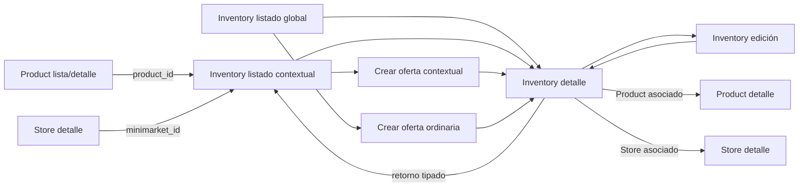
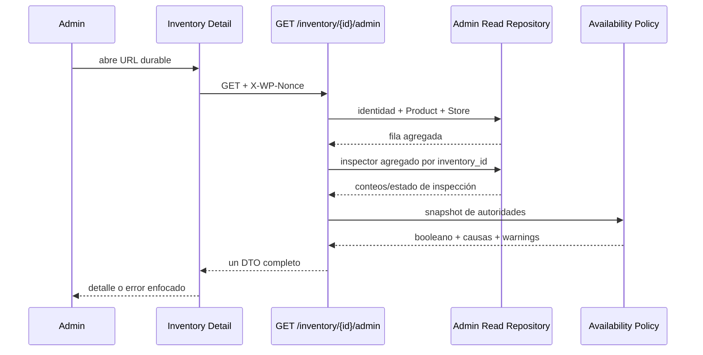
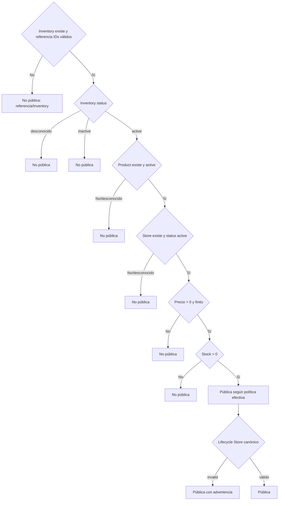

# Serie 36.5.1 — Diseño operacional de Inventory Admin

## 1. Resumen ejecutivo

Este documento define la experiencia administrativa objetivo de Inventory sin
implementar código. Su fuente principal es la auditoría certificada
`docs/inventory-admin-audit.md`, contrastada con el código vigente en el commit
`e724abf0a1d05adde0f4e377545fa64576cafbbb`.

Inventory seguirá siendo autoridad exclusiva de la oferta que relaciona un
Product con un Store: asociación, precio, stock persistido, estado y timestamps.
Product y Store mantienen sus propias autoridades. Nombres, imágenes, estados
externos, disponibilidad pública y referencias se proyectan en lectura; no se
copian a `inventory`.

El diseño cierra estas decisiones:

- se incorpora un listado operacional con Product y Store identificables,
  diagnóstico público explicable y señales referenciales resumidas;
- se incorpora un detalle administrativo durable, cargado con una sola llamada
  REST;
- se proponen `GET /veciahorra/v1/inventory/admin` y
  `GET /veciahorra/v1/inventory/{id}/admin`, separados del DTO crudo actual;
- se define un evaluador único de disponibilidad, con una causa primaria
  estable, bloqueos secundarios y advertencias;
- la inconsistencia del lifecycle compuesto de Store será una advertencia
  visible, pero no cambiará todavía la regla pública efectiva basada en
  `Store.status = active`;
- el listado se resolverá sin consultas por fila: un JOIN principal, un agregado
  referencial por lote y un count;
- el detalle resolverá identidad/autoridades con una consulta y el inspector con
  un agregado acotado;
- edición, activación e inactivación seguirán usando transitoriamente los
  endpoints actuales, sin fingir que poseen CAS;
- delete no se ofrecerá como acción ejecutable hasta definir una política
  transaccional;
- CAS/eliminación, semántica transaccional de stock y lifecycle público de Store
  quedan expresamente derivados a series posteriores.

La Serie 36.5.2 podrá implementar lectura, navegación, diagnóstico y UX sin
resolver de forma improvisada los tres problemas transaccionales pendientes.

## 2. Objetivos

### 2.1 Objetivo principal

Permitir que un administrador responda, con una vista inicial:

- qué Product ofrece qué Store;
- cuál es el precio y el stock persistido;
- si Inventory está activa;
- si la oferta aparece públicamente bajo la política efectiva actual;
- por qué no aparece;
- si existen referencias operacionales o históricas relevantes;
- qué acciones son seguras, cuáles requieren advertencia y cuáles aún no deben
  ofrecerse.

### 2.2 Objetivos técnicos

- eliminar llamadas REST por fila;
- separar DTO de lista y DTO de detalle;
- reutilizar una política de diagnóstico entre Inventory Admin, Product Admin y
  Catalog sin compartir DTO de interfaz;
- mantener estados desconocidos y fallas como casos explícitos;
- establecer URLs durables y retornos tipados;
- preparar, sin implementar, un contrato futuro de CAS;
- traducir fallas de `wpdb` a errores y nunca a resultados vacíos engañosos;
- dejar criterios verificables para backend y navegador.

### 2.3 No objetivos

No se redefine en esta serie el modelo de stock, no se cambia el lifecycle de
Store, no se habilita hard delete seguro y no se implementan escrituras CAS.

## 3. Fuentes revisadas

### 3.1 Auditoría y composición

- `docs/inventory-admin-audit.md`.
- `app/Core/Application.php`: bindings de `InventoryRepositoryInterface`,
  `InventoryService`, `InventoryPage` e `InventoryRoutes`.
- `app/Database/Schemas/InventorySchema.php`:
  `InventorySchema::define()`.

### 3.2 Inventory backend

- `app/Modules/Inventory/Admin/InventoryPage.php`:
  `InventoryPage::render()` y `PAGE_SLUG`.
- `app/Modules/Inventory/Routes/InventoryRoutes.php`:
  `register()`, `index()`, `show()`, `create()`, `update()`, `delete()` y
  endpoints de campo.
- `app/Modules/Inventory/Controllers/InventoryController.php`.
- `app/Modules/Inventory/Requests/InventoryListRequest.php`,
  `InventoryCreateRequest.php` e `InventoryUpdateRequest.php`.
- `app/Modules/Inventory/Services/InventoryService.php`.
- `InventoryReferenceValidator::validate()`.
- `InventoryCreationCoordinator::execute()`.
- `InventoryLockService` e `InventoryLockRepository`.
- `InventoryRepository`, especialmente `paginate()`, `count()`, `find()`,
  `findActiveByProductIds()` y `buildFilters()`.

### 3.3 Inventory frontend

- `app/Modules/Inventory/Views/index.php`.
- `assets/admin/js/modules/inventory/app.js`.
- `api.js`, `store.js`, `view.js` y `context.js`.
- `product-selector.js` y `store-selector.js`.
- `assets/admin/css/inventory.css`.

### 3.4 Patrones administrativos certificados

- `ProductController::adminDetail()` y `serializeAdminDetail()`.
- `ProductRepository::adminOffers()` y el agregado del listado.
- `ProductReferenceInspector`.
- `assets/admin/products/detail-app.js`, `detail-store.js`,
  `detail-view.js`, `detail-api.js` y `navigation.js`.
- `StoreAdminReadController`.
- `StoreLifecycleContract`.
- `StoreRepository::compareAndSetLifecycle()` y `findActiveByIds()`.
- `StoreAdminPageRequest`, detalle y navegación de Store.
- coordinador de lectura, descarte de respuestas y abandono en
  `assets/admin/js/modules/stores/detail-app.js`.

### 3.5 Consumidores

- `CatalogService::publicInventory()`, `inventoryRows()`,
  `publicStores()` e `isVisible()`.
- `CartRepository::findInventoryContext()`.
- `CartService::validatedInventory()`, `addItem()` y `updateQuantity()`.
- `CheckoutValidationService::validateItem()` y `CheckoutService`.
- `ReservationService::lockItems()`, `releaseItems()` y
  `confirmForOrders()`.
- `ReservationExpirationService`.
- `OrderService::create()` y `createFromReservedItems()`.
- esquemas `CartItemSchema`, `ReservationSchema` y `OrderItemSchema`.

### 3.6 Pruebas que fijan comportamiento

- `inventory-admin-list-test.php`.
- `inventory-admin-form-test.php`.
- `inventory-product-selector-test.php`.
- `inventory-store-selector-test.php`.
- `product-inventory-context-test.php`.
- `store-inventory-context-test.php`.
- `inventory-controller-test.php`, `inventory-routes-test.php`,
  `inventory-service-test.php` e `inventory-repository-test.php`.
- `product-admin-operational-detail-test.php`.
- `store-admin-operational-detail-read-test.php`.

La prueba defectuosa preexistente `checkout-validation-test.php` no se modifica
ni se usa como fundamento exclusivo de una decisión.

## 4. Arquitectura actual relevante

```text
Inventory Admin SPA
  ├─ GET /inventory                  fila cruda + count
  ├─ GET /inventory/{id}             fila cruda
  ├─ GET /products/{id}              contexto Product
  ├─ GET /stores/{id}                contexto Store
  ├─ GET /products/search            selector Product
  └─ GET /stores                     selector Store

InventoryService
  ├─ InventoryRepository             autoridad de oferta
  ├─ InventoryReferenceValidator     existencia/status reconocido
  └─ InventoryCreationCoordinator    creación serializada

Consumidores
  ├─ Product Admin                   diagnóstico propio por oferta
  ├─ Catalog                         regla pública propia
  ├─ Cart / Checkout                 revalidación comercial
  ├─ Reservations                    decremento/liberación atómica
  └─ Orders                          referencias + snapshots monetarios
```

La lectura actual no tiene JOINs y por ello tampoco N+1 backend, pero obliga a
mostrar IDs. Product Admin ya calcula un diagnóstico por oferta con
`availability_reason`; Catalog repite la regla pública. Store posee un lifecycle
compuesto, mientras sus consumidores públicos consultan solo `status`.

El diseño objetivo añade una capa de **proyección operacional**. Esta capa no es
un nuevo agregado autoritativo ni una tabla:

```text
Inventory authorities
      + Product decoration/status
      + Store decoration/status/lifecycle
      + reference aggregates
      + availability policy
                  │
                  ▼
        Admin list/detail DTO
```

## 5. Principios del diseño

1. **Autoridad sin duplicación.** Ningún nombre, imagen, estado externo,
   disponibilidad o agregado se persiste en Inventory.
2. **Disponibilidad explicable.** El booleano siempre se acompaña de causa,
   bloqueos y advertencias.
3. **Política compartida, DTO separados.** Inventory Admin, Product Admin y
   Catalog reutilizan un evaluador puro; cada consumidor conserva su DTO.
4. **Lectura acotada.** No se llama a repositorios o REST por fila.
5. **Desconocido no significa inactivo.** Estados desconocidos, referencias
   ausentes y fallas de inspección tienen códigos propios.
6. **Detalle para decisiones; lista para triage.** El listado muestra señales,
   no todos los conteos.
7. **URLs como estado durable.** Lista, filtros, contexto, detalle y edición son
   recuperables.
8. **Retornos tipados.** Nunca se acepta una URL externa arbitraria.
9. **Escrituras honestas.** Mientras no exista CAS, la UI no afirma protección
   contra concurrencia.
10. **Problemas transaccionales separados.** La UX operacional no redefine stock,
    delete o Store lifecycle.
11. **Privacidad por agregación.** No se exponen compradores, correos, pedidos
    concretos ni datos financieros sensibles.
12. **Falla cerrada.** Una lectura incompleta no habilita una acción destructiva.

## 6. Autoridades y datos derivados

| Dato | Propietario | Clasificación en Inventory Admin | Escritura desde Inventory |
|---|---|---|---|
| `inventory.id` | Inventory | Autoridad | No |
| `product_id` | Inventory para la relación | Autoridad inmutable | Solo create |
| `minimarket_id` | Inventory para la relación | Autoridad inmutable | Solo create |
| `price` | Inventory | Autoridad | Sí |
| `stock` | Inventory | Autoridad actual, semántica pendiente | Sí, con advertencia |
| `inventory.status` | Inventory | Autoridad | Sí |
| timestamps Inventory | Inventory | Autoridad/versionado débil | Automática |
| nombre/SKU/imagen Product | Product | Decorativo | No |
| `product.status` | Product | Autoridad externa leída | No |
| nombre/localización Store | Store | Decorativo | No |
| status/onboarding/aprobación Store | Store | Autoridad externa leída | No |
| lifecycle canónico Store | Store | Derivado desde autoridad externa | No |
| disponibilidad pública | Ningún módulo como dato persistido | Derivada | No |
| causa/advertencias | Política compartida | Derivada | No |
| conteos de Cart/Reservations/OrderItems | Módulos consumidores | Agregado derivado | No |
| precio de Cart/Order | Cart/Order | Snapshot monetario | No |
| acciones permitidas | Política administrativa | Derivada | No |

Inventory Admin puede enlazar a Product y Store, pero no editar sus datos.

## 7. Flujo administrativo objetivo



### 7.1 Entrada al listado

- global: muestra todas las ofertas;
- desde Product: fija `product_id`, muestra encabezado contextual y permite
  crear con Product bloqueado;
- desde Store: fija `minimarket_id`, muestra encabezado contextual y permite
  crear con Store bloqueado;
- un contexto inválido no cae al listado global silenciosamente.

### 7.2 Lista → detalle

“Ver detalle” navega a una URL durable con `inventory_id` y parámetros de
retorno allowlisted. El detalle es la superficie principal para inspección,
acciones y diagnóstico.

### 7.3 Creación

La creación ordinaria permite seleccionar Product y Store. La contextual bloquea
solo la autoridad recibida por contexto. Tras crear, navega al detalle del nuevo
Inventory conservando el retorno al listado de origen.

### 7.4 Edición

La edición carga el detalle operacional, muestra Product/Store como solo lectura
y edita precio, stock y estado. En 36.5.2 puede seguir usando el PATCH actual,
mostrando explícitamente que no posee protección CAS. Tras éxito recarga el
detalle y restaura foco en el mensaje de éxito o encabezado.

### 7.5 Acciones de estado

Activar e inactivar son representaciones explícitas del cambio de
`inventory.status`, aunque transitoriamente invoquen el endpoint actual. Activar
no se etiqueta “Publicar”: el resultado puede seguir no público por Product,
Store, precio o stock.

## 8. Listado operacional

### 8.1 Jerarquía y columnas

| Orden | Columna | Contenido principal | Contenido secundario |
|---|---|---|---|
| 1 | Oferta | Product name | SKU, Product ID, Inventory ID |
| 2 | Minimarket | Store name | Store ID y localidad breve si existe |
| 3 | Comercial | Precio CLP | Stock persistido |
| 4 | Estado | Badge Inventory | Product y Store status en texto secundario |
| 5 | Disponibilidad | Sí/No | Etiqueta de causa primaria y warning |
| 6 | Referencias | Señales compactas | Cart, reserva activa, historia |
| 7 | Actualización | fecha local | versión/timestamp accesible |
| 8 | Acciones | Ver detalle | Editar; activar/inactivar según caso |

La información principal son Product, Store, precio, stock y resultado público.
IDs, estados externos y timestamp son secundarios. No se muestran conteos
completos, pedidos, reservas concretas ni compradores.

### 8.2 Badges

- Inventory: Activa, Inactiva o Estado desconocido.
- Disponibilidad: Pública, No pública o Diagnóstico no disponible.
- Warning adicional: Lifecycle Store inconsistente.
- Referencias:
  - “Carrito” si existe al menos una;
  - “Reserva activa” con severidad alta;
  - “Historial” si existen reservas históricas u OrderItems;
  - “Inspección fallida” nunca se traduce a “sin referencias”.

Todos combinan texto e icono opcional; nunca solo color.

### 8.3 Acciones por fila

- `Ver detalle`: siempre que el ID sea válido.
- `Editar`: si la lectura es íntegra y las referencias Product/Store resuelven;
  una referencia ausente conduce primero al detalle diagnóstico.
- `Activar`: Inventory inactiva con estado reconocido.
- `Inactivar`: Inventory activa.
- `Eliminar`: no se presenta como ejecutable en 36.5.2.

Las acciones rápidas de estado requieren confirmación contextual si hay reserva
activa o si la acción cambia la disponibilidad efectiva.

### 8.4 Filtros

- Product selector/ID.
- Store selector/ID.
- Inventory status: active, inactive, unknown.
- disponibilidad: public, not_public, diagnostic_error.
- causa primaria.
- referencia: active_reservation, cart, history, none_known.
- stock: available, zero.
- precio: publishable, non_publishable.
- `per_page`: 20, 50, 100.

Los filtros por referencia pueden ser más costosos. En 36.5.2 solo se habilitan
si el repositorio implementa el filtro en SQL antes de paginar; no se filtra una
página ya cargada.

### 8.5 Búsqueda

Un único término busca:

- Inventory ID exacto si el término es entero canónico;
- Product ID o Store ID exacto mediante prefijos explícitos (`inventory:`,
  `product:`, `store:`);
- nombre o SKU de Product;
- nombre de Store.

La UI ofrece selectores para Product/Store como camino preferido. No promete
búsqueda por substring de IDs.

### 8.6 Orden

Allowlist:

- `updated_at DESC|ASC` (default DESC);
- `id DESC|ASC`;
- `product_name ASC|DESC`;
- `store_name ASC|DESC`;
- `price ASC|DESC`;
- `stock ASC|DESC`;
- `status ASC|DESC`.

Disponibilidad y causa solo serán ordenables si la expresión queda en la consulta
principal; no se ordena en PHP después de paginar. Todo orden agrega `i.id` como
desempate estable.

### 8.7 Paginación

Paginación por página compatible con WordPress y el contrato actual:
`page >= 1`, `per_page <= 100`. Lista y count pueden divergir bajo concurrencia;
36.5.2 lo mitiga corrigiendo página fuera de rango y presentando el total como
instantáneo, sin prometer snapshot. Una solución transaccional o keyset queda
sujeta a medición posterior.

### 8.8 Estados de la lista

- carga inicial con `aria-busy`;
- vacío global;
- vacío por filtros con “Limpiar filtros”;
- vacío contextual con “Crear primera oferta”;
- error recuperable con “Reintentar”;
- contexto inválido con enlace al listado global;
- resultado obsoleto descartado por secuencia;
- respuesta parcial o shape inválido tratada como error, no como vacío.

### 8.9 Responsive

En escritorio se usa tabla. Bajo 782 px cada fila se convierte semánticamente en
tarjeta:

1. Product + Store;
2. precio + stock;
3. estado + disponibilidad;
4. warnings/referencias;
5. acciones.

No se oculta una causa de no publicación. IDs y timestamp pueden plegarse en
“Datos técnicos”. La transformación no depende de duplicar contenido en dos DOM
paralelos.

## 9. Detalle operacional

### 9.1 Decisión

Inventory **sí requiere detalle independiente**:

`admin.php?page=veciahorra-inventory&action=view&inventory_id={id}`

Justificación:

- combina tres autoridades y varias condiciones derivadas;
- necesita inspector referencial sin sobrecargar la lista;
- concentra lifecycle, concurrencia y acciones;
- ofrece destino durable desde Product, Store y listado;
- permite diagnóstico de referencias ausentes o estados desconocidos;
- sigue el patrón certificado de Product y Store.

La ruta es compatible con el registro WordPress actual porque
`InventoryPage::render()` ya monta un único shell para
`page=veciahorra-inventory`; no colisiona con una página administrativa
distinta. Sin embargo, **no funciona todavía como detalle**: el
`readAdminContext()` vigente retorna contexto `none` cuando no recibe
Product/Store y no despacha `action=view`. La Serie 36.5.2 debe reemplazar o
extender ese parser con un router de pantalla validado. Esto es implementación
de navegación, no una capacidad existente.

### 9.2 Secciones

1. **Encabezado**
   - “Oferta #ID”;
   - Product → Store;
   - badges Inventory y disponibilidad;
   - última actualización.
2. **Resumen comercial**
   - precio autoritativo;
   - stock persistido;
   - estado Inventory.
3. **Product asociado**
   - ID, nombre, SKU, status e imagen opcional;
   - estado de resolución;
   - enlace al detalle Product.
4. **Store asociado**
   - ID, nombre, localidad, status y lifecycle canónico;
   - estado de resolución;
   - enlace al detalle Store.
5. **Disponibilidad pública**
   - booleano efectivo;
   - causa primaria;
   - bloqueos secundarios;
   - advertencias;
   - explicación de cada dimensión.
6. **Inspector referencial**
   - agregados de Cart, Reservations y OrderItems;
   - clasificación operacional;
   - estado de inspección.
7. **Lifecycle Inventory**
   - estado actual;
   - acciones de status representables;
   - aclaración “activa no implica pública”.
8. **Concurrencia**
   - versión observada;
   - advertencia transitoria si CAS no está soportado;
   - última recarga.
9. **Acciones**
   - editar, activar/inactivar;
   - delete no disponible hasta política posterior.
10. **Navegación**
   - volver al listado preservado;
   - Product;
   - Store.

### 9.3 Carga



“Una llamada REST” no significa una sola sentencia SQL; significa que el
frontend no orquesta subrecursos.

## 10. Disponibilidad pública y causas

### 10.1 Contrato

Un servicio/proyector puro, por ejemplo `OfferAvailabilityPolicy`, recibe un
snapshot explícito y devuelve:

```text
is_publicly_available: bool
primary_cause: Cause
blocking_causes: Cause[]
warnings: Cause[]
dimensions:
  inventory: { exists, observed_status, status_known, active }
  product: { exists, observed_status, status_known, public }
  store: {
    exists, observed_status, status_known, active,
    lifecycle_state, lifecycle_consistent
  }
  price: { observed_value, valid_for_publication }
  stock: { observed_value, available }
evaluated_policy: "effective-v1"
```

No consulta la base de datos, no persiste y no depende de DTO de UI.
`observed_value` conserva la representación segura normalizada o `null`; no
expone errores internos. El listado puede renderizar solo el resumen, mientras
el detalle muestra todas las dimensiones.

Las referencias operacionales no forman parte de esta política: Cart,
Reservations y OrderItems no determinan por sí mismos la visibilidad pública.
Sus warnings pertenecen al inspector y al modelo de acciones. Esta separación
evita que un consumidor público de la política deba conocer relaciones
administrativas.

### 10.2 Política efectiva v1



La advertencia de Store no cambia el booleano en 36.5.2, porque hacerlo
divergiría del Catalog vigente. La serie “Lifecycle público de Store” decidirá
si se convierte en bloqueo y versionará la política.

### 10.3 Catálogo de causas y precedencia

Se evalúan todas las dimensiones. `primary_cause` es la primera causa bloqueante
según esta precedencia; las restantes quedan en `blocking_causes`.

| Orden | Código | Disponible | Etiqueta | Severidad | Explicación |
|---:|---|---:|---|---|---|
| 1 | `inventory_missing` | No | Inventory inexistente | error | La oferta solicitada ya no existe |
| 2 | `product_reference_invalid` | No | Referencia Product inválida | error | `product_id` no es positivo o representable |
| 3 | `store_reference_invalid` | No | Referencia Store inválida | error | `minimarket_id` no es positivo o representable |
| 4 | `product_missing` | No | Product inexistente | error | Un `product_id` válido no resuelve |
| 5 | `store_missing` | No | Store inexistente | error | Un `minimarket_id` válido no resuelve |
| 6 | `reference_mismatch` | No | Referencia contradictoria | error | El ID resuelto por el adaptador no coincide con la referencia Inventory |
| 7 | `inventory_status_unknown` | No | Estado Inventory desconocido | error | No se asume active/inactive |
| 8 | `inventory_inactive` | No | Inventory inactiva | neutral | La oferta fue inactivada |
| 9 | `product_status_unknown` | No | Estado Product desconocido | error | Estado fuera del contrato |
| 10 | `product_not_public` | No | Product no público | warning | Product draft o inactive |
| 11 | `store_status_unknown` | No | Estado Store desconocido | error | Status fuera del contrato |
| 12 | `store_not_active` | No | Store no activo | warning | Store pending, inactive o rejected |
| 13 | `invalid_public_price` | No | Precio no publicable | warning | Nulo, no numérico, no finito o <= 0 |
| 14 | `out_of_stock` | No | Sin stock disponible | warning | Stock <= 0 o inválido |
| 15 | `publicly_available` | Sí | Pública | success | Cumple la política efectiva |

Warnings no bloqueantes:

| Código | Etiqueta | Severidad | Regla |
|---|---|---|---|
| `store_lifecycle_inconsistent` | Lifecycle Store inconsistente | warning | status/onboarding/aprobación producen `invalid` |

Las referencias no resolubles por ausencia usan `product_missing` o
`store_missing`; no se duplican como referencia inválida. Los indicadores
`references_present`, `active_reservation_present` e `inspection_unavailable`
son códigos del inspector operacional, no causas de disponibilidad.

Si Inventory no existe, el endpoint de detalle responde 404; el código
`inventory_missing` sirve a evaluadores internos y diagnósticos de referencias,
no para convertir un 404 en DTO 200.

### 10.4 Reutilización sin acoplamiento

- extraer la decisión a una política pura con tests de matriz;
- Product Admin adapta sus offers a la entrada de esa política;
- Inventory Admin usa la misma salida completa;
- Catalog filtra por el booleano de la misma versión;
- Cart/Checkout conservan validaciones transaccionales adicionales: cantidad,
  precio snapshot y coherencia del carrito;
- no se reutiliza el DTO administrativo dentro de Catalog.

Hasta que Catalog migre, pruebas de contrato comparan su salida con
`effective-v1` para impedir divergencia.

## 11. Read model del listado

### 11.1 Contrato raíz

```text
{
  success: true,
  data: InventoryAdminListItem[],
  meta: {
    page, per_page, total, total_pages,
    order_by, direction,
    snapshot_consistent: false
  }
}
```

### 11.2 Campos

Estabilidad: **estable** forma parte del contrato; **extensible** admite nuevas
claves sin cambiar semántica; **diagnóstica** puede crecer por nuevos códigos.

| Campo | Tipo / nulabilidad | Fuente | Clase | Uso | Estabilidad |
|---|---|---|---|---|---|
| `id` | int no nulo | `inventory.id` | autoridad | enlaces/ID | estable |
| `product.id` | int no nulo | `inventory.product_id` | autoridad relacional | ID | estable |
| `product.exists` | bool | JOIN Product | derivado | error | estable |
| `product.name` | string nullable | Product | decorativo | título | estable |
| `product.sku` | string nullable | Product | decorativo | secundario | extensible |
| `product.status` | string nullable | Product | autoridad externa | diagnóstico | estable |
| `store.id` | int no nulo | `inventory.minimarket_id` | autoridad relacional | ID | estable |
| `store.exists` | bool | JOIN Store | derivado | error | estable |
| `store.name` | string nullable | Store | decorativo | título | estable |
| `store.location_label` | string nullable | Store | decorativo | secundario | extensible |
| `store.status` | string nullable | Store | autoridad externa | diagnóstico | estable |
| `store.lifecycle_state` | string nullable | campos Store | derivado | warning | estable |
| `price` | decimal string | Inventory | autoridad | comercial | estable |
| `stock` | int | Inventory | autoridad actual | comercial | estable |
| `status` | string | Inventory | autoridad | badge | estable |
| `availability.is_publicly_available` | bool | política | derivado | badge | estable |
| `availability.primary_cause.code` | string | política | derivado | etiqueta | estable |
| `availability.primary_cause.label` | string | presentación servidor | decorativo | texto | extensible |
| `availability.blocking_codes` | string[] | política | derivado | detalles accesibles | diagnóstica |
| `availability.warning_codes` | string[] | política | derivado | warnings | diagnóstica |
| `availability.dimensions` | objeto resumido | política | derivado | explicación accesible | extensible |
| `references.has_cart_items` | bool | agregado batch | derivado | señal | estable |
| `references.has_active_reservations` | bool | agregado batch | derivado | warning | estable |
| `references.has_history` | bool | agregado batch | derivado | señal | estable |
| `references.inspection_status` | enum | consulta | derivado | falla cerrada | estable |
| `created_at` | datetime string | Inventory | autoridad | técnico | estable |
| `updated_at` | datetime string | Inventory | autoridad | visible | estable |
| `version` | string | proyección de `updated_at` en 36.5.2 | derivado | futura CAS | provisional |
| `actions.view` | bool | política UI | derivado | acción | extensible |
| `actions.edit` | bool | política UI | derivado | acción | extensible |
| `actions.activate` | bool | política UI | derivado | acción | extensible |
| `actions.deactivate` | bool | política UI | derivado | acción | extensible |
| `routes.detail` | string | builder server | decorativo | navegación | estable |
| `routes.product` | string nullable | builder server | decorativo | navegación | estable |
| `routes.store` | string nullable | builder server | decorativo | navegación | estable |

No incluye imagen: en una tabla densa aporta poco, añade resolución de
attachments y compite con señales operacionales. Puede reconsiderarse tras
pruebas de usuario sin romper la autoridad.

`version` no prueba CAS. Mientras los endpoints actuales no la acepten, el DTO
añade `concurrency.mode: "last_write_wins"` a nivel meta o detalle.

## 12. Read model del detalle

### 12.1 Contrato raíz

```text
{
  success: true,
  data: {
    identity,
    offer,
    product,
    store,
    availability,
    references,
    lifecycle,
    concurrency,
    actions,
    routes
  }
}
```

### 12.2 Campos

| Campo | Tipo / nulabilidad | Fuente | Clase | Estabilidad |
|---|---|---|---|---|
| `identity.id` | int | Inventory | autoridad | estable |
| `identity.created_at` | datetime | Inventory | autoridad | estable |
| `identity.updated_at` | datetime | Inventory | autoridad | estable |
| `offer.product_id` | int | Inventory | autoridad relacional | estable |
| `offer.minimarket_id` | int | Inventory | autoridad relacional | estable |
| `offer.price` | decimal string | Inventory | autoridad | estable |
| `offer.stock` | int | Inventory | autoridad actual | estable |
| `offer.status` | string | Inventory | autoridad | estable |
| `product.exists` | bool | JOIN | derivado | estable |
| `product.id` | int | Inventory/Product | relacional | estable |
| `product.name` | string nullable | Product | decorativo | estable |
| `product.slug` | string nullable | Product | decorativo | extensible |
| `product.sku` | string nullable | Product | decorativo | estable |
| `product.status` | string nullable | Product | autoridad externa | estable |
| `product.image` | object nullable | Product/WP media | decorativo | extensible |
| `store.exists` | bool | JOIN | derivado | estable |
| `store.id` | int | Inventory/Store | relacional | estable |
| `store.name` | string nullable | Store | decorativo | estable |
| `store.status` | string nullable | Store | autoridad externa | estable |
| `store.onboarding_status` | string nullable | Store | autoridad externa | estable |
| `store.approved_at` | datetime nullable | Store | autoridad externa | estable |
| `store.lifecycle_state` | string | lifecycle contract | derivado | estable |
| `store.location` | resumen nullable | Store | decorativo | extensible |
| `availability.*` | objeto completo | política | derivado | estable/extensible |
| `references.*` | inspector agregado | consumidores | derivado | estable |
| `lifecycle.status` | string | Inventory | autoridad | estable |
| `lifecycle.allowed_actions` | string[] | política administrativa | derivado | extensible |
| `concurrency.version` | string | Inventory | derivado | provisional |
| `concurrency.mode` | enum | capacidad endpoint | derivado | estable |
| `concurrency.last_observed_at` | datetime | servidor | decorativo | extensible |
| `actions.*` | capacidades + confirmación | políticas | derivado | extensible |
| `routes.list/product/store/edit` | URL nullable | builders server | decorativo | estable |

### 12.3 Privacidad

El detalle no contiene:

- IDs de usuarios o compradores;
- nombres, correos, teléfonos o direcciones de clientes;
- IDs de pedidos o reservas concretos;
- totales de órdenes o datos de pago;
- SQL, stack traces, `last_error` o nombres de tablas físicos;
- payloads internos.

## 13. Inspector referencial

### 13.1 Modelo

```text
references: {
  inspection_status: "complete" | "failed" | "partial",
  classification:
    "unreferenced" | "operationally_referenced" |
    "historically_referenced" | "mixed" | "unknown",
  cart: { total },
  reservations: {
    total, active, active_quantity, released, expired, consumed, unknown
  },
  order_items: { total },
  warning_codes: Array<
    "references_present" |
    "active_reservation_present" |
    "inspection_unavailable" |
    "reference_mismatch"
  >
}
```

No se listan registros concretos.

### 13.2 Agregados e impacto

| Agregado | Finalidad | Consulta | Impacto |
|---|---|---|---|
| Cart total | Detectar uso vigente/residual | COUNT por `inventory_id` | warning; bloqueante para delete futuro |
| Reservations active | Detectar stock reservado y carrera | COUNT y SUM(quantity) status=active | bloquea delete; warning fuerte en edit/inactivate |
| Reservations históricas | Trazabilidad y liberaciones ya cerradas | SUM por status | bloquea hard delete propuesto |
| Reservations unknown | Corrupción/estado nuevo | SUM NOT IN allowlist | bloquea acciones destructivas |
| OrderItems total | Historia comercial | COUNT | bloquea hard delete propuesto |
| Inspección fallida | Evitar falso “sin referencias” | estado de consulta | bloquea delete y reduce acciones |

“Bloquea” describe la política futura recomendada. En 36.5.2 delete no se
ejecuta desde la UI, por lo que el inspector es diagnóstico y preparación.

`active_quantity` es nullable: se entrega solo con inspección completa y valores
de cantidad válidos. Es un agregado derivado de Reservations, no stock físico ni
autoridad de Inventory. No se suma automáticamente a `inventory.stock`.

### 13.3 Otras referencias

El código certificado referencia Inventory desde `cart_items`, `reservations` y
`order_items`. No se inventan relaciones adicionales. Si una futura tabla
incorpora `inventory_id`, deberá registrarse en el inspector antes de habilitar
delete.

### 13.4 Consistencia

El inspector también cuenta:

- referencias cuyo Inventory ya no existe;
- mismatch entre `product_id` copiado y Product del Inventory;
- estados Reservation desconocidos.

En el detalle de un Inventory existente, un mismatch se presenta como warning
de integridad. No se repara desde esta vista.

## 14. Lifecycle y acciones

### 14.1 Estado actual

Inventory reconoce `active` e `inactive`, sin máquina formal ni CAS. La UI
objetivo representa esas mutaciones como acciones comprensibles, pero no inventa
un estado `published`.

| Acción | Precondición visible | Confirmación | Resultado UI |
|---|---|---|---|
| Editar | Inventory existente, lectura íntegra | warning si cambia stock o hay reserva activa | recarga detalle |
| Activar | status=inactive reconocido | explica que no garantiza publicación | recarga diagnóstico |
| Inactivar | status=active | confirma pérdida de disponibilidad si era pública | recarga diagnóstico |
| Eliminar | ninguna en 36.5.2 | no disponible | deriva a serie posterior |
| Volver | retorno allowlisted | ninguna | lista preservada |
| Ir a Product | Product existe | ninguna | ruta Product real |
| Ir a Store | Store existe | ninguna | ruta Store real |

### 14.2 Estado de interacción

- botón deshabilitado y `aria-disabled` durante request;
- una sola operación por recurso;
- spinner/texto “Guardando…”;
- doble clic no envía dos requests;
- respuestas con sequence/request ID obsoleto se descartan;
- AbortController en lectura y abandono/pagehide;
- tras éxito se vuelve a pedir el detalle;
- error se enfoca, mantiene contexto y ofrece retry cuando corresponde;
- foco tras éxito al notice; tras cancelar, vuelve al disparador si sigue
  conectado o al encabezado de la vista destino.

### 14.3 Errores de acciones

- 409: conflicto/versiones o política; conservar datos del usuario, mostrar
  “Recargar datos” y no reintentar automáticamente;
- 422: asociar error al campo/acción y enfocar primer error;
- 404: recurso desapareció; ofrecer volver al listado;
- 500/503: mensaje genérico, retry manual idempotente solo para lectura;
- timeout/network: estado incierto para escritura; recargar detalle antes de
  permitir repetir.

### 14.4 CAS futuro

Contrato propuesto:

```text
PATCH /inventory/{id}
{
  price?,
  stock?,
  status?,
  expected_version: "opaque-version"
}
```

Respuesta:

```text
{ success: true, data: { id, updated, version, resource? } }
```

Conflicto:

```text
HTTP 409
{
  success: false,
  error: {
    code: "inventory_version_conflict",
    message: "...",
    details: { expected_version, current_version }
  }
}
```

`updated_at` puede servir transitoriamente como `expected_updated_at`, siguiendo
Product, pero tiene resolución limitada y Reservations también lo modifica. La
decisión durable debe preferir una versión opaca/monótona y coordinarse con la
serie de stock.

### 14.5 Convivencia transitoria

En 36.5.2:

- lecturas exponen `concurrency.mode = "last_write_wins"`;
- la UI usa endpoints actuales sin enviar una precondición inexistente;
- antes de guardar muestra la versión observada y después recarga;
- no se interpreta la recarga como garantía contra lost update;
- cuando la serie CAS esté disponible, el mismo DTO cambia a
  `mode = "compare_and_set"` y habilita `expected_version`.

## 15. Eliminación segura

### 15.1 Matriz de decisión propuesta

| Situación | UI 36.5.2 | Política futura recomendada |
|---|---|---|
| Sin referencias, inspección completa | Informar “candidata” | hard delete CAS podría permitirse |
| Con Cart | Advertir; ofrecer inactivar separadamente | bloquear hard delete hasta resolver Cart |
| Reserva activa | Alerta crítica | bloquear delete e inactivación requiere política |
| Reservas históricas | Historial visible | bloquear hard delete |
| OrderItems | Historial visible | bloquear hard delete |
| Estado Reservation desconocido | Error de integridad | bloquear |
| Inspección parcial/fallida | Diagnóstico no disponible | bloquear |
| Referencias contradictorias | Error de integridad | bloquear |

### 15.2 Política híbrida recomendada para diseño posterior

- hard delete solo para oferta nunca utilizada, sin referencias, con inspección
  completa y CAS;
- inactivación como acción explícita, no como efecto automático de DELETE;
- referencias históricas preservan Inventory o requieren tombstone diseñado;
- reservas activas exigen coordinación transaccional;
- una falla de inspección cierra la acción.

### 15.3 Experiencia

El detalle puede mostrar “Eliminación no disponible en esta versión” y la
clasificación. No debe llamar al DELETE actual. No debe sugerir que inactivar ya
es fallback automático.

### 15.4 Decisión pendiente

La serie posterior “Concurrencia y eliminación” debe definir locks, orden de
bloqueo, inspector `FOR UPDATE`, CAS, respuesta 409, posible tombstone y
comportamiento de Cart/Reservations/OrderItems.

## 16. Stock y reservas

### 16.1 Conflicto vigente

Reservations decrementa `inventory.stock` al bloquear y lo incrementa al
liberar. El formulario administrativo escribe un valor absoluto en el mismo
campo:

```text
stock=10
reserva 3        -> stock=7
admin fija 20    -> stock=20
reserva libera 3 -> stock=23
```

No puede saberse si el administrador quiso 20 físicos, 20 disponibles o sumar
13. CAS basado solo en el valor observado detectaría algunas carreras, pero no
define la semántica.

### 16.2 Conceptos que deben separarse

| Concepto | Situación actual | Autoridad deseable por definir |
|---|---|---|
| Stock comercial/físico | No existe separado | Inventory o ledger |
| Unidades reservadas | Implícitas en Reservations y descuento | Reservations |
| Stock disponible | Persistido como `inventory.stock` | Derivado o contador protegido |
| Ajuste administrativo | Reemplazo absoluto | Comando con semántica explícita |

### 16.3 Información visible en 36.5.2

Mientras persista el contrato actual:

- etiqueta exacta: “Stock persistido disponible”;
- explicación: “Reservations puede modificar este valor”;
- conteo de reservas activas desde inspector;
- unidades activamente reservadas agregadas, si la suma puede obtenerse de forma
  confiable;
- timestamp/versión observada;
- warning antes de editar stock;
- no calcular “stock físico” sumando reservas como si fuera autoridad;
- si el inspector falla, mostrar “reservas desconocidas”.

### 16.4 Alternativas conceptuales

1. stock físico + reserved quantity derivada;
2. stock disponible + ledger de ajustes;
3. contador único serializado con comandos delta;
4. reserva sin mutar stock y disponibilidad calculada.

No se selecciona ninguna aquí. Cada opción cambia locks, expiración, checkout,
reconciliación y recuperación.

### 16.5 Serie futura requerida

“Semántica transaccional de stock” debe fijar invariantes, orden de locks,
idempotencia, expiración, ajustes administrativos, liberación y pruebas de
concurrencia antes de cambiar el formulario.

## 17. Navegación canónica

### 17.1 Rutas reales y propuestas

| Destino | Ruta |
|---|---|
| Inventory lista | `admin.php?page=veciahorra-inventory` |
| Inventory detalle | `...&action=view&inventory_id={id}` |
| Inventory edición | `...&action=edit&inventory_id={id}` |
| Inventory creación | `...&action=create` |
| Crear desde Product | `...&action=create&product_id={id}` |
| Crear desde Store | `...&action=create&minimarket_id={id}&return_store_id={id}` |
| Product detalle real | `admin.php?page=veciahorra-products&action=view&product_id={id}` |
| Store detalle real | `admin.php?page=veciahorra-stores&action=view&id={id}` |

No se propone una página WordPress inexistente.

### 17.2 Estado durable del listado

Allowlist de retorno, prefijada en detalle/edición:

```text
return_search
return_product_id
return_minimarket_id
return_status
return_availability
return_cause
return_reference
return_order_by
return_direction
return_paged
return_per_page
```

Valores:

- IDs canónicos positivos y safe integer;
- status/availability/cause/reference/order/direction en enum;
- página positiva;
- per page 20/50/100;
- search texto acotado y sanitizado.

No se acepta `return_url`.

Nonce, `_wpnonce`, REST nonce y tokens de sesión no forman parte de la URL de
retorno ni se copian entre pantallas; el nonce REST se obtiene de la
configuración de la pantalla y viaja solo en header.

### 17.3 Contextos

- Product y Store son mutuamente excluyentes como **contexto de navegación**;
- filtros avanzados internos pueden combinarse solo si el backend los modela
  explícitamente, sin hacerse pasar por contexto;
- `return_store_id` se mantiene por compatibilidad en creación Store, pero el
  parser verifica igualdad y el diseño futuro puede retirarlo;
- `action=view|edit` exige un único `inventory_id` y rechaza Product/Store como
  identidad alternativa;
- `action=create` prohíbe `inventory_id`;
- acción desconocida, arrays, duplicados o IDs incompatibles producen pantalla
  de error controlada.

### 17.4 Seguridad

- origen same-origin;
- pathname termina en `/admin.php`;
- `page` exacta;
- allowlist de claves;
- ningún protocolo distinto de HTTP(S);
- ningún destino construido desde input sin builder;
- Product/Store se resuelven server-side antes de habilitar enlace;
- los builders de Product actuales deben endurecerse hasta el nivel del builder
  Store; esto pertenece a navegación de 36.5.2.

### 17.5 Canonicalización

Un parser server-side o contrato equivalente:

- acepta cada clave una sola vez y rechaza sintaxis array;
- normaliza IDs a decimal canónico sin ceros iniciales;
- elimina defaults (`page=1`, orden/dirección default, filtros vacíos);
- emite claves en un orden estable al construir enlaces;
- conserva únicamente el allowlist aplicable a la acción;
- para GET no canónico puede redirigir con `wp_safe_redirect` a la URL
  same-origin reconstruida, o entregar la URL canónica para
  `history.replaceState`;
- nunca canonicaliza una combinación incompatible convirtiéndola silenciosamente
  en otra pantalla: muestra error controlado.

`view|edit` requieren exactamente un `inventory_id`; `create` lo prohíbe. Esta
gramática no colisiona con `action=create` vigente, pero sí exige que el nuevo
router distinga las tres acciones antes de inicializar lista/contexto.

## 18. Formularios y URLs durables

### 18.1 Creación ordinaria

`page=veciahorra-inventory&action=create`

Product y Store se seleccionan mediante los endpoints existentes. Ningún precio,
stock ni status se acepta como valor autoritativo desde URL.

### 18.2 Creación desde Product

`action=create&product_id={id}`:

- Product se resuelve por REST/read model;
- `product_id` queda bloqueado;
- Store sigue seleccionable;
- si Product desaparece, no se abre un formulario global accidentalmente;
- cancelar vuelve al Product o listado contextual según retorno tipado.

### 18.3 Creación desde Store

`action=create&minimarket_id={id}&return_store_id={id}`:

- Store se resuelve;
- Store queda bloqueado;
- Product sigue seleccionable;
- lifecycle Store se muestra, incluso si no es público;
- cancelar vuelve al Store o listado contextual.

### 18.4 Edición

`action=edit&inventory_id={id}`:

- Product y Store son solo lectura;
- price, stock y status se cargan desde REST, nunca desde URL;
- versión observada proviene del DTO;
- el formulario no acepta cambio de asociación;
- cancelar vuelve al detalle y conserva retorno del detalle.

### 18.5 Unsaved changes

- navegación/cancelación con cambios pide confirmación;
- guardar deshabilita abandonar controles locales;
- `beforeunload` solo mientras hay cambios;
- tras éxito se actualiza baseline;
- respuesta obsoleta no reemplaza valores más recientes.

## 19. Contratos REST

### 19.1 Convenciones

Todos los endpoints administrativos:

- permiso `manage_options`;
- nonce REST en `X-WP-Nonce`;
- `credentials: same-origin`;
- `Cache-Control: private, no-store`;
- envelope `{success,data,meta?}` o `{success:false,error}`;
- validación estricta de campos y enums;
- errores internos sin SQL ni `last_error`;
- lectura fallida no devuelve 200 vacío.

### 19.2 Listado operacional

| Propiedad | Diseño |
|---|---|
| Método | GET |
| Ruta | `/veciahorra/v1/inventory/admin` |
| Parámetros | search, product_id, minimarket_id, status, availability, cause, reference, page, per_page, order_by, direction |
| Respuesta | DTO sección 11 |
| Consultas | JOIN principal + agregado batch + count |
| Cache | private, no-store |
| Errores | 400/422 query inválida, 500 lectura, 503 timeout |

Se elige endpoint nuevo porque extender la fila cruda de `GET /inventory`
mezclaría esquema físico y proyección anidada. El endpoint actual permanece
transitoriamente para la UI antigua y compatibilidad de pruebas.

### 19.3 Detalle operacional

| Propiedad | Diseño |
|---|---|
| Método | GET |
| Ruta | `/veciahorra/v1/inventory/{id}/admin` |
| Parámetros | ID positivo |
| Respuesta | DTO sección 12 |
| Consultas | detalle JOIN + inspector agregado |
| Cache | private, no-store |
| Errores | 404, 422 ID, 500/503 |

El inspector se embebe; no se crea endpoint separado en 36.5.2. Un refresh
repite el detalle completo y mantiene coherencia del diagnóstico.

### 19.4 Selectores

| Necesidad | Endpoint | Decisión |
|---|---|---|
| Product | `GET /products/search` | reutilizar; mínimo 2 caracteres, límite acotado |
| Store | `GET /stores` | reutilizar con search, orden y página |
| Contexto Product | Product admin detail o show existente | reutilizar sin pedirlo por fila |
| Contexto Store | Store show existente | reutilizar sin pedirlo por fila |

No se crean búsquedas duplicadas de Inventory.

### 19.5 Escrituras transitorias

- `PATCH /inventory/{id}`: edición actual;
- `PATCH /inventory/{id}/status`: activación/inactivación rápida actual;
- `POST /inventory`: creación actual;
- `DELETE /inventory/{id}`: existe, pero la nueva UI no lo invoca.

Los endpoints `/price` y `/stock` no se incorporan a la nueva UI si el PATCH
general resuelve el formulario. No se eliminan en esta tarea.

### 19.6 Lifecycle/CAS futuro

La serie posterior decidirá si:

- evoluciona PATCH con `expected_version`;
- agrega comandos `/activate` y `/deactivate`;
- crea preflight/DELETE seguro.

No se agregará un endpoint `published`: publicación es derivada.

### 19.7 Contrato de error

```text
{
  success: false,
  error: {
    code: stable_machine_code,
    message: safe_admin_message,
    details?: {
      field?: allowlisted_field,
      reason?: stable_reason,
      current_version?: opaque_version
    }
  }
}
```

| HTTP | Códigos principales | UI |
|---:|---|---|
| 400 | `invalid_json`, `invalid_query` | corregir request/estado controlado |
| 401/403 | `rest_forbidden` | acceso denegado |
| 404 | `inventory_not_found` | volver a lista |
| 409 | `inventory_version_conflict`, `inventory_referenced`, `inventory_duplicate` | recargar/explicar |
| 422 | `validation_error`, `unknown_status` | campo/acción |
| 429 | `rate_limited` | retry respetando espera |
| 500 | `inventory_read_failed`, `persistence_error` | genérico + request ID no sensible |
| 503/504 | `inventory_read_timeout` | retry manual |

Los 409 son contrato futuro salvo que una serie posterior los implemente.

## 20. Estrategia de consultas

### 20.1 Listado

Consulta 1, página:

```sql
SELECT columnas_explicitas
FROM inventory i
LEFT JOIN products p ON p.id = i.product_id
LEFT JOIN stores s ON s.id = i.minimarket_id
WHERE filtros_allowlisted
ORDER BY expresion_allowlisted, i.id
LIMIT ? OFFSET ?
```

Incluye campos suficientes para derivar disponibilidad y lifecycle Store. No
JOIN a Cart/Reservations/Orders antes de paginar, para evitar multiplicación de
filas.

Consulta 2, referencias de los IDs de la página:

```text
UNION ALL de agregados por inventory_id:
  cart_items
  reservations por status
  order_items
```

Se agrupa en PHP sobre un máximo de 100 IDs o mediante una subconsulta
`source, inventory_id, count`. Es una consulta batch, no tres por fila.

Consulta 3, total:

```sql
SELECT COUNT(DISTINCT i.id)
FROM inventory i
LEFT JOIN products p ...
LEFT JOIN stores s ...
WHERE los mismos filtros
```

Si el filtro referencial está activo, count debe incorporar un `EXISTS`
equivalente; nunca se filtra después de paginar.

### 20.2 Detalle

1. `inventory` LEFT JOIN Product y Store por ID.
2. un agregado referencial acotado a `inventory_id`.
3. resolución de imagen Product mediante API WordPress; para un único Product no
   existe N+1.

No se consulta Catalog ni se llama a ProductService/StoreService por sección.

### 20.3 Disponibilidad

Se deriva en aplicación desde las columnas seleccionadas, usando una política
pura. No requiere una consulta adicional.

### 20.4 Conteo y snapshot

36.5.2 acepta consistencia eventual entre página y count:

- `meta.snapshot_consistent=false`;
- si page > total_pages, repite una vez con última página;
- no mantiene transacción de lectura abierta alrededor de requests largos;
- no promete total exacto durante mutaciones concurrentes.

Una futura medición puede adoptar keyset/`has_next` para vistas que no necesiten
total.

### 20.5 Fallas de base de datos

Cada repositorio de lectura:

- comprueba `wpdb->last_error` después de cada query;
- lanza `PersistenceException` con mensaje interno no expuesto;
- distingue fila ausente de query fallida;
- no convierte `false`, `null` o array vacío ambiguo en éxito;
- no devuelve inspector `unreferenced` si el agregado falló;
- controller traduce a código estable y loguea fuera del payload.

### 20.6 N+1

Criterio verificable:

- listado: número constante de queries respecto del número de filas;
- detalle: número constante de queries;
- selectores: una request por búsqueda, con debounce/cancelación;
- ninguna llamada REST desde render de fila;
- media/taxonomías no se resuelven individualmente en listado.

### 20.7 Medición posterior

Antes de índices o migraciones:

- datos representativos de 10k/100k ofertas;
- `EXPLAIN` global, Product, Store, status, search y reference filter;
- tiempo p50/p95;
- filas examinadas;
- memoria de hidratación;
- conteo de queries;
- rendimiento de count y OFFSET profundo.

### 20.8 Presupuesto aproximado aceptado

| Lectura | Queries propias del módulo | Queries WordPress auxiliares | Total esperado |
|---|---:|---:|---:|
| Listado no vacío | 3: página, referencias batch, count | 0 | 3 |
| Listado vacío | 2: página y count; se omite batch | 0 | 2 |
| Detalle sin imagen resoluble | 2: JOIN detalle e inspector | 0 | 2 |
| Detalle con imagen no cacheada | 2 | hasta 2 acotadas para post/meta de una imagen | hasta 4 |
| Inspector embebido | 1 agregado/UNION acotado | 0 | incluido arriba |

El presupuesto es constante respecto de filas y se debe instrumentar en pruebas.
Una implementación con tres agregados referenciales separados seguiría siendo
acotada, pero elevaría el listado no vacío a 5 y el detalle a 4; no es la opción
preferida y requeriría justificación mediante `EXPLAIN`. El count es una query
separada y ya está incluido en los totales de listado.

## 21. Búsqueda, filtros y orden

### 21.1 Evolución de búsqueda

La búsqueda actual con `CAST(id AS CHAR) LIKE '%x%'` se conserva solo en el
endpoint legado. La lectura operacional:

- reconoce ID exacto sin cast;
- usa igualdad para prefijos tipados;
- busca Product por `name`/`sku` y Store por `business_name`;
- escapa LIKE;
- acota longitud;
- no afirma sargabilidad donde hay `%term%`.

Sin nuevos índices, nombre/store substring puede seguir siendo costoso. Debe
medirse y, si es necesario, evolucionar a búsqueda por prefijo o índice en una
serie de esquema posterior.

### 21.2 Matriz

| Filtro | Valores | SQL conceptual |
|---|---|---|
| Product | ID positivo | `i.product_id = ?` |
| Store | ID positivo | `i.minimarket_id = ?` |
| Inventory status | active/inactive/unknown | equality o NOT IN |
| Availability | public/not_public/error | expresión política equivalente |
| Cause | catálogo allowlisted | predicado equivalente |
| Reference | cart/active_reservation/history | EXISTS |
| Stock | available/zero | `i.stock > 0` / `<=0` |
| Price | publishable/non_publishable | `i.price > 0` / `<=0` |

Estados desconocidos se filtran con `NOT IN` más NULL cuando corresponda; no se
agrupan con inactive.

### 21.3 Consistencia entre SQL y política

Los filtros por availability/cause deben compartir especificación y tests con la
política de aplicación. Si no puede demostrarse equivalencia, no se ofrece el
filtro en 36.5.2.

## 22. Accesibilidad y responsive

### 22.1 Lista

- `<caption>` descriptivo;
- headers con `scope=col`;
- resumen de resultados en región live;
- filtros con label visible;
- botones con nombre accesible que incluya Product/Store cuando haga falta;
- causa disponible como texto;
- loading con `aria-busy`;
- errores `role=alert` y foco programático;
- paginación con `aria-current=page`;
- tarjetas móviles conservan orden semántico.

### 22.2 Detalle

- un H1 y jerarquía H2;
- definición `<dl>` para pares nombre/valor;
- badges con texto;
- secciones con landmarks/labels;
- actualización dinámica en región status;
- foco al error, éxito, confirmación y cambio de vista;
- enlaces Product/Store identifican destino.

### 22.3 Formularios y diálogos

- errores conectados con `aria-describedby`;
- `aria-invalid` solo cuando existe error;
- confirmaciones destructivas/inactivación con título, impacto y botones
  inequívocos;
- Escape y retorno de foco;
- no bloquear zoom;
- targets táctiles adecuados;
- selector Product/Store conserva combobox/listbox, debounce, cancelación,
  Arrow keys, Enter y Escape ya probados.

### 22.4 Breakpoints

- escritorio: tabla/dos columnas en detalle;
- tablet: tabla simplificada y secciones en una columna;
- móvil: tarjetas y acciones apiladas;
- contenido largo usa `overflow-wrap:anywhere`;
- ningún dato crítico exige scroll horizontal.

Matriz mínima de certificación visual:

| Viewport | Expectativa verificable |
|---:|---|
| 1440 px | tabla completa, detalle en dos columnas cuando aporte jerarquía |
| 1024 px | tabla sin solapamiento; toolbar puede envolver; detalle legible |
| 768 px | transición controlada a tabla simplificada/tarjetas; foco visible |
| 375 px | tarjetas en una columna; causa, precio, stock y acción sin scroll horizontal |

En cada ancho se prueba zoom 200 %, texto largo, status desconocido, warning
Store, error de inspector y estado de carga.

## 23. Manejo de errores y estados desconocidos

### 23.1 Matriz defensiva

| Caso | Backend | UI | Acciones |
|---|---|---|---|
| Inventory no existe | 404 | estado desaparecido | volver |
| Product falta | DTO exists=false | error diagnóstico | no enlace; editar limitado |
| Store falta | DTO exists=false | error diagnóstico | no enlace; editar limitado |
| status Inventory desconocido | cause explícita | badge error | no activar/inactivar automático |
| status Product desconocido | cause explícita | error | no pública |
| status Store desconocido | cause explícita | error | no pública |
| lifecycle Store invalid | warning | warning visible | no cambia boolean v1 |
| precio/stock corrupto | cause explícita | error/warning | no pública |
| inspector falla | 500 detalle o status failed según política | no simular cero | delete bloqueado |
| SQL falla | 500 estable | retry | ninguna destructiva |
| timeout | 503/504 | retry manual | estado desconocido |
| DTO inválido | error cliente | notice | no render parcial |
| respuesta obsoleta | descartada | sin cambio | ninguna |

Para detalle, si falla el inspector, se recomienda fallar la carga completa con
500 en 36.5.2: las acciones dependen de ese diagnóstico. Si en el futuro se
admite `partial`, todas las acciones sensibles quedan deshabilitadas.

### 23.2 Logging

El servidor puede registrar excepción, query lógica y correlation/request ID,
pero el payload solo entrega código seguro. No se incluyen SQL ni datos
personales.

## 24. Riesgos y trade-offs

| Decisión | Beneficio | Coste/riesgo | Mitigación |
|---|---|---|---|
| Endpoint admin nuevo | DTO limpio | superficie REST adicional | retirar legado cuando no tenga consumidores |
| Detalle independiente | diagnóstico completo | nueva vista | una llamada y patrón Product/Store |
| Ref flags en lista | triage | query agregada extra | batch máximo 100 |
| Lifecycle Store como warning | no cambia negocio | acepta inconsistencia pública actual | serie separada y warning visible |
| Count exacto | UX conocida | costo/snapshot distinto | medir; meta honesta |
| LEFT JOIN Product/Store | detecta huérfanos | filtros/planes más complejos | columnas/EXPLAIN |
| No imagen en lista | lectura densa/rápida | menos reconocimiento visual | nombre/SKU; imagen en detalle |
| Delete oculto | seguridad | endpoint riesgoso sigue existiendo | serie posterior; no invocarlo |
| PATCH sin CAS transitorio | compatibilidad | lost update | warning, recarga, serie CAS |
| Stock editable actual | continuidad | carrera con reservas | warning; serie stock prioritaria |
| Política pura compartida | evita divergencia | migración de consumidores | tests de matriz/versionado |

## 25. Matriz de implementación por series

### 25.1 Serie 36.5.2 — Implementación operacional de Inventory Admin

Incluye:

- listado operacional;
- detalle durable;
- DTO y endpoints REST de lectura admin;
- política `effective-v1` y diagnóstico;
- JOINs y agregados batch;
- navegación y retornos allowlisted;
- formularios con URLs durables;
- acciones actuales representadas honestamente;
- signals referenciales sin delete ejecutable;
- errores `last_error`;
- responsive, accesibilidad y pruebas;
- endurecimiento de builders Product/Inventory.

No incluye CAS real, política delete, cambio de modelo stock ni cambio de
publicación Store.

### 25.2 Serie posterior — Concurrencia y eliminación

- versión durable;
- CAS para update/status/delete;
- 409;
- inspector bloqueante con locks;
- política hard delete/tombstone;
- inactivación explícita como alternativa;
- orden transaccional y pruebas de carreras.

### 25.3 Serie posterior — Semántica transaccional de stock

- definición físico/reservado/disponible;
- ajuste absoluto o delta;
- ledger/contadores;
- lock, release, expire y consume;
- idempotencia/reconciliación;
- edición administrativa;
- invariantes y pruebas concurrentes.

### 25.4 Serie posterior — Lifecycle público de Store

- política status/onboarding/approved_at;
- tratamiento de `invalid`;
- migración uniforme de Catalog, Cart, Checkout y administraciones;
- versionado de availability policy;
- datos inconsistentes existentes y reparación.

### 25.5 Serie posterior — Rendimiento de esquema

- índices simples o compuestos;
- posible evolución de búsqueda;
- migraciones de soporte;
- cambios de paginación física.

Solo se abre después de capturar `EXPLAIN`, cardinalidad, filas examinadas,
p50/p95 y costo de count con datos representativos. La Serie 36.5.2 no introduce
índices ni migraciones.

## 26. Criterios de aceptación

### 26.1 Backend 36.5.2

- `GET /inventory/admin` exige `manage_options`.
- `GET /inventory/{id}/admin` exige `manage_options`.
- respuestas llevan `private, no-store`.
- lista usa un número constante de queries para 0, 1 y 100 filas.
- detalle inicial requiere una llamada REST.
- Product/Store ausentes se diagnostican, no causan fatal.
- cada status desconocido obtiene causa propia.
- availability coincide con Catalog efectivo para fixtures válidos.
- Store lifecycle invalid produce warning sin alterar boolean v1.
- fallas `wpdb->last_error` producen error, no vacío.
- inspector no expone IDs concretos ni PII.
- filtros/order rechazan valores fuera de allowlist.
- IDs duplicados, array syntax y overflow se rechazan.
- no existe N+1 de Product, Store, media o referencias.
- listado no vacío cumple 3 queries propias; vacío cumple 2.
- detalle cumple 2 queries propias y como máximo 2 auxiliares de media.
- un usuario sin `manage_options` obtiene 403 y ningún DTO administrativo.
- el nonce ausente o inválido es rechazado por la autenticación REST.
- headers incluyen `Cache-Control: private, no-store`.
- ningún payload contiene PII, SQL, `last_error`, Order IDs o Reservation IDs.

### 26.2 Navegador 36.5.2

- lista identifica Product y Store sin conocer IDs.
- muestra precio, stock, Inventory status, disponibilidad y causa.
- contexto Product y Store sobrevive recarga.
- lista → detalle → lista conserva filtros/página allowlisted.
- detalle → Product y Store usa rutas reales same-origin.
- URLs con host externo, claves desconocidas, nonce en retorno, arrays,
  duplicados o combinaciones de acción/ID incompatibles son rechazadas.
- una URL no canónica válida se normaliza sin perder filtros allowlisted.
- create/edit poseen URL durable.
- back/forward no pierde la vista.
- request obsoleto no reemplaza estado nuevo.
- doble clic envía una escritura.
- 409 futuro se representa sin perder formulario.
- loading, empty, error y success son accesibles.
- teclado opera filtros, selectores, acciones y confirmaciones.
- foco se restaura.
- a 320 px no se pierde causa ni acción principal.
- a 1440, 1024, 768 y 375 px se cumplen las expectativas de la matriz
  responsive.
- unknown nunca se muestra como active/inactive.

### 26.3 Integración

- Product Admin e Inventory Admin usan códigos de disponibilidad comunes.
- pruebas comparan Catalog con policy v1.
- Cart/Checkout conservan su revalidación transaccional.
- Reservations no se presenta como stock físico.
- OrderItems se cuentan sin exponer pedidos.
- la nueva UI no llama DELETE.

### 26.4 Rendimiento

- registrar queries por request;
- EXPLAIN documentado antes de cualquier índice;
- p95 definido con dataset representativo;
- count/paginación fuera de rango probados bajo mutación;
- agregado referencial limitado a IDs de la página.

## 27. Alcance negativo

Este diseño y la Serie 36.5.1:

- no implementan código;
- no modifican PHP, JavaScript, CSS ni pruebas;
- no modifican endpoints existentes;
- no modifican servicios o repositorios;
- no modifican esquemas, índices ni migraciones;
- no corrigen `checkout-validation-test.php`;
- no implementan CAS;
- no hacen seguro el DELETE actual;
- no definen todavía hard delete/tombstone;
- no cambian la semántica de stock;
- no calculan stock físico ficticio;
- no cambian la regla pública de Store;
- no persisten disponibilidad ni causas;
- no crean una autoridad duplicada de Product/Store;
- no exponen PII, pedidos concretos o información financiera;
- no realizan staging, commit ni push;
- no inician la implementación de la Serie 36.5.2.

El único entregable de esta serie es
`docs/inventory-admin-operational-design.md`.
