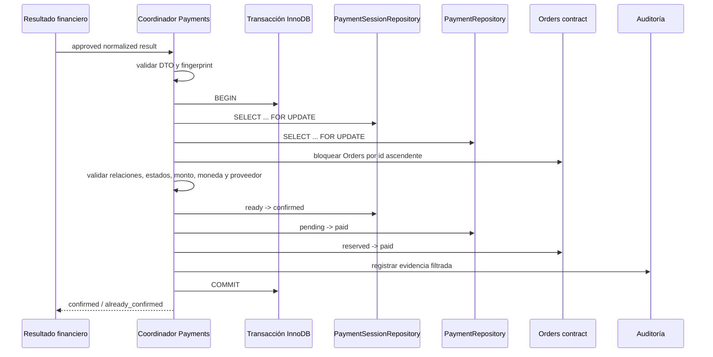

# VeciAhorra 28.7.4.5A — Diseño funcional de confirmación transaccional de pagos

## 1. Propósito y alcance

Este documento define la futura frontera que convierte un resultado financiero
Webpay aprobado y ya normalizado en una confirmación interna única, atómica y
auditable. La aprobación financiera es una precondición: **no equivale a una
confirmación de negocio** hasta que la transacción interna haya confirmado de
forma coherente `PaymentSession`, `Payment` y todas las `Order` del Checkout.

El hito 28.7.4.5B deberá coordinar esas entidades, verificar sus relaciones,
montos, moneda, proveedor y referencias financieras, y persistir todas las
transiciones en una sola transacción InnoDB. Participan Payments, el contrato de
dominio de Orders, sus repositorios, un coordinador transaccional y auditoría.

Precondiciones:

- existe un resultado financiero normalizado, aprobado y persistido por el
  flujo de retorno;
- el token está asociado de forma inequívoca a una `PaymentSession` interna;
- la sesión pertenece a un Checkout con una o más Orders;
- el monto, moneda, `buy_order`, `session_id` y proveedor coinciden con los
  snapshots internos;
- el resultado aún no fue aplicado o coincide exactamente con uno aplicado.

Una ejecución correcta deja la sesión confirmada, un Payment pagado y todas las
Orders asociadas pagadas, con timestamps y auditoría coherentes. No deja estados
parciales, es segura ante reintentos y no activa Delivery ni efectos externos.

Quedan fuera: llamada a Webpay, endpoint/REST, frontend, Delivery, repartidores,
correo, notificaciones, webhooks, carrito, documentos tributarios, reembolsos,
anulaciones, conciliación, analytics, jobs y colas.

## 2. Principios e invariantes

1. Una aprobación financiera produce como máximo una confirmación de negocio.
2. Una confirmación exitosa se aplica exactamente una vez.
3. PaymentSession, Payment y Orders se escriben en una única transacción.
4. No se publica éxito ni se conserva un estado intermedio antes de `COMMIT`.
5. Una sesión sólo confirma el Payment derivado de su propio Checkout.
6. Un Payment sólo confirma las Orders incluidas en `payment_orders` y en el
   mismo Checkout; ambos conjuntos deben ser idénticos.
7. Monto, moneda, proveedor, orden comercial y sesión deben coincidir de forma
   estricta con snapshots internos.
8. Una Order no puede pertenecer a dos Payments; el índice único actual de
   `payment_orders.order_id` es la última barrera.
9. Una Order pagada no se vuelve a pagar. Un Payment pagado no retrocede.
10. Estados terminales no se reabren automáticamente.
11. Toda escritura usa estado esperado y cardinalidad esperada.
12. Cualquier fallo antes de finalizar el commit provoca rollback completo.
13. Un reintento idéntico devuelve el mismo resultado lógico.
14. El token completo, API Key y datos bancarios no entran en logs ni auditoría.
15. No hay llamadas remotas dentro de la transacción interna.
16. Delivery y efectos secundarios permanecen fuera del hito.

Conceptos distintos:

- **Idempotencia técnica:** un retorno/token repetido no repite `commit()` ni
  inicia trabajo técnico duplicado.
- **Idempotencia funcional:** una evidencia financiera idéntica no repite las
  transiciones de negocio.
- **Unicidad financiera:** una sesión y un Payment aceptan una sola referencia
  financiera aprobada.
- **Consistencia transaccional:** todas las entidades cambian o ninguna cambia.
- **Auditabilidad:** cada intento puede correlacionarse sin almacenar secretos.

## 3. Arquitectura propuesta

El componente central será un servicio de aplicación de confirmación
transaccional dentro de Payments. Recibe un resultado financiero interno; no
recibe objetos del SDK, requests REST ni payloads del navegador.

Responsabilidades conceptuales:

| Componente | Responsabilidad |
| --- | --- |
| Coordinador de confirmación | Inicia la unidad de trabajo, adquiere locks, valida relaciones, solicita transiciones y decide commit/rollback. |
| PaymentSessionRepository | Lectura/bloqueo y transición condicionada de la sesión. |
| PaymentRepository | Lectura/bloqueo, vínculo sesión-pago y transición `pending → paid`. |
| Contrato de Orders | Valida y aplica `reserved → paid` sin conocer Webpay. |
| Proveedor transaccional | `BEGIN`, `COMMIT`, `ROLLBACK`, clasificación de deadlock/timeout y recuperación de commit ambiguo. |
| Política de idempotencia | Fingerprint financiero, replay benigno y conflictos. |
| Auditoría | Evidencia filtrada dentro de la misma transacción. |
| Resultado financiero | DTO inmutable y agnóstico del SDK. |
| Resultado de negocio | Resultado estable: confirmado, repetido, conflicto, transitorio o ambiguo. |

Payments coordina la transacción porque posee sesión, pago, evidencia e
idempotencia. Orders conserva la autoridad sobre sus transiciones mediante un
puerto de dominio. Payments no debe ejecutar SQL interno de Orders; Orders no
depende de Payments ni del SDK. Un módulo de aplicación puede depender de ambos
puertos, evitando `Payments ↔ Orders` circular.

## 4. Frontera financiera y frontera de negocio

La fase financiera recibe el retorno, normaliza, llama `commit()`, valida la
respuesta y persiste una evidencia confiable. Produce como mínimo: estado,
`response_code`, monto CLP entero, moneda conocida por contexto, `buy_order`,
`session_id`, proveedor, referencia segura del token, fecha financiera,
autorización, tipo de pago, cuotas, fecha contable y últimos cuatro dígitos.

No atraviesan la frontera: objeto SDK, token completo, API Key, payload crudo,
stack trace ni número completo de tarjeta.

La fase de negocio carga y bloquea las entidades, repite las validaciones
cruzadas contra datos internos y aplica las transiciones. Debe diferenciar:

- `financial_result=approved`: Webpay aprobó;
- `business_confirmation=confirmed`: la transacción interna terminó;
- `business_confirmation=pending_recovery`: Webpay aprobó, pero la operación
  interna hizo rollback o su commit quedó ambiguo.

Si Webpay aprueba y la transacción interna falla, la evidencia financiera
permanece disponible y el negocio sigue sin confirmar. Un reintento reutiliza
la misma evidencia y fingerprint; nunca vuelve a cobrar ni inventa una nueva.

## 5. Máquinas de estados

### 5.1 PaymentSession

El modelo actual declara `pending`, `ready`, `expired` y `cancelled`. No existe
`confirmed`, `aborted`, `financially_approved` ni relación directa con Payment.
Para 5B se propone añadir `confirmed`; la evidencia de aborto/rechazo continúa
en la persistencia técnica del retorno, sin reabrir sesiones terminales. Se debe
decidir si `aborted` merece estado propio o sólo resultado técnico.

| Origen | Evento y precondiciones | Destino | Escritura | Replay | Error |
| --- | --- | --- | --- | --- | --- |
| `pending` | Gateway crea sesión válida | `ready` | provider, token, URL, timestamps | recupera `ready` | conflicto si datos difieren |
| `ready` | Evidencia aprobada y confirmación interna completa | `confirmed` propuesto | estado, `confirmed_at`, fingerprint | devuelve confirmado | rollback ante fallo |
| `ready` | Rechazo financiero | `ready` o terminal futuro decidido en 5B | evidencia técnica solamente en este diseño | mismo rechazo | no confirmar negocio |
| `ready` | Aborto | `cancelled` sólo si política 5B lo aprueba | estado esperado | mismo aborto | nunca commit financiero |
| `pending/ready` | Expiración sin aprobación | `expired` | estado y timestamp | devuelve expirado | no confirmar |
| `confirmed` | Evidencia idéntica | `confirmed` | ninguna | éxito idempotente | ninguno |
| terminal | Evidencia distinta | sin cambio | ninguna | no | conflicto crítico |

Una aprobación posterior al vencimiento no se descarta automáticamente: exige
recuperación supervisada, porque el dinero puede estar autorizado mientras las
reservas ya no son válidas.

### 5.2 Payment

El código actual usa `pending`, `paid` y `failed`; `paid` y `failed` son
terminales. La tabla incluye `provider`, `provider_reference`, `paid_at`, monto
y moneda. No incluye `payment_session_id`.

| Origen | Evento y precondiciones | Destino | Escritura | Replay | Error |
| --- | --- | --- | --- | --- | --- |
| inexistente | Primera confirmación válida de sesión pública | `pending`, luego `paid` en la misma transacción o Payment precreado | crear/vincular según decisión 5B | índice evita duplicado | conflicto de relación |
| `pending` | Evidencia aprobada, sesión y Orders coherentes | `paid` | estado, `paid_at`, referencia segura | luego idempotente | rollback |
| `pending` | Evidencia no aprobada | permanece o `failed` fuera de este coordinador | ninguna confirmación | repetible | `financial_not_approved` |
| `paid` | Mismo fingerprint | `paid` | ninguna | confirmado previo | ninguno |
| `paid` | Fingerprint distinto | `paid` | ninguna | no | conflicto financiero |
| `failed` | Aprobación tardía | sin cambio automático | ninguna | no | intervención/reconciliación |

`paid → pending/failed` y `failed → paid` automático están prohibidos.

### 5.3 Order

No existe modelo Order dedicado. El schema usa `reserved` por defecto; el
repositorio implementa `reserved → paid` y también escribe `delivered` desde
otro flujo. Documentación existente trata `paid` como terminal para Payments.

| Origen | Evento y precondiciones | Destino | Escritura | Replay | Error |
| --- | --- | --- | --- | --- | --- |
| `reserved` | Payment confirmado, reserva válida, monto/owner correctos | `paid` | estado y `updated_at` | luego idempotente | rollback |
| `paid` | Mismo Payment/fingerprint | `paid` | ninguna | confirmado previo | ninguno |
| `paid` | Otro Payment | `paid` | ninguna | no | intento de doble pago |
| cancelada/expirada | Aprobación financiera | sin cambio | ninguna | no | recuperación manual |
| inexistente | Confirmación | ninguna | ninguna | no | rollback/not found |
| `delivered` | Reintento de confirmación ya coherente | sin cambio | ninguna | sólo si evidencia histórica prueba pago | inconsistencia si no |

Delivery sólo puede consumir posteriormente Orders `paid`; no participa aquí.

## 6. Transiciones coordinadas

Camino feliz propuesto:

- PaymentSession `ready → confirmed`;
- Payment `pending → paid`;
- cada Order `reserved → paid`;
- timestamps derivados de un único reloj SQL/aplicativo;
- auditoría `payment_confirmation_succeeded` dentro de la transacción.

| Session | Payment | Orders | Clasificación | Acción |
| --- | --- | --- | --- | --- |
| `ready` | `pending` | todas `reserved` | válida | confirmar atómicamente |
| `confirmed` | `paid` | todas `paid` | replay benigno si fingerprint coincide | devolver ya confirmado |
| `confirmed` | `pending` | `reserved` | parcial imposible/legado | alerta; no reparar automáticamente |
| `ready` | `paid` | `reserved` | inconsistente | rollback, alerta crítica |
| `ready` | `pending` | alguna `paid` | inconsistente o doble canal | rollback, intervención |
| cancelada/abortada | cualquiera | cualquiera | incompatible | rechazar |
| sesión de otro checkout | cualquiera | cualquiera | confirmación cruzada | rechazar y auditar |
| sesión correcta | Payment de otras Orders | cualquiera | relación inválida | rechazar y auditar |

Para checkout con varios minimarkets se confirma una sesión y un Payment
agregado sobre **todas** sus Orders. El índice único actual impide que una Order
participe en otro Payment. No se confirma parcialmente por minimarket.

## 7. Contrato entre Payments y Orders

Operación conceptual: `confirmOrdersPaid(command, transactionContext)`.

El comando contiene IDs internos positivos de sesión, Payment y Orders; ID
comercial/check-out; monto autorizado entero y moneda; proveedor; referencia
financiera hash; fecha financiera; fingerprint; correlation ID y origen. Token,
API Key y tarjeta no forman parte del contrato.

Payments garantiza previamente que la evidencia es aprobada, la sesión y el
Payment están bloqueados, el conjunto de Orders es exacto y monto/moneda
coinciden. Orders vuelve a comprobar existencia, estado `reserved`, pertenencia
al conjunto bloqueado y cardinalidad, y actualiza con estado esperado.

Orders devuelve IDs confirmados, estados previos/finales y filas afectadas.
Puede emitir errores funcionales (not found, estado incompatible, conjunto
distinto) o técnicos (deadlock, timeout, persistencia). El coordinador controla
transacción y orden de locks; Orders controla la validez de su transición.

## 8. Secuencia transaccional

Orden obligatorio:

1. validar formato financiero mínimo y fingerprint;
2. `BEGIN`;
3. bloquear PaymentSession;
4. bloquear Payment;
5. obtener IDs y bloquear Orders en orden numérico ascendente;
6. si 5B incluye Reservations, bloquearlas después de Orders también por ID;
7. validar relaciones, estados, proveedor, moneda, monto, `buy_order` y
   `session_id`;
8. detectar replay/conflicto;
9. escribir sesión, Payment, Orders y auditoría;
10. comprobar exactamente una fila de sesión, una de Payment y N Orders;
11. `COMMIT`;
12. releer si el resultado del commit fue ambiguo;
13. devolver resultado estable.

El orden fijo reduce ciclos de espera y hace compatibles todos los flujos que
adopten la misma disciplina.

## 9. Rollback

Fallo al iniciar `BEGIN` no produce escrituras. Entidad inexistente, relación,
monto, moneda, referencia o estado inválido provocan rollback y resultado
funcional. Lock timeout y deadlock provocan rollback; sólo pueden reintentarse
un número pequeño con jitter y el mismo fingerprint. Fallo en cualquier update,
auditoría o cardinalidad provoca rollback. Excepción inesperada se sanitiza,
audita y revierte.

Nunca se devuelve éxito antes de confirmar `COMMIT`. Si se pierde conexión
durante commit, no se asume rollback ni éxito: se relee bajo una nueva conexión
y se compara el fingerprint. Si las tres entidades y auditoría son coherentes,
se devuelve confirmado; si todas permanecen previas, puede reintentarse; si hay
mezcla, se clasifica ambiguo y requiere intervención. No se usan compensaciones
parciales ni llamadas externas dentro de la unidad crítica.

## 10. Locking

Se eligen locks pesimistas porque la confirmación es corta, sensible a doble
efecto y usa MySQL/MariaDB InnoDB. `SELECT ... FOR UPDATE` debe ejecutarse en la
misma conexión `$wpdb` y dentro de la transacción. Orden global:

1. PaymentSession por PK;
2. Payment por `payment_session_id`/PK;
3. Orders por PK ascendente;
4. relaciones/auditoría necesarias por clave ascendente.

Los locks duran hasta commit/rollback. No se espera red ni interacción humana.
El aislamiento mínimo esperado es `READ COMMITTED` o el predeterminado InnoDB,
pero 5B debe probar el valor real de la instalación. Los índices de búsqueda
deben evitar scans y locks de rango innecesarios. Deadlock (1213) y lock timeout
(1205) se clasifican por separado. WordPress no ofrece una unidad de trabajo
nativa: el proveedor transaccional debe asegurar una sola instancia `$wpdb`.

## 11. Idempotencia

Clave primaria funcional propuesta: `payment_session_id` más fingerprint
financiero. El hash incluye versión, provider, referencia segura del token,
PaymentSession, Checkout, conjunto ordenado de Order IDs, Payment ID, monto,
moneda, `buy_order`, `session_id`, estado/response code y fecha financiera
normalizada.

- Misma clave y fingerprint, ya confirmado: `already_confirmed`.
- Misma clave en curso: esperar de forma acotada o responder `in_progress`.
- Misma sesión y fingerprint diferente: conflicto, nunca replay benigno.
- Token diferente para la misma sesión: conflicto de unicidad financiera.
- Primera ejecución con rollback: reintento permitido con misma evidencia.
- Resultado de commit ambiguo: releer, no ejecutar a ciegas.

El almacenamiento requiere en 5B una relación única sesión-pago y evidencia de
fingerprint/confirmación. La tabla técnica de retornos del trabajo 28.7.4.4 usa
hash único de token, pero por sí sola no garantiza idempotencia funcional.

## 12. Concurrencia

| Escenario | Recurso/ganador | Perdedor | Estado final/auditoría |
| --- | --- | --- | --- |
| Mismo token simultáneo | hash técnico y lock de sesión; primero | replay/in progress | una confirmación; repetición auditada |
| Misma sesión, dos procesos | PaymentSession | relee tras lock | confirmado o conflicto |
| Dos tokens para una sesión | constraint sesión-referencia | conflicto | una evidencia aceptada; alerta |
| Retorno y reenvío paralelo | misma sesión | replay | exactamente una vez |
| Retry mientras original abierto | lock sesión | timeout acotado/in progress | sin segunda escritura |
| Cancelación de Order concurrente | primer lock siguiendo orden global | segundo revalida estado | gana una transición completa |
| Reserva expira simultáneamente | locks de Orders/Reservations | segundo revalida | confirmar o rollback total |
| Admin cambia Order | lock de Order | espera/revalida | sin overwrite silencioso |
| Deadlock con Orders | transacción víctima | retry acotado | evento deadlock |
| Lectura durante transacción | MVCC | observa commit anterior | nunca parcial confirmado |

## 13. Recuperación ante fallos

- Muerte antes de `BEGIN`: no hay cambios; reintento normal.
- Muerte después de `BEGIN` o de una escritura: InnoDB revierte al cerrar la
  conexión; el reintento relee.
- Muerte durante `COMMIT`: estado ambiguo; ejecutar recuperación por lectura.
- Timeout del cliente o respuesta perdida: consultar resultado por correlation
  ID/sesión; no repetir efecto sin relectura.
- Webpay aprobado y rollback interno: evidencia financiera queda pendiente de
  confirmación; retry automático sólo para fallos transitorios y relaciones aún
  válidas.
- DB no disponible: fallo transitorio, sin afirmar confirmación.
- Mezcla imposible de estados: detener automatización, alerta crítica y revisión
  administrativa con IDs, hashes, estados y timestamps, nunca secretos.

Jobs, webhooks y reconciliación programada son evoluciones futuras, no parte de
5A/5B.

## 14. Auditoría técnica y funcional

Eventos: intento, éxito, replay, conflicto, mismatch de monto/orden/sesión,
estado incompatible, rollback, deadlock, timeout, fallo DB, commit ambiguo,
recuperación y entidad ya confirmada.

Campos permitidos: evento, timestamp, correlation ID, IDs internos, proveedor,
monto, moneda, estados anterior/final, resultado, código, origen, hash parcial,
duración y contador. Prohibidos: token completo, API Key, credenciales, tarjeta,
payload SDK/crudo, SQL, PII innecesaria y stack trace público.

Auditoría funcional es evidencia durable de transición; log técnico diagnostica
infraestructura; evidencia financiera es el DTO filtrado; métricas sólo agregan
conteos/latencia. La auditoría mínima que prueba el commit debe escribirse en la
misma transacción; logs y métricas no deben hacer fallar una confirmación ya
durable salvo que sean requisito explícito de cumplimiento.

## 15. Modelo de resultado interno

| Código | Significado | Retry | HTTP futuro | Auditoría |
| --- | --- | --- | --- | --- |
| `confirmed` | negocio confirmado ahora | no | 200 | info |
| `already_confirmed` | replay idéntico | no | 200 | info |
| `financial_not_approved` | evidencia no aprobada | no | 422 | info |
| `not_confirmable` | estado terminal/incompatible | no automático | 409 | warning |
| `idempotency_conflict` | misma clave, fingerprint distinto | no | 409 | high |
| `transient_failure` | deadlock/timeout/DB temporal | sí acotado | 503 | warning |
| `permanent_failure` | relación o datos corruptos | no | 409/500 | high |
| `ambiguous` | commit interno incierto | sólo recuperación | 202/503 | critical |

Mensajes al frontend serán genéricos; IDs internos, hashes completos y causas
técnicas quedan restringidos.

## 16. Matriz de errores

| Código | Condición/entidad | Tx/rollback | Retry | Respuesta segura | Severidad/acción |
| --- | --- | --- | --- | --- | --- |
| `session_not_found` | sesión inexistente | sí/sí | no | no confirmable | high, investigar |
| `payment_not_found` | Payment inexistente | sí/sí | según creación aprobada | no confirmable | high |
| `order_not_found` | Order inexistente | sí/sí | no | no confirmable | high |
| `session_payment_mismatch` | vínculo inválido | sí/sí | no | conflicto | critical |
| `payment_order_mismatch` | conjuntos distintos | sí/sí | no | conflicto | critical |
| `provider_mismatch` | proveedor distinto | sí/sí | no | conflicto | critical |
| `amount_mismatch` | monto distinto | sí/sí | no | conflicto | critical |
| `currency_mismatch` | moneda distinta | sí/sí | no | conflicto | critical |
| `buy_order_mismatch` | referencia distinta | sí/sí | no | conflicto | critical |
| `session_id_mismatch` | sesión financiera distinta | sí/sí | no | conflicto | critical |
| `financial_not_approved` | rechazo financiero | no | no | no aprobado | info |
| `session_aborted/expired` | sesión terminal | sí/sí | manual si hubo aprobación | no confirmable | high |
| `already_confirmed` | todo coincide | sí/no write | no | ya confirmado | info |
| `order_already_paid` | mismo Payment: replay; otro: conflicto | sí/según caso | no | ya confirmado/conflicto | warning/critical |
| `order_cancelled/expired` | estado incompatible | sí/sí | no automático | no confirmable | high |
| `fingerprint_conflict` | evidencia diferente | sí/sí | no | conflicto | critical |
| `row_count_mismatch` | 0 o más filas inesperadas | sí/sí | tras relectura | fallo interno | critical |
| `lock_timeout` | espera excedida | sí/sí | sí acotado | temporal | warning |
| `deadlock` | víctima InnoDB | sí/automático | sí acotado | temporal | warning |
| `connection_failure` | DB perdida | depende/sí | sí tras relectura | temporal | high |
| `commit_failure` | commit rechazado | sí | sí tras estado | temporal | high |
| `commit_ambiguous` | respuesta perdida | desconocido/releer | no ciego | procesando | critical |
| `unexpected_error` | excepción | sí/sí | según causa | error interno | high |

## 17. Casos límite

IDs sólo son enteros positivos internos; booleanos, floats, arrays y strings
parciales se rechazan. CLP se representa como entero autorizado y como decimal
`N.00` en tablas actuales; cero, negativos, decimal fraccionario, NaN e infinito
son inválidos. Se normalizan espacios sólo donde el contrato lo permite y se
comparan provider/moneda con casing canónico.

Sesión, Payment u Order eliminados; owner/Checkout distintos; token truncado;
retorno tardío; reloj desajustado; auditoría no disponible; datos internos
corruptos o intervención manual producen rechazo/ambigüedad, nunca reparación
peligrosa. Una Order pagada por otro canal exige conciliación administrativa.

El Checkout actual crea una Order por minimarket y `checkout_orders` las agrupa.
La PaymentSession pertenece al Checkout; por ello la unidad correcta es una
confirmación por PaymentSession/Checkout completo, con un Payment que agrupa
todas las Orders. No se confirma una sola Order cuando el cobro cubre el total.

## 18. Seguridad

Todos los identificadores se validan y se resuelven desde relaciones internas;
el navegador no decide IDs, monto ni moneda. Se comparan snapshots y hashes con
comparación segura. El servicio no es público ni autoriza por sesión de usuario:
consume evidencia financiera previamente autenticada/correlacionada, evitando
IDOR y confirmación cruzada. Correlation IDs son aleatorios y no secretos.

Replay se controla con constraints, locks y fingerprint. Los errores no revelan
existencia de tokens, SQL ni configuración. No hay llamadas remotas dentro de
la transacción. La capa REST y el SDK permanecen fuera del dominio.

## 19. Efectos secundarios excluidos

Delivery, repartidores, correos, notificaciones, webhooks, limpieza de carrito,
pantalla/redirect, analytics, documentos tributarios, reembolsos, anulaciones,
conciliación automática y jobs/colas quedan excluidos. Deben reaccionar después
a un estado confirmado durable, idealmente mediante outbox/evento futuro, nunca
dentro de la transacción crítica.

## 20. Compatibilidad con el modelo actual

Estado comprobado:

- `payment_sessions`: Checkout, idempotency key/fingerprint, estado, provider,
  token proveedor, monto/moneda y expiración; sin Payment ni confirmación.
- `payments`: referencia única, cliente, monto/moneda, estado, provider,
  provider reference, `paid_at`; sin PaymentSession/Checkout.
- `payment_orders`: `order_id` único y par Payment-Order único.
- `orders`: customer/minimarket, total, estado y expiración; sin moneda,
  payment ID ni identificador comercial público.
- `checkout_orders`: vincula Checkout con múltiples Orders.
- PaymentRepository ofrece transacción y lock de Payment por provider reference.
- OrderRepository bloquea múltiples Orders por ID ascendente y actualiza todas
  `reserved → paid` exigiendo cardinalidad.
- PaymentConfirmationService actual llama al gateway antes de la transacción,
  bloquea Payment y coordina reservas, Orders y Payment, pero no PaymentSession.
- No hay foreign keys físicas ni repositorio de auditoría funcional.

Brechas para 5B:

1. relación única `Payment.payment_session_id` (o tabla equivalente);
2. estado/timestamp de confirmación de PaymentSession;
3. fingerprint financiero durable y único por sesión;
4. lectura `FOR UPDATE` de PaymentSession;
5. puerto transaccional compartido y contrato explícito de Orders;
6. auditoría durable;
7. moneda en Order o regla formal de herencia CLP;
8. definición de aborto/rechazo/tardío;
9. recuperación de commit ambiguo;
10. constraints/índices comprobados mediante migración futura.

Estos son requisitos propuestos, no columnas ni capacidades existentes.

## 21. Decisiones arquitectónicas

| Decisión | Alternativas | Elección y razón | Riesgo/mitigación |
| --- | --- | --- | --- |
| Coordinación | Payments, Orders, servicio neutral | application service de Payments sobre puertos | acoplamiento; interfaz de Orders |
| Locking | optimista/pesimista | pesimista por doble efecto | contención; transacción corta/índices |
| Auditoría | dentro/fuera | evidencia mínima dentro | fallo bloquea; esquema mínimo probado |
| Idempotencia | token, sesión, Payment | sesión + fingerprint; token hash como evidencia | conflictos; unique constraint |
| Commit ambiguo | retry ciego/relectura | relectura determinista | estado mixto; alerta |
| Unidad | Order/Checkout | PaymentSession + Checkout completo | múltiples Orders; locks ascendentes |
| Reserva expirada | confirmar/rechazar | no automático; recuperación | dinero aprobado; operación manual |
| Estado transitorio | persistir/no | evitar parciales; sólo evidencia financiera pendiente | observabilidad; auditoría |
| Constraints | sólo servicio/DB | ambos | migración; pruebas upgrades |

## 22. Criterios de aceptación

- Una evidencia aprobada válida produce una confirmación como máximo.
- Las tres familias cambian en una sola transacción.
- Fallo en cualquier escritura o auditoría revierte todo.
- Replay idéntico devuelve el mismo resultado sin writes.
- Dos procesos concurrentes no duplican efectos.
- Conflicto de datos nunca se clasifica como duplicado benigno.
- Una Order ya pagada sólo es idempotente si Payment/fingerprint coinciden.
- Monto, moneda, proveedor, orden y sesión se verifican internamente.
- No aparece token completo en logs/auditoría.
- No se activa Delivery ni efectos externos.
- Existe recuperación explícita para fallos y commits ambiguos.
- Todos los resultados son auditables y probables sin red.

## 23. Plan de pruebas para 28.7.4.5B

### Unitarias

Cada caso define entidades iniciales, comando, resultado, estados finales,
auditoría y cero red: estados válidos/inválidos, relaciones, monto/moneda,
fingerprint, replay, conflictos, errores y sanitización.

### Integración

Confirmación completa; fallo inyectado en cada update/auditoría; cardinalidad;
Payment/Order ya pagados; estados incompatibles; rollback; recuperación después
de rollback y commit ambiguo simulado. Verificar Session/Payment/N Orders y
auditoría antes/después.

### Concurrencia

Dos procesos con mismo token; tokens distintos; lock timeout; deadlock; cambio
concurrente de Order; replay con transacción abierta y confirmación simultánea
del mismo conjunto. Usar procesos/conexiones DB reales, no sólo dobles.

### Seguridad

IDs/monto manipulados, confirmación cruzada, replay, token/API Key en logs,
errores sensibles y payloads de tipos inesperados.

### Manuales

Sandbox aprobado, retorno repetido/refresco/tardío, indisponibilidad interna
después de aprobación y recuperación posterior. La red sólo es necesaria para
obtener evidencia real; la confirmación interna se prueba sin red.

## 24. Plan de implementación de 28.7.4.5B

1. Aprobar unidad PaymentSession/Checkout y política de reservas expiradas.
2. Diseñar migración compatible para vínculo sesión-pago, estado/timestamps,
   fingerprint, auditoría e índices únicos; probar upgrade y reejecución.
3. Crear DTO de comando/resultado y política de fingerprint.
4. Crear proveedor transaccional y lecturas `FOR UPDATE` en orden fijo.
5. Definir puerto de Orders y adaptar su repositorio sin dependencia inversa.
6. Implementar coordinador con validaciones antes de writes.
7. Añadir auditoría filtrada dentro de la transacción.
8. Implementar recuperación/relectura de resultados ambiguos.
9. Ejecutar unitarias, integración, rollback, concurrencia y seguridad.
10. Integrar después con el resultado financiero sin cambiar aún REST/Delivery.

Antes de codificar requieren aprobación: esquema futuro, creación o reutilización
de Payment, tratamiento de reservas expiradas, estados nuevos, contrato de
auditoría y política de commit ambiguo. La fase se completa sólo con migraciones
idempotentes, rollback probado, concurrencia real, cero efectos parciales y
árbol revisado. Ante una incompatibilidad se revierte el cambio de código, no
se eliminan automáticamente datos o tablas.
