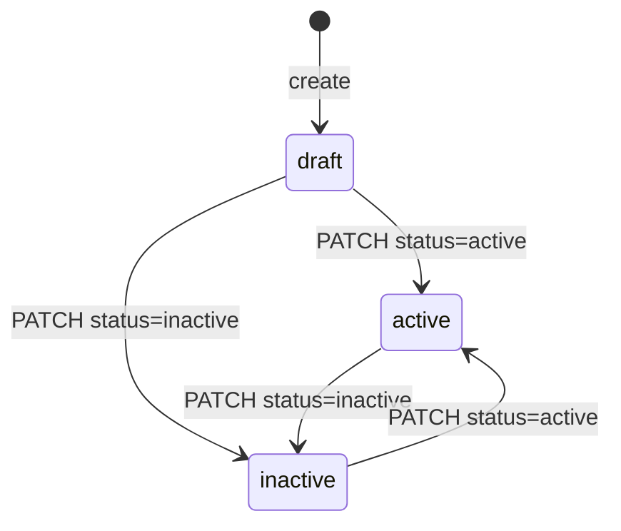
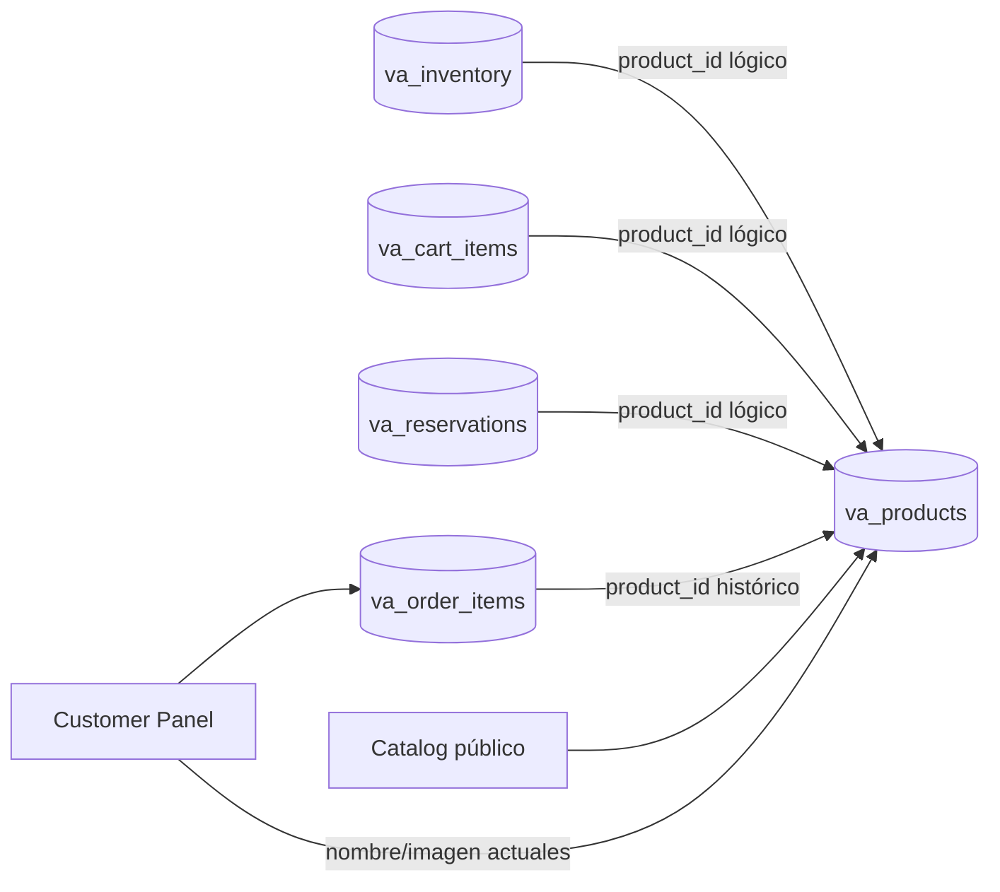
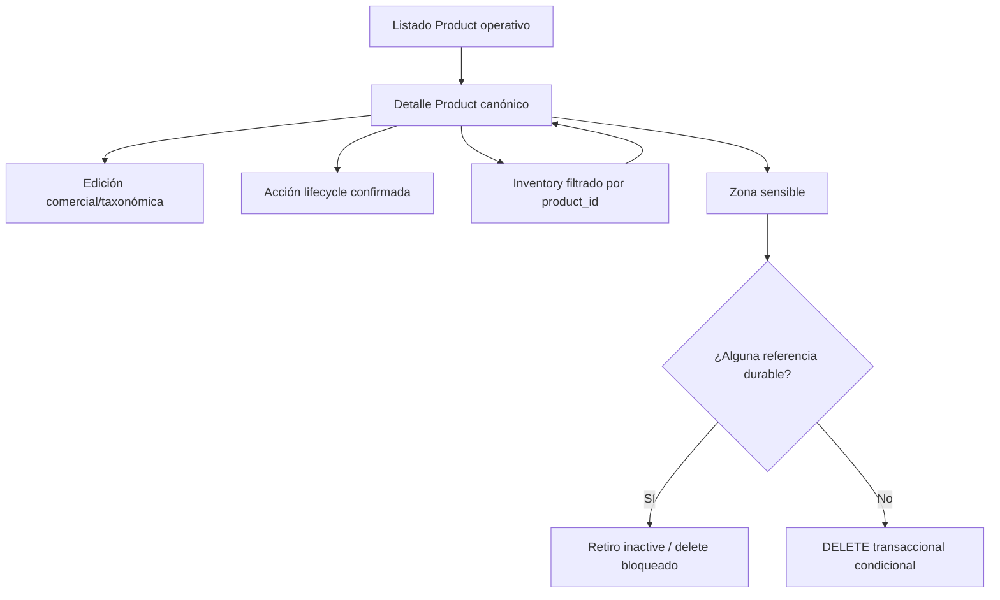

# Serie 36 — Auditoría y diseño de la administración operativa de Products

## 1. Resumen ejecutivo

Products dispone de una autoridad durable propia y de un CRUD administrativo
funcional: lista, busca, pagina, crea en `draft`, edita campos comerciales y
taxonómicos, selecciona una imagen con `wp.media`, activa/inactiva y enlaza a
Inventory. Sin embargo, todavía no alcanza el estándar operativo certificado de
Stores.

Las brechas principales son estructurales:

1. no existe una ruta ni vista administrativa de detalle independiente;
2. el listado sólo muestra ID, nombre, SKU, estado y actualización y no expone
   filtros, taxonomías, imagen, ofertas ni operaciones masivas ya disponibles;
3. el lifecycle no es una máquina cerrada: cualquier Product existente puede
   pasar a `active` o `inactive`, sin CAS, precondición ni confirmación;
4. edición comercial y estado conviven en el mismo formulario y una transición
   puede ejecutarse mientras existen cambios comerciales sin guardar;
5. Product → Inventory existe, pero no hay retorno canónico Inventory → Product
   porque Product no tiene detalle administrativo direccionable;
6. no existe endpoint ni política implementada de eliminación de Product;
7. las referencias a taxonomías e imagen son lógicas, no foreign keys, y pueden
   quedar huérfanas;
8. la imagen valida que el ID sea un `attachment`, pero no su MIME;
9. no hay concurrencia optimista: edición y estado son last-writer-wins;
10. la cobertura prueba piezas importantes, pero no certifica un flujo operativo
    integrado comparable a Serie 35.

La publicación pública no pertenece al estado Product por sí solo. Se calcula
conjuntamente a partir de Product activo, Inventory activo, stock positivo,
precio positivo y Store activa. Serie 36 debe preservar esa composición y no
duplicar autoridades de Inventory o Store.

**Veredicto:** Products es un CRUD técnico moderno y utilizable, con integración
parcial de catálogo e Inventory, pero no una administración operativa completa.
Está listo para iniciar implementación únicamente después de cerrar las
decisiones de lifecycle, detalle, concurrencia y eliminación descritas aquí.

## 2. Alcance, exclusiones y metodología

Esta auditoría fue exclusivamente diagnóstica. No se modificaron código,
pruebas, configuración, datos, menús, páginas ni migraciones. No se ejecutaron
pruebas capaces de crear fixtures ni se consultaron datos personales. El único
archivo creado es este documento.

Se inspeccionaron:

- `app/Modules/Products` completo;
- `app/Modules/ProductCatalogs` completo;
- `assets/admin/products` completo;
- rutas de registro en `app/Core/Application.php` y el menú administrativo;
- tablas y schemas de Product, Inventory, Cart, Orders y Reservations;
- consumidores Catalog, Frontend, Cart, Checkout y CustomerPanel;
- integración contextual en `assets/admin/js/modules/inventory`;
- pruebas manuales Product, catálogos, Inventory y catálogo público;
- historial Git específico de Products y el arreglo `wp.media`;
- documentos de auditoría y diseño anteriores, contrastándolos con HEAD.

Quedan fuera de la propuesta funcional: administración de términos WordPress,
rediseño del catálogo público, cambios en Inventory, Cart, Checkout, Orders,
Reservations, Delivery, pagos, esquema transaccional o migraciones no exigidas
por un contrato Product demostrado.

## 3. Fuentes inspeccionadas e inventario técnico

### 3.1 Núcleo Product

| Ruta | Responsabilidad y autoridad | Estado |
|---|---|---|
| `app/Database/Tables/ProductsTable.php` | Esquema autoritativo `va_products` | Activo |
| `app/Modules/Products/Models/Product.php` | Modelo y estados `draft/active/inactive` | Activo, contrato mínimo |
| `Products/Repositories/ProductRepository.php` | CRUD, unicidad, lista, count y bulk | Activo; sin delete ni CAS |
| `Products/Services/ProductService.php` | Slug, unicidad, catálogos y estados | Activo; lifecycle abierto |
| `Products/Services/CatalogValidator.php` | Existencia de términos y attachment | Activo; MIME incompleto |
| `Products/Requests/ProductRequest.php` | Create, PATCH y status | Activo; IDs normalizados permisivamente |
| `Products/Requests/ProductListRequest.php` | Paginación, búsqueda, status y orden | Activo; status sólo active/inactive |
| `Products/Requests/ProductBulkRequest.php` | Bulk status/categoría/marca/unidad | Activo, no conectado a UI |
| `Products/Controllers/ProductController.php` | Resultado neutral y traducción de errores | Activo |
| `Products/Routes/ProductRoutes.php` | REST administrativo | Activo; sin DELETE/no-store |
| `Products/Admin/ProductsPage.php` | Submenú, config, media y assets | Activo |
| `Products/Views/index.php` | Shell único lista/formulario | Activo; sin shell detalle |

### 3.2 Frontend administrativo

| Ruta | Responsabilidad | Estado |
|---|---|---|
| `assets/admin/products/app.js` | Coordinación, protección de cambios y URLs Inventory | Activo |
| `assets/admin/products/api.js` | Transporte REST Product y validación DTO | Activo |
| `assets/admin/products/catalogApi.js` | GET categorías/marcas/unidades | Activo |
| `assets/admin/products/store.js` | Estado de lista y formulario | Activo; sin estado de detalle/lifecycle formal |
| `assets/admin/products/view.js` | Tabla, formulario, status, media y ofertas | Activo |
| `assets/admin/products/navigation.js` | Construcción Product → Inventory | Activo; validación de base parcial |
| `assets/admin/products/products.css` | Layout, formularios y responsive | Activo |

### 3.3 Catálogos externos

| Componente | Autoridad | Estado |
|---|---|---|
| `CategoryRepository` | término `product_cat` | Sólo lectura |
| `BrandRepository` | término `product_brand` | Sólo lectura |
| `UnitRepository` | término `pa_unidad` | Sólo lectura |
| `UnitTaxonomy` | registro de `pa_unidad` sobre post type `product` | Activo, UI y REST WP ocultos |
| `/categories`, `/brands`, `/units` | `{id,name}` para administradores | Activos |

Products guarda IDs de términos WordPress, pero no asigna términos al post type
WooCommerce ni convierte Product en un post. Los términos son catálogos externos;
`va_products` sigue siendo la autoridad del producto maestro.

### 3.4 Integraciones indirectas

- Inventory referencia `product_id` y valida existencia mediante
  `InventoryReferenceValidator`.
- Catalog lee Products activos y agrega Inventory/Stores por lotes.
- Frontend presenta ficha por shortcode/ruta canónica pública.
- Cart guarda `product_id` y precio snapshot y resuelve nombre/imagen actuales.
- Checkout recertifica Product activo junto con Inventory.
- Reservations y OrderItems guardan `product_id` durable.
- CustomerPanel resuelve nombre e imagen actuales con `LEFT JOIN` a Product.
- `woo_product_id` es sólo una referencia opcional y única; no es la autoridad
  comercial ni se usa para publicación VeciAhorra.

## 4. Autoridad y modelo durable

La autoridad es la tabla `${wpdb->prefix}va_products`, construida por
`ProductsTable`.

| Campo | Contrato durable |
|---|---|
| `id` | Identificador positivo durable |
| `woo_product_id` | bigint nullable, único; referencia decorativa/compatibilidad |
| `name` | varchar(180), obligatorio |
| `slug` | varchar(200), obligatorio y único, derivado de name |
| `sku` | varchar(100), nullable y único |
| `description` | text nullable, texto plano |
| `category_id` | bigint nullable, término `product_cat` lógico |
| `brand_id` | bigint nullable, término `product_brand` lógico |
| `unit_id` | bigint nullable, término `pa_unidad` lógico |
| `image_id` | bigint nullable, post `attachment` lógico |
| `status` | varchar(20), default `draft` |
| `created_at`, `updated_at` | datetime obligatorios |

No existen foreign keys físicas hacia términos, attachments, WooCommerce ni
tablas dependientes. Hay índices para estado, catálogos, imagen y nombre. Slug,
SKU y `woo_product_id` tienen restricciones únicas; MySQL permite múltiples NULL
para SKU y referencia Woo.

Creación admite nombre obligatorio y siete campos opcionales. El servicio
ignora cualquier status recibido, genera slug único y fuerza `draft`. PATCH
admite únicamente `woo_product_id`, name, SKU, descripción, tres catálogos e
imagen; `status`, slug y timestamps quedan fuera de su allowlist.

El DTO administrativo de detalle es directamente `Product::toArray()`: trece
campos persistidos, sin nombres taxonómicos, URL de imagen, oferta agregada ni
acciones derivadas. Nombre de término, URL de imagen, disponibilidad y precio
son datos derivados; los textos mostrados por JavaScript son presentación.

Si un término desaparece, el ID queda persistido. Al editar, el selector agrega
`{id} (No disponible)` y Catalog público devuelve `null` para ese atributo. Si
un attachment desaparece, `wp_get_attachment_image_url()` devuelve false/null y
los consumidores aplican fallback, pero el ID huérfano permanece. Un PATCH que
no incluya esa relación no la recertifica.

## 5. Listado administrativo actual

Fuente: GET `/veciahorra/v1/products` o `/products/search`. Repositorio y count
comparten filtros preparados y aplican `LIMIT/OFFSET`.

Capacidades reales:

- búsqueda por name, slug o SKU;
- paginación de 20 registros en la UI;
- backend con per_page hasta 100;
- backend con filtro `active/inactive`, pero sin `draft` y sin control visual;
- backend con orden por ID, name, SKU, created_at o updated_at;
- frontend no envía status, order_by ni direction;
- columnas: ID, nombre, SKU, estado y updated_at;
- acciones: Editar, Ver ofertas y Crear oferta;
- loading, empty, error, retry y paginación accesible;
- descarte de respuestas list stale mediante secuencia;
- `manage_options`, nonce REST y credenciales same-origin.

No muestra imagen, categoría, marca, unidad, created_at, número de ofertas,
estado público derivado ni minimarkets. No hay badges semánticos en la tabla,
checkboxes ni bulk UI, aunque existen cuatro endpoints bulk. No hay enlace de
detalle: “Editar” abre el formulario en memoria. Un Product sin términos o
imagen lista normalmente porque esas columnas no existen. Muchas ofertas no
afectan la consulta: no se consultan ni cuentan.

Conclusión: es un listado CRUD técnico, no operativo al nivel Store. Tiene una
base sólida de búsqueda/paginación y evita N+1 precisamente porque no agrega
información relacional, pero carece del read model necesario para supervisión.

## 6. Detalle administrativo actual

No existe una ruta `admin.php?...&action=view&id=...`, request router, shell,
assets exclusivos ni estado frontend de detalle. GET `/products/{id}` existe,
pero sólo alimenta el formulario de edición.

La constante `FORM_MODE_READONLY` y textos “Ver producto” existen en JavaScript,
pero ningún flujo abre ese modo. No constituyen una pantalla de detalle.

Backend ya puede entregar identidad, name, slug, SKU, descripción, IDs de
catálogos, image ID, status y timestamps. Un detalle operativo nuevo podría
resolver los tres nombres de términos y una URL de attachment mediante las
autoridades existentes. Ofertas/minimarkets requieren un read model agregado de
Inventory; no deben resolverse con una consulta por fila ni con varios fetches
desde el detalle.

Recomendación de alcance:

- detalle Product con DTO administrativo explícito y allowlist;
- catálogos e imagen representados de forma honesta, incluido “referencia no
  disponible”;
- navegación a Inventory mediante URLs, sin cargar lista/conteos inicialmente;
- si se exige número/resumen de ofertas, añadir una agregación por Product en un
  servicio/read model y endpoint documentado, nunca N+1 en el listado;
- excluir carrito, pedidos, reservas y estadísticas públicas del DTO de detalle
  salvo indicadores booleanos estrictamente necesarios para eliminación.

## 7. Creación y edición comercial

El formulario maneja name, SKU, descripción, referencia Woo, categoría, marca,
unidad e imagen. Name es el único campo obligatorio. Cliente y servidor limitan
name a 180 y SKU a 100; descripción usa sanitización textarea; IDs son positivos
o null. Slug se regenera al cambiar name.

El servidor valida existencia de catálogos presentes y attachment presente,
además de unicidad de SKU y `woo_product_id`. La base refuerza unicidad. No hay
mensaje de conflicto 409: duplicados levantados como `InvalidArgumentException`
se traducen a `validation_error` 422; una carrera que llegue al índice puede
terminar como `persistence_error` 500.

El frontend valida antes de enviar, bloquea doble submit local, conserva valores
tras errores, ejecuta POST/PATCH y luego GET autoritativo. Si la mutación tuvo
éxito y el GET falla, comunica que el guardado ocurrió, pero mantiene valores
derivados del payload y permite continuar editando: no existe el estado
`uncertain` certificado en Stores.

No hay versión, ETag, expected_updated_at ni CAS. Dos administradores aplican
last-writer-wins. El PATCH parcial reduce colisiones accidentales por campo, pero
no las detecta. Status usa un endpoint separado, aunque visualmente comparte el
mismo formulario y puede cambiarse con campos comerciales sucios. Por tanto la
separación de transporte existe, pero la separación operacional/lifecycle es
incompleta.

## 8. Taxonomías

| Catálogo | Taxonomía | Registro/UI | Contrato Product |
|---|---|---|---|
| Categoría | `product_cat` | Externa, normalmente WooCommerce | ID nullable |
| Marca | `product_brand` | Externa | ID nullable |
| Unidad | `pa_unidad` | Registrada por VeciAhorra sobre `product`, sin UI | ID nullable |

Los endpoints administrativos son GET, protegidos por `manage_options`, y
devuelven términos incluso vacíos (`hide_empty=false`) ordenados por nombre.
`get_term(id,taxonomy)` certifica pertenencia en create/PATCH/bulk. Taxonomía no
registrada produce 503 `catalog_unavailable`; término inexistente produce 422.

Los selectores son de sólo selección. Si la carga falla, quedan deshabilitados;
si el ID actual ya no existe, se muestra como no disponible. No hay crear,
editar, eliminar, activar ni refresco en caliente.

Decisión recomendada: Serie 36 debe mantenerlas como autoridades externas de
sólo lectura y permitir seleccionar/limpiar términos existentes. Gobernar
términos es una serie distinta: especialmente `product_cat` y `product_brand`
pueden tener consumidores WooCommerce ajenos. Crear términos inline ampliaría
permisos, errores, slugs, jerarquía y ownership sin evidencia de necesidad.

## 9. Imagen y `wp.media`

`ProductsPage` ejecuta `wp_enqueue_media()`. `view.js` mantiene un único frame,
`multiple:false`, biblioteca `type:image`, un único listener `select` y un
`activeControl`. Abrir reutiliza el frame; prepara selección tras `frame.open()`;
cancelar no cambia estado; seleccionar persiste el attachment ID; cambiar
reemplaza; quitar envía null; reabrir restaura selección.

La preview prefiere thumbnail y cae a URL original. Un cache Map evita recargas;
`requestedIds` evita fetch duplicado. Antes de actualizar el control se comprueba
que el input conserve el mismo ID. DOM usa nodos y `textContent`; la URL procede
del modelo Media de WordPress.

El defecto histórico fue corregido en `e67245b`: antes se consultaba
`frame.state().get('selection')` antes de abrir el frame; ahora se abre primero y
`currentSelection()` es defensivo. El harness conserva el escenario de estado
no disponible.

Brechas vigentes:

- backend sólo exige `post_type=attachment`, no `get_post_mime_type()` image/*;
- un attachment no-imagen enviado manualmente supera la validación;
- un attachment eliminado conserva el ID y sólo degrada preview/publicación;
- la preview no valida explícitamente protocolo de URL;
- no hay texto alternativo editable; la imagen decorativa usa alt vacío;
- el harness no cubre concurrencia visual entre varios Products reales ni el
  ciclo completo con un attachment borrado después de cargar el formulario.

## 10. Lifecycle real de Product

Estados persistibles declarados: `draft`, `active`, `inactive`.



El diagrama representa el contrato efectivo. El servicio acepta también draft,
pero la ruta REST restringe el endpoint a active/inactive; no existe retorno a
draft por HTTP. `updateStatus` lee existencia, considera idempotente el mismo
estado y actualiza por ID. No verifica estado esperado, Inventory, campos
obligatorios, términos, imagen ni publicación. No hay confirmación UI, CAS,
transacción, side effect ni 409 por estado obsoleto. Bulk permite active o
inactive directamente para hasta 1000 IDs y no confirma existencia individual.

Publicación pública efectiva:

```text
Product.status = active
AND Inventory.status = active
AND Inventory.stock > 0
AND Inventory.price > 0
AND Store.status = active
```

Catalog carga Inventory activo por lotes, descarta stock/precio inválidos y
resuelve Stores activas por lotes. Category/brand/unit/image no son requisitos
de visibilidad.

- Product inactive o draft oculta todas sus ofertas sin modificar Inventory.
- Volver a active las vuelve visibles si los demás cuatro criterios continúan.
- Store inactive oculta sus ofertas.
- Inventory inactive, stock cero o precio no positivo oculta esa oferta.
- Inventory permite administrativamente todos los estados Product conocidos;
  no sustituye la autoridad pública de Product.

Serie 36 debe decidir una máquina cerrada. La opción conservadora es mantener
los tres estados pero declarar acciones y transiciones, separar commercial save,
usar CAS y no tocar Inventory al desactivar. No debe “sincronizar” estados
modificando ofertas o Stores.

## 11. Navegación Product ↔ Inventory

Products recibe en PHP la base canónica
`admin.php?page=veciahorra-inventory`. En lista y formulario crea enlaces reales:

```text
admin.php?page=veciahorra-inventory&product_id={id}
admin.php?page=veciahorra-inventory&product_id={id}&action=create
```

`navigation.js` valida ID decimal positivo, mismo origen e intent list/create,
pero no allowlistea ruta `/admin.php`, page exacta, credenciales, fragmento,
duplicados ni parámetros base desconocidos con el rigor de Serie 35.

Inventory rechaza doble/array/duplicado, carga Product por GET administrativo,
verifica el ID, fija filtro y bloquea Product en creación. Store conserva su
selector. Edición carga IDs desde Inventory y ambos quedan inmutables. El estado
vacío ofrece crear primera oferta y “Ver todas las ofertas” limpia contexto.

No existe `return_product_id`, enlace “Volver al producto” ni detalle Product
canónico. Cancelar desde creación Product contextual vuelve al listado Inventory
filtrado por Product; después de guardar, el formulario conserva contexto y su
cancelación hace lo mismo. Esto es consistente con el patrón Product histórico,
pero inferior a Serie 35.

Objetivo de Serie 36: crear primero el detalle canónico y luego transportar sólo
`return_product_id={id}` allowlisted; Inventory deberá reconstruir
`admin.php?page=veciahorra-products&action=view&id={id}` desde una base PHP
validada. No aceptar URL completa, referrer ni History API.

## 12. Mapa completo de referencias durables

| Entidad/tabla | Campo | FK física | Naturaleza y dependencia actual |
|---|---|---:|---|
| `va_inventory` | `product_id` | No | Oferta durable; UNIQUE con Store |
| `va_cart_items` | `product_id` | No | Carrito mutable; precio snapshot, nombre/imagen actuales |
| `va_reservations` | `product_id` | No | Reserva transaccional; identidad durable |
| `va_order_items` | `product_id` | No | Historia; precio/subtotal snapshot, no nombre/imagen snapshot |
| Product público | ID en URL/shortcode | No | Lectura derivada; 404/no visible si falta |
| Customer Panel | join de OrderItem | No | Nombre e imagen actuales; fallback genérico si falta |
| Checkout | ID desde Cart/Inventory | No | Recertifica Product actual antes de confirmar |
| `woo_product_id` | Product → post Woo | No | Referencia opcional, no consumidor Product inverso certificado |

Inventory, Cart, Reservations y OrderItems tienen índices relevantes, pero no
constraints referenciales. No se encontró tabla snapshot de name/SKU/image.
OrderItem congela precio, cantidad y subtotal; borrar Product preservaría cifras,
pero perdería nombre e imagen actuales y degradaría CustomerPanel/OrderRepository
a null o texto genérico. Reservations y Cart conservarían IDs huérfanos; Checkout
los rechazaría, pero la inconsistencia seguiría persistida.

Catálogo y frontend son consumidores de lectura, no referencias que por sí solas
bloqueen borrado. Logs y tablas de pago no guardan Product directamente en los
schemas inspeccionados; llegan a Order/Checkout por relaciones superiores.



## 13. Política recomendada de eliminación y retiro

No existe DELETE Product actualmente. `ProductService::deactivate()` sólo delega
al cambio de estado y ni siquiera tiene ruta propia adicional.

### A. Product sin referencias

Puede ser candidato a eliminación física sólo mediante un servicio específico,
transacción, bloqueo/inspección de todas las tablas y delete condicional de una
fila. Debe certificar cero Inventory, CartItems, Reservations y OrderItems. No
debe borrar attachment, términos ni Woo Product, que son autoridades externas.

### B. Product con Inventory, sin transacciones

La política por defecto debe ser **retirar (`inactive`)**, no cascada. Si el
negocio exige borrar, el administrador debe retirar/eliminar explícitamente las
ofertas mediante la autoridad Inventory y luego repetir una eliminación segura.
Product no debe borrar Inventory automáticamente ni reinterpretar inactividad
como eliminación.

### C. Product con historia transaccional

La eliminación física debe quedar prohibida. OrderItem no congela name/image y
CustomerPanel depende del Product actual; borrar pierde trazabilidad visible.
`inactive` conserva identidad y oculta publicación sin alterar snapshots.

### D. Referencias huérfanas preexistentes

Deben mostrarse como inconsistencia explícita con IDs, sin inventar nombre ni
ocultar filas. Las operaciones nuevas deben rechazarlas. La reparación debe ser
un flujo separado, auditable y sin reasignación automática. No crear cascadas ni
“limpiar” historia durante la lectura.

La política es semejante a Store en el mecanismo seguro, pero más estricta para
historia: Product participa directamente en la presentación de OrderItems.

## 14. REST, permisos y seguridad

Todos los endpoints siguientes están bajo `/wp-json/veciahorra/v1`, requieren
`manage_options`, nonce `wp_rest` mediante `X-WP-Nonce` en el cliente y
credenciales same-origin.

| Método y ruta | DTO/resultado | Errores observables |
|---|---|---|
| GET `/products` | lista + page/per_page/total/pages | 422 validación, 500 interno |
| GET `/products/search` | mismo contrato con term | idem |
| POST `/products` | `{id}`; siempre draft | 400 JSON, 422 validación/catálogos, 503 catálogo, 500 |
| GET `/products/{id}` | 13 campos persistidos | 404/500 |
| PATCH `/products/{id}` | `{id,updated:true}` | 400/404/422/503/500 |
| PATCH `/products/{id}/status` | `{id,status}` active/inactive | 400/404/422/500 |
| PATCH `/products/bulk/status` | requested/affected | 400/422/500 |
| PATCH `/products/bulk/category` | requested/affected | 400/422/503/500 |
| PATCH `/products/bulk/brand` | requested/affected | idem |
| PATCH `/products/bulk/unit` | requested/affected | idem |
| GET `/categories`, `/brands`, `/units` | lista `{id,name}` | 503 |

Las rutas exigen JSON object y Content-Type para mutaciones. Los IDs de path
aceptan dígitos positivos dentro de PHP_INT, aunque normalizan ceros iniciales.
No hay DELETE, 409 de concurrencia ni código específico de unicidad. No se añaden
cabeceras `Cache-Control: private, no-store`; WordPress puede aplicar sus headers
REST generales, pero el contrato Product no las garantiza explícitamente.

El endpoint público separado `/catalog/...` no comparte DTO administrativo:
omite SKU, `woo_product_id`, IDs internos de términos y timestamps internos,
salvo los campos públicos derivados definidos por CatalogService.

DOM administrativo evita HTML dinámico peligroso. Los mensajes del backend se
insertan con `textContent`, aunque errores genéricos deberían continuar
traduciéndose localmente para no exponer detalles futuros.

## 15. Pruebas y cobertura real

### Backend/REST

| Prueba | Cobertura principal | Limitación |
|---|---|---|
| `product-list-request-test.php` | filtros/paginación/orden | No UI ni draft filter |
| `product-detail-route-test.php` | ID y GET detalle | No shell administrativo |
| `product-search-route-test.php` | búsqueda/paginación | Datos locales/WordPress |
| `product-bulk-*-test.php` (5) | request, repo, service, controller, routes | Bulk no conectado a UI; no concurrencia |
| `product-catalog-routes-test.php` | GET catálogos y permisos | No mantenimiento de términos |
| `product-catalog-validation-test.php` | términos/attachment y persistencia | No MIME ni attachment borrado posterior |
| `inventory-reference-integrity-test.php` | Product/Store de Inventory | Estados conocidos se aceptan todos |
| `catalog-public-*.php` | visibilidad, detalle y categorías | No administración |
| `public-offer-selection-test.php` | selección pública | Dependiente de fixtures/navegador asociado |

### Browser/harness

| Archivo | Cobertura | Limitación |
|---|---|---|
| `product-catalog-selects-test.html` | selects y términos ausentes | DOM simulado |
| `product-form-save-ux-test.html` | doble submit, errores, reintento | API simulada |
| `product-media-selector-test.html` | frame/media y regresión e67245b | Media simulada, no biblioteca real |
| `product-unsaved-changes-test.html` | dirty state/beforeunload | confirm/browser simulado |
| `product-inventory-context-test.php/html` | URLs, parser, filtro, create/cancel | Chrome ambiental; varias aserciones son strings |
| `inventory-product-selector-test.php/html` | combobox Product | No flujo Product admin completo |

No existe prueba integral de ProductService create/update/status, lifecycle
cerrado, CAS, detalle operativo, delete/referencias, lista enriquecida, retorno
Inventory → Product, MIME real, orphan taxonómico ni accesibilidad/375 px real.

Pruebas requeridas en Serie 36:

- contrato lifecycle y transición CAS;
- request/router/shell/read DTO del detalle;
- edición comercial separada y respuesta incierta;
- media MIME, attachment borrado y reapertura entre Products;
- listado operativo y EXPLAIN de agregaciones;
- navegación bidireccional y URLs manipuladas;
- inspector/delete transaccional por cada dominio referencial;
- huérfanos preexistentes y trazabilidad histórica;
- harness integrado ordinario/contextual/edit y responsive.

## 16. Comparación Products versus Stores

| Capacidad | Stores Serie 35 | Products actual | Brecha |
|---|---|---|---|
| Listado operativo | Filtros, lifecycle, sort, detalle, EXPLAIN | Búsqueda/página y 5 columnas | Alta |
| Detalle administrativo | Ruta/shell/DTO/estados | No existe; formulario hace de lectura | Crítica |
| Edición comercial | Allowlist, nonce separado, refresh, uncertain | PATCH allowlist y refresh; sin uncertain | Media/alta |
| Taxonomías | N/A | Tres autoridades externas seleccionables | Gobierno fuera de alcance |
| Imagen | N/A | `wp.media` funcional, MIME incompleto | Media |
| Lifecycle | Máquina cerrada y allowed_actions | Saltos directos active/inactive | Crítica |
| CAS/concurrencia | CAS triple | Last-writer-wins | Crítica |
| Navegación contextual | Store ↔ Inventory canónica | Product → Inventory solamente | Alta |
| Eliminación segura | Inspector transaccional 5 dominios | No DELETE ni política implementada | Crítica |
| Retorno canónico | ID allowlisted | No detalle Product retornable | Crítica |
| Pruebas | Contratos integrales y certificación | Piezas CRUD/bulk/media/contexto | Alta |
| Certificación | Documento final publicado | Auditoría previa parcialmente obsoleta | Alta |

## 17. Brechas priorizadas

1. Definir lifecycle y CAS antes de añadir más botones.
2. Crear ruta y read model de detalle como ancla de navegación.
3. Separar edición comercial de lifecycle y modelar uncertain.
4. Diseñar inspector de referencias antes de exponer DELETE.
5. Completar retorno Product ↔ Inventory sin alterar contratos certificados.
6. Enriquecer listado por agregaciones acotadas, no N+1.
7. Recertificar MIME y huérfanos de términos/attachment.
8. Conectar bulk sólo si el diseño operativo demuestra necesidad; no por existir
   backend.
9. Actualizar documentación que aún afirma que Inventory no valida referencias:
   `InventoryReferenceValidator` demuestra que esa afirmación histórica ya no
   es vigente.

## 18. Propuesta de microhitos Serie 36

### 36.0 Auditoría y diseño

- Objetivo: cerrar este diagnóstico y decisiones abiertas.
- Positivo: inventario, lifecycle, eliminación, DTOs y plan.
- Negativo: código, migraciones y datos.
- Aceptación: documento revisado contra HEAD.

### 36.1 Contrato lifecycle y concurrencia

- Objetivo: acciones/transiciones cerradas y CAS.
- Áreas: Domain, Service, Repository, Requests, REST y pruebas.
- Negativo: UI y cambios Inventory.
- Riesgo: elegir transiciones incompatibles con Products existentes.
- Pruebas: matriz, idempotencia, stale state, inexistente y una fila afectada.
- Dependencia: decisión D1.

### 36.2 Listado operativo

- Objetivo: filtros status incluidos draft, sort, taxonomías/imagen y navegación.
- Áreas: request/repository/read model, API/store/view/CSS.
- Negativo: contar ofertas si no existe agregación eficiente aprobada.
- Riesgo: N+1 y DTO sobredimensionado.
- Pruebas: request, repository, UI, stale response, EXPLAIN y empty/error.
- Dependencia: lifecycle.

### 36.3 Detalle administrativo

- Objetivo: ruta `action=view&id`, shell, DTO explícito y render seguro.
- Positivo: identidad, catálogos, imagen, estado, fechas y enlaces Inventory.
- Negativo: métricas transaccionales o listado completo de ofertas.
- Riesgo: convertir DTO persistido crudo en contrato permanente.
- Pruebas: rutas duplicadas, assets, GET único, invalid/orphans, foco.

### 36.4 Edición comercial y taxonómica

- Objetivo: edición inline desde detalle con snapshot, allowlist y refresh.
- Positivo: ocho campos existentes y términos sólo lectura.
- Negativo: crear/editar/borrar términos y lifecycle.
- Riesgo: respuesta incierta y conflicto concurrente.
- Pruebas: payload, dirty/cancel, POST único, GET, field errors y CAS/versión si
  se aprueba para comercial.
- Dependencia: detalle.

### 36.5 Imagen

- Objetivo: certificar media como parte del detalle/edición.
- Positivo: MIME image/* backend, attachment inexistente, preview/fallback.
- Negativo: borrar attachments o crear uploader propio.
- Riesgo: caché de Media y referencia eliminada durante edición.
- Pruebas: frame real/simulado, múltiples aperturas, MIME y orphan.

### 36.6 Lifecycle inline

- Objetivo: confirmaciones y acciones derivadas del contrato 36.1.
- Negativo: predicción frontend o mutar Inventory.
- Riesgo: coexistencia con edición y respuestas inciertas.
- Pruebas: allowed_actions, cancelar, POST único, 409+GET, unknown outcome.

### 36.7 Navegación Product ↔ Inventory

- Objetivo: retorno canónico por ID desde lista/create Inventory.
- Positivo: `return_product_id`, links y cancelación/guardado coherentes.
- Negativo: URL arbitraria, referer o cambiar matriz Inventory.
- Pruebas: duplicados, arrays, doble contexto, ordinary/Product/Store/edit.
- Dependencia: detalle canónico.

### 36.8 Eliminación segura o retiro controlado

- Objetivo: `inactive` como retiro y delete sólo sin referencias.
- Áreas: inspector, contrato/repositorio/servicio, REST y zona sensible.
- Negativo: cascadas, borrar Inventory/Orders/attachments/términos.
- Riesgo: carrera entre inspección y nueva referencia.
- Pruebas: cada dominio individual, transacción, CAS/delete condicional,
  huérfanos, 204 y errores seguros.
- Dependencia: decisiones D2/D3 y detalle.

### 36.9 Recertificación, cierre y publicación

- Objetivo: regresión integral Product, Inventory y catálogo público.
- Positivo: PHP/browser, EXPLAIN, seguridad, accesibilidad y documento final.
- Negativo: corregir otros módulos sin defecto demostrado.
- Aceptación: no-browser verde, browser o bloqueo ambiental documentado, Git
  limpio y publicación autorizada.

Orden recomendado: 36.0 → 36.1 → 36.2 → 36.3 → 36.4 → 36.5 → 36.6 → 36.7 →
36.8 → 36.9. Detalle debe preceder retorno y zona sensible; lifecycle backend
debe preceder su UI.

## 19. Riesgos arquitectónicos

| Riesgo | Impacto | Mitigación requerida |
|---|---|---|
| Borrar Product referenciado | Corrupción/trazabilidad | Inspector transaccional, sin cascada |
| Historia sin Product | Nombre/imagen perdidos | Prohibir delete con OrderItem |
| Término huérfano | Filtros/datos incompletos | Mostrar inconsistencia y reparar aparte |
| Attachment eliminado/no imagen | Preview/publicación degradada | MIME + estado orphan explícito |
| Conteo de ofertas N+1 | Listado lento | Agregación por lote/SQL y EXPLAIN |
| Lifecycle abierto | Publicación accidental | Contrato y allowed_actions |
| Mutación simultánea | Cambios perdidos | CAS/expected authority |
| DTO administrativo crudo | Acoplamiento/exposición | DTO allowlisted específico |
| Ruptura catálogo público | Productos/ofertas invisibles | Regresión de matriz compuesta |
| Ruptura Product → Inventory | Operación incompleta | URLs PHP + revalidación JS |
| Retorno arbitrario | Open redirect | ID/flags allowlisted |
| Inactive confundido con delete | Pérdida de datos | Etiquetas y contratos separados |
| Pruebas con datos locales | Falsos positivos | Fixtures aisladas/finally y mocks |
| Docs obsoletas | Decisiones incorrectas | Certificar siempre contra HEAD |

## 20. Decisiones abiertas antes de implementar

- **D1 Lifecycle:** confirmar si `draft → inactive` debe existir o si sólo
  `draft → active`, `active ↔ inactive`; definir retorno a draft.
- **D2 Delete:** confirmar política absoluta de prohibición con OrderItem y
  Reservations, incluso si están completadas/liberadas.
- **D3 Inventory:** decidir si presencia de cualquier Inventory bloquea delete
  hasta eliminación explícita o sólo Inventory activa; se recomienda cualquier
  Inventory.
- **D4 Concurrencia comercial:** CAS por `updated_at`, versión dedicada o PATCH
  last-writer-wins documentado. Lifecycle sí requiere CAS.
- **D5 Read model:** decidir si detalle/listado muestran conteo de ofertas; si
  sí, aprobar consulta agregada y semántica (todas vs activas vs públicas).
- **D6 Orphans:** definir permisos y UX de reparación, sin reasignación automática.
- **D7 SKU:** confirmar si debe seguir nullable o volverse obligatorio antes de
  activar; hoy no es requisito.
- **D8 Imagen:** confirmar MIME image/* como precondición de activación o sólo de
  asignación; hoy imagen es opcional.
- **D9 Bulk UI:** demostrar necesidad y semántica transaccional antes de exponerla.
- **D10 Woo reference:** confirmar si `woo_product_id` sigue visible/editable o
  debe relegarse a dato técnico.

## 21. Criterios de entrada a implementación

La implementación puede comenzar cuando:

1. D1–D5 estén resueltas por escrito;
2. lifecycle y matriz pública tengan autoridades separadas explícitas;
3. se acuerde que taxonomías siguen siendo sólo lectura;
4. se apruebe “inactive = retiro” y “delete = ausencia total de referencias”;
5. el DTO de detalle y la semántica de conteo estén allowlisted;
6. el retorno canónico dependa del nuevo detalle, no de URL arbitraria;
7. cada microhito tenga pruebas backend y frontend proporcionales al riesgo;
8. Inventory, Catalog, Cart y Orders figuren como regresiones, no como áreas a
   reescribir.

## 22. Contrato objetivo propuesto (no implementado)



Este diagrama es una propuesta de Serie 36, no describe capacidades existentes.

## 23. Veredicto final

Products tiene una buena base de persistencia, REST, formulario, catálogos,
media e integración pública. El arreglo histórico de `wp.media` continúa en
HEAD y su causa está correctamente cerrada. Inventory contextual funciona en
dirección Product → Inventory y conserva la matriz de selectores.

No obstante, el módulo sigue siendo un CRUD técnico: no hay detalle direccionable,
lifecycle cerrado/CAS, retorno canónico, read model operativo ni eliminación
segura. La ausencia de snapshots de nombre/imagen en OrderItem hace que la
eliminación física con historia sea inaceptable. La Serie 36 debe construir esas
capacidades de forma incremental, usando `inactive` como retiro y sin duplicar
las autoridades de Inventory, Store o catálogo público.
