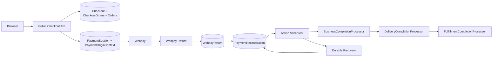
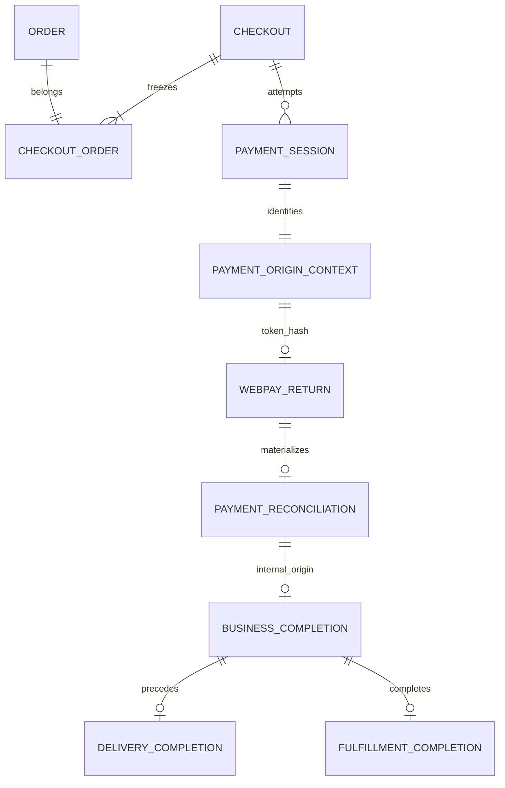
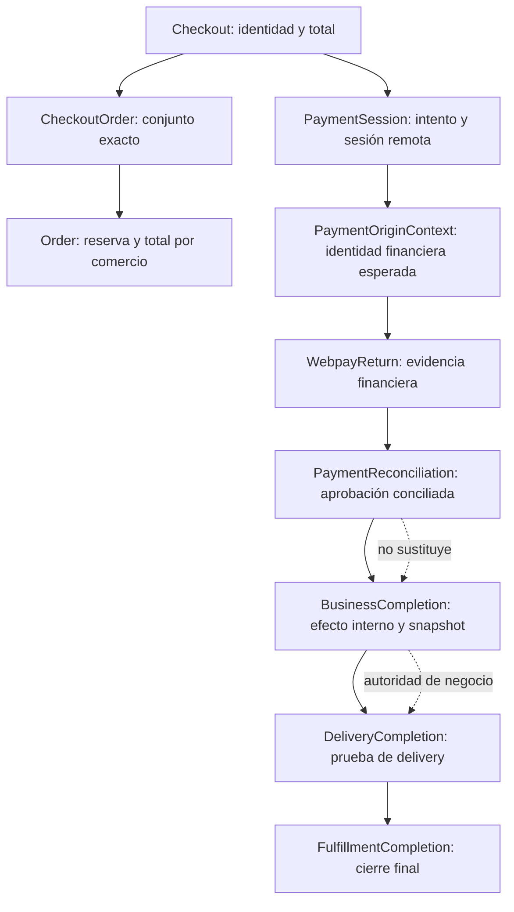
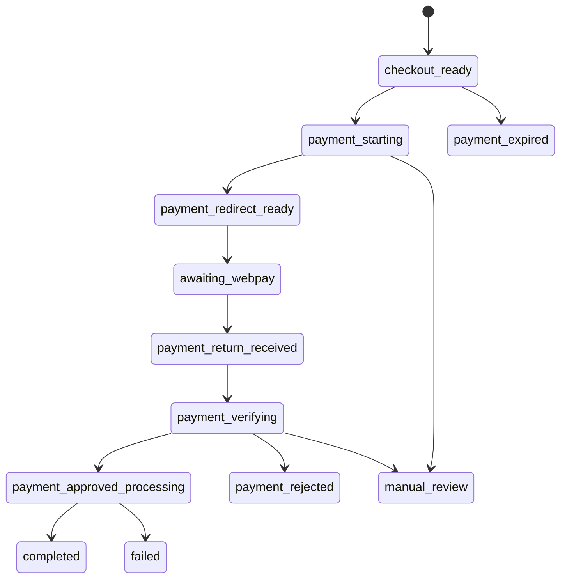
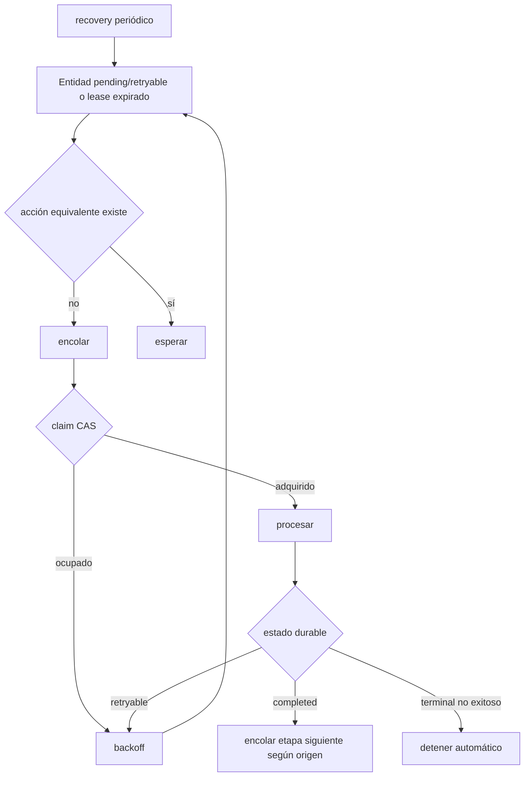

# VeciAhorra 28.7.5 — Public Checkout → Durable Payment Pipeline

## 1. Propósito y evidencia revisada

Este documento diseña la integración futura del checkout público propio con el pipeline durable existente. No autoriza código, esquemas ni migraciones.

Se revisaron los diseños de checkout público, sesión pública, retorno Webpay, materialización, reconciliación, BusinessCompletion, DeliveryCompletion y FulfillmentCompletion, junto con sus modelos, schemas, repositorios, rutas, servicios, leases, CAS, workers y recovery.

Hechos actuales relevantes:

- `CheckoutService` crea un `Checkout` opaco, sus `CheckoutOrder`, Orders `reserved` y reservas, con ownership `user` o `session`.
- `POST /veciahorra/v1/payments/session` y `GET /payments/session/{public_id}` existen y resuelven ownership desde WordPress o `CartSession`.
- `PaymentSessionService::start()` bloquea Checkout, CheckoutOrders y Orders; valida reservas, monto, fulfillment e idempotencia; crea una `PaymentSession` y cambia Checkout a `payment_started`.
- Hoy `start()` llama `createSession()` dentro de esa transacción local. Es una brecha: mantiene locks durante red y no representa de forma durable el resultado remoto ambiguo.
- El flujo público actual no crea `PaymentOriginContext`; `PaymentSession.payment_id` puede quedar nulo y Payment nace posteriormente en `BusinessCompletion`.
- `WebpayPaymentGateway` ya genera `buy_order` y `session_id` deterministas, valida CLP entero, URL/host y token; ofrece `recoverSession()`.
- `WebpayReturnService` persiste evidencia normalizada, materializa o reanuda una única `PaymentReconciliation` y agenda su worker.
- `DurablePaymentOrigin` ya admite `veciahorra_checkout`; `BusinessCompletionProcessor` exige ese origen, relee Checkout y PaymentSession por identidades selladas, materializa Payment, sella Orders/fulfillment y marca Orders pagadas.
- La orquestación origin-aware agenda Business solo para `veciahorra_checkout`; Delivery y Fulfillment ya tienen leases, CAS, unicidad y recovery.

## 2. Decisión principal

El intento durable nace en la operación pública “continuar al pago”, después de bloquear y validar el Checkout congelado, pero antes de cualquier llamada remota. En una transacción local corta se crean o recuperan conjuntamente:

1. una `PaymentSession.pending` con identidad pública e idempotencia;
2. un `PaymentOriginContext` con `origin=veciahorra_checkout`, referencias financieras esperadas y token aún nulo;
3. la transición CAS `Checkout.pending → payment_started`.

No se crea al inicializar Checkout: todavía podría no existir intención de pago. No se crea después de Webpay: se perdería la autoridad necesaria para validar/bindear la respuesta remota. Payment no necesita nacer aquí: el contrato real permite `PaymentSession.payment_id=NULL` y `BusinessCompletion` crea una única Payment ligada a reconciliación.

La llamada `Webpay create` ocurre después del commit local, sin locks. Su respuesta se vincula por CAS al mismo intento. Si es ambigua, no se crea otro intento ni se repite `create` a ciegas: se usa recuperación explícita por la identidad remota disponible; si esta no quedó durable, el intento termina en revisión/estado ambiguo según la integración futura.

## 3. Autoridad inicial: PaymentOriginContext

El componente futuro responsable es un coordinador de inicio de pago usado por `PaymentSessionService`, no el frontend ni el gateway. Dentro de la transacción local debe exigir:

- Checkout owned, `pending` o el mismo intento ya `payment_started`, no expirado/cancelado;
- `fulfillment_method` sellado (`pickup|delivery`);
- conjunto no vacío de CheckoutOrders, bloqueado y ordenado;
- Orders exactas en `reserved`, mismo owner y reservas activas;
- total exacto `Checkout.total_amount = Σ Order.total`, moneda `CLP` entera;
- ninguna sesión activa incompatible ni pago conciliado del conjunto.

Datos directos existentes del contexto: `public_id`, `site_scope`, `origin`, `origin_resource_id=Checkout.public_id`, `gateway_id=webpay_plus`, `payment_attempt_id=PaymentSession.public_id`, `origin_key`, `amount_clp`, `currency`, environment, merchant hash, `buy_order`, `financial_session_id`, token hash nullable, versión, timestamps y expiración. No almacena Payment, Orders ni fulfillment: se obtienen por las relaciones durables Checkout→CheckoutOrder→Order y Checkout/PaymentSession. El snapshot definitivo posterior queda en BusinessCompletion.

Cardinalidades:

- Checkout 1:N PaymentSession/intentos históricos, pero como máximo un intento activo compatible.
- PaymentSession 1:1 PaymentOriginContext mediante `payment_attempt_id=PaymentSession.public_id`; la unicidad existente de `payment_attempt_id` lo protege.
- Checkout 1:N CheckoutOrder y cada Order pertenece a un solo Checkout por `checkout_orders.order_id UNIQUE`.
- Un intento rechazado/expirado permanece como evidencia. Un intento nuevo requiere comando explícito, clave nueva y que ninguna autoridad indique pago aprobado/en proceso irreversible.
- Checkout completado no admite un nuevo intento. Pago tardío de intento antiguo no se descarta: se concilia contra su contexto y puede exigir `manual_review` si contradice el estado vigente.

## 4. PaymentSession e idempotencia

Comando real reutilizado: `POST /payments/session`, con `checkout_id` y header `Idempotency-Key`; ownership se deriva de usuario autenticado o sesión opaca, nunca del payload.

La clave se acota al Checkout/owner. El fingerprint actual incluye Checkout público, owner, moneda, monto, Orders ordenadas y fulfillment. Repetición idéntica recupera la sesión; misma clave con otro fingerprint devuelve `idempotency_conflict`; doble clic y concurrencia convergen por locks y `UNIQUE(checkout_id,idempotency_key)`.

Secuencia local/remota futura:

1. Transacción A: lock Checkout→CheckoutOrders→Orders; validar; crear/reusar PaymentSession y PaymentOriginContext; CAS Checkout; commit.
2. Sin locks: llamar `Webpay create` una vez para ese intento.
3. Transacción B: CAS de `PaymentSession.pending` a `ready|expired` y bind único del hash del token al contexto.
4. Si la respuesta se pierde, `GET /payments/session/{public_id}` recupera la autoridad local. Un recovery de sesión debe usar `recoverSession()` solo cuando existe referencia remota durable; nunca iniciar otro create implícito.

La expiración local es `PaymentSession.expires_at`, limitada por Checkout/reservas; la expiración remota no puede extenderla. El servidor, no el navegador, declara expiración. La política existente de Reservations decide liberación. Un nuevo intento solo nace tras cierre seguro del anterior.

Brecha: los estados actuales `pending|ready|confirmed|expired|cancelled` no expresan “create remoto ambiguo”, y `provider_session_id` se persiste después de la red. La implementación futura debe resolverlo con el cambio mínimo de persistencia/estado que una auditoría de esquema autorice; este documento no lo implementa.

## 5. Webpay

Se reutilizan `WebpayPaymentGateway`, configuración y retorno actuales:

- monto: entero CLP derivado del Checkout/Orders bloqueados;
- `buy_order`: `WebpayTransactionReference::buyOrder(checkoutPublicId,idempotencyKey)`, formato `VA` + 24 hex, estable en el intento y distinto en uno nuevo;
- `session_id`: `WebpayTransactionReference::sessionId(checkoutPublicId)`, opaco y no suficiente para autoridad;
- retorno: URL configurada `/payments/webpay/return`;
- token: nunca ID público ni autoridad; solo se conserva donde hoy es imprescindible y se liga por SHA-256 al contexto mediante CAS.

Fallos: rechazo conocido cierra/expone fallo recuperable sin aprobar; conexión/timeout es ambiguo hasta consultar; respuesta inválida no se vincula; si Webpay respondió pero falla persistencia, no se repite create; si bind falla, no se crea un contexto alternativo. No existe atomicidad distribuida.

## 6. Webpay Return

Secuencia existente a reutilizar:

1. recibir solo campos allowlist (`token_ws` o aborto soportado);
2. clasificar commit/abort;
3. hashear token y resolver `PaymentOriginContext` preexistente;
4. ejecutar un commit si no existe resultado terminal durable;
5. validar status, response code, amount, buy_order y session_id contra el contexto;
6. completar `WebpayReturn` con payload normalizado allowlist/fingerprint;
7. crear o reutilizar `PaymentReconciliation` por retorno, fingerprint y origin key;
8. encolar reconciliation_id mediante Action Scheduler;
9. responder sin esperar la cadena.

Retorno repetido usa evidencia persistida y `resume()`; token desconocido/incompatible no crea negocio; contexto vencido se trata según evidencia financiera y política de tardíos, nunca desde reloj del navegador; discrepancias terminan inconsistente/manual; commit aprobado no persistido exige recuperación financiera, no segundo commit ciego.

## 7. Reconciliación y completion existentes

`PaymentReconciliationProcessor` consume exclusivamente referencias de reconciliación, `DurablePaymentOrigin` y `ValidatedFinancialResult`; adquiere lease CAS, valida identidad/monto/moneda/gateway/fingerprint, renueva heartbeat y cierra `completed|retryable|permanent_failure|manual_review`. No crea Orders, Delivery ni Fulfillment.

Para `veciahorra_checkout`, el handler técnico reconoce el origen y la orquestación origin-aware agenda Business tras `completed`. `BusinessCompletionProcessor` es la autoridad de efecto interno: valida Checkout y PaymentSession sellados, bloquea Orders exactas, crea/reusa Payment, vincula Payment↔Orders, sella fulfillment, marca Orders pagadas y cierra por CAS. `UNIQUE(reconciliation_id)` da como máximo una BusinessCompletion.

DeliveryCompletion consume Business completada: pickup termina `not_required`; delivery crea/reusa exactamente una Delivery compatible por Order. FulfillmentCompletion exige Business sellada y Delivery terminal compatible. Ninguna etapa reconstruye autoridad ni añade efectos fuera de sus contratos.

## 8. Arquitectura y relaciones





## 9. Secuencia temporal completa

```mermaid
sequenceDiagram
  participant B as Browser
  participant A as Public Checkout API
  participant DB as Database
  participant W as Webpay
  participant R as Webpay Return
  participant AS as Action Scheduler
  participant PR as PaymentReconciliationProcessor
  participant BC as BusinessCompletionProcessor
  participant DC as DeliveryCompletionProcessor
  participant FC as FulfillmentCompletionProcessor
  B->>A: POST payment/session + checkout_id + Idempotency-Key
  A->>DB: TX lock Checkout, CheckoutOrders, Orders; validate
  A->>DB: create/reuse PaymentSession + PaymentOriginContext; CAS payment_started; COMMIT
  A->>W: create(buy_order, session_id, amount, return_url)
  W-->>A: token + URL
  A->>DB: TX bind token hash + CAS session ready; COMMIT
  A-->>B: public session + redirect URL
  B->>W: navigate/pay
  W->>R: token_ws
  R->>DB: resolve durable context
  R->>W: commit(token)
  W-->>R: normalized financial result
  R->>DB: persist WebpayReturn + create/reuse Reconciliation
  R->>AS: enqueue reconciliation_id
  R-->>B: processing/result reference
  AS->>PR: claim lease and process
  PR->>DB: validate + CAS completed
  AS->>BC: reconciliation_id (only veciahorra_checkout)
  BC->>DB: TX Payment + Orders + snapshot + CAS completed
  AS->>DC: business_completion_id
  DC->>DB: TX not_required or exact Deliveries + CAS
  AS->>FC: business_completion_id
  FC->>DB: verify sealed chain + CAS completed
  B->>A: GET observable status (poll/reload)
  A-->>B: safe visible state
```

## 10. Tabla de autoridades

| Autoridad | Decide | No decide | Nace cuando | Estado terminal | Recuperable por |
|---|---|---|---|---|---|
| Checkout | identidad, owner, total, fulfillment, vigencia | resultado financiero | creación persistente | expired/cancelled; completitud se deriva hoy | Checkout API/service |
| CheckoutOrder | conjunto exacto de Orders | pago | creación del Checkout | relación inmutable | locks/unique |
| Order | total por comercio, reserva/paid | aprobación Webpay | checkout persistente | paid/cancelled según dominio | servicios existentes |
| Payment | efecto financiero interno materializado | evidencia proveedor | BusinessCompletion | paid/fallo del dominio | BusinessCompletion |
| PaymentOriginContext | identidad esperada del intento | resultado financiero | inicio local de pago | evidencia histórica vinculada | repositorio/bind |
| PaymentSession | sesión pública/remota y expiración | negocio completado | inicio de pago | confirmed/expired/cancelled | API/recovery de sesión |
| WebpayReturn | evidencia del commit | Orders/fulfillment | retorno/commit | completed financiero | return resume |
| PaymentReconciliation | unión financiera-origen | Delivery/Orders directas | evidencia validada | completed/permanent_failure/manual_review | worker/recovery |
| BusinessCompletion | efecto interno y snapshot sellado | tracking | reconciliation interna completed | completed/permanent_failure/manual_review | worker/recovery |
| DeliveryCompletion | materialización exacta de Delivery | fulfillment final | Business elegible | completed/not_required/permanent_failure/manual_review | worker/recovery |
| FulfillmentCompletion | cierre del hito autorizado | efectos posteriores | Delivery terminal | completed/permanent_failure/manual_review | worker/recovery |

Fuentes de verdad: compra=Checkout; Orders=CheckoutOrder; monto=Checkout+Orders congeladas; intento=PaymentSession+PaymentOriginContext; evidencia=WebpayReturn; aprobación conciliada=PaymentReconciliation; negocio=BusinessCompletion; Delivery=DeliveryCompletion+Deliveries; fulfillment=FulfillmentCompletion; estado visible=proyección read-only de estas autoridades.



## 11. Estado público observable

Los nombres siguientes son una proyección conceptual, no columnas nuevas.

| Visible | Sustento durable | Terminal | Mensaje/acción segura |
|---|---|---:|---|
| checkout_ready | Checkout pending, Orders reserved | no | continuar al pago |
| payment_starting | Session pending/contexto creado | no | esperar/consultar |
| payment_redirect_ready | Session ready con URL válida | no | continuar a Webpay |
| awaiting_webpay | Session ready, sin retorno terminal | no | volver/consultar; no duplicar |
| payment_return_received | WebpayReturn processing/completed | no | verificando |
| payment_verifying | Reconciliation pending/processing | no | polling con backoff |
| payment_approved_processing | Reconciliation completed; Business/Delivery/Fulfillment no terminal | no | pago recibido, preparando compra |
| completed | Fulfillment completed | sí | compra completada |
| payment_rejected | retorno financiero rejected | sí para intento | iniciar nuevo intento explícito si permitido |
| payment_expired | Checkout/Session expirados sin aprobación | sí para intento | volver al carrito |
| manual_review | cualquier autoridad manual_review | sí automático | informar revisión sin detalle |
| failed | fallo permanente | sí | soporte/reintento solo si política lo permite |



La consulta futura debe usar `checkout_id`/`payment_session_id` públicos opacos más ownership. Autenticados usan sesión WordPress; invitados, la sesión opaca existente mientras sea válida. Polling: 1–2 s inicial, backoff hasta 10–15 s, detener en terminal o al expirar autorización. F5 y reapertura recuperan; otro navegador solo si puede demostrar la misma identidad. Nunca se exponen IDs internos, token, fingerprints, leases, CAS, acciones ni errores técnicos.

## 12. Locks, CAS y orden global

| Operación | Autoridad bloqueada | Tipo | Invariante | Duración |
|---|---|---|---|---|
| congelar/iniciar | Checkout | `FOR UPDATE` | owner, estado, intento único | TX corta |
| verificar conjunto | CheckoutOrder→Order IDs ascendentes | locks de lectura/escritura | conjunto/total/estado | misma TX |
| crear sesión/contexto | índices de idempotencia/origin key | UNIQUE + insert/CAS | una identidad lógica | misma TX |
| vincular create | PaymentSession+OriginContext | CAS estado/token nulo | una respuesta remota | TX corta posterior |
| reconciliation | fila Reconciliation | lease owner/version/expiry + CAS | un efecto lógico | lease durable |
| Business | Business→Reconciliation→Checkout→Session→Orders | locks existentes + CAS | Payment/snapshot/Orders atómicos | TX procesador |
| Delivery | Completion→Business→Orders→Deliveries | locks/unique/CAS | Delivery exacta | TX procesador |
| Fulfillment | Completion→Business→snapshot→Delivery | locks/CAS | cierre exacto | TX procesador |

Orden de inicio futuro: Checkout, CheckoutOrders por order_id, Orders por id, PaymentSession/OriginContext. Nunca se mantiene ningún lock durante Webpay. Leases no sustituyen transacciones; índices únicos no sustituyen CAS.

## 13. Action Scheduler y recovery

Acciones existentes: reconciliation por `reconciliation_id`; Business por `reconciliation_id`; Delivery/Fulfillment por `business_completion_id`. Hook+`authority_id`+grupo deduplican pending/in-progress; ejecución real es at-least-once y la seguridad proviene de UNIQUE, lease y CAS.

Backoff existente es exponencial acotado, máximo cinco intentos automáticos. `completed|permanent_failure|manual_review` no se readquieren. `processing` expirado sí. El barrido cada cinco minutos recupera reconciliaciones, Business interna, Delivery y Fulfillment elegibles. La política por origen impide Business para WooCommerce.



## 14. Exactly-once e idempotencia

| Componente | Ejecución física | Garantía lógica | Mecanismo | Evidencia durable |
|---|---|---|---|---|
| Checkout | at-least-once | uno por clave/owner | fingerprint+UNIQUE | Checkout |
| congelar Orders | relectura posible | conjunto único | CheckoutOrder UNIQUE+locks | relaciones/Orders |
| Payment | reintentos | una por reconciliación | UNIQUE reconciliation/idempotency | Payment |
| OriginContext | reintentos | uno por intento | origin/payment_attempt UNIQUE | contexto |
| PaymentSession | reintentos | una por checkout+key | fingerprint+UNIQUE | sesión |
| Webpay create | red, no exactly-once | un comando lógico; ambigüedad explícita | intento estable+status recovery | sesión/contexto |
| Webpay commit | red, no exactly-once físico | no repetir tras evidencia terminal | claim token+WebpayReturn | retorno |
| WebpayReturn | entregas duplicadas | una por token/fingerprint | UNIQUE+resume | retorno |
| Reconciliation create/process | at-least-once | una/efecto lógico uno | UNIQUE+lease+CAS | reconciliation |
| Business create/process | at-least-once | una/efecto atómico | UNIQUE+TX+CAS | Business+Payment+snapshot |
| Delivery create/process | at-least-once | una por Order | UNIQUE+TX+CAS | Completion+Delivery |
| Fulfillment create/process | at-least-once | uno por Business | UNIQUE+TX+CAS | FulfillmentCompletion |

## 15. Escenarios de recuperación

| Caso | Autoridad/detección | Recuperación e idempotencia | Visible/terminal |
|---|---|---|---|
| navegador cierra antes de URL | Session/contexto pending | GET sesión; no nuevo intento | payment_starting |
| cierra con URL/dentro Webpay | Session ready | reusar URL/consultar | awaiting_webpay |
| paga sin volver | proveedor/contexto; falta mecanismo push | status/recovery autorizado; no inferir | verifying/manual |
| retorno duplicado | WebpayReturn UNIQUE | replay/resume | mismo resultado |
| create timeout | intento local | `recoverSession` si referencia durable; si no, ambiguo | manual/recovery |
| commit timeout | retorno retryable/unknown | status soportado, nunca commit ciego | verifying/manual |
| aprobado antes de persistir | proveedor sin evidencia local | recuperación financiera explícita | verifying/manual |
| retorno sin reconciliation | WebpayReturn terminal | materializer resume | verifying |
| reconciliation sin acción | reconciliation pending | recovery encola | verifying |
| worker muerto/lease vencido | processing expirado | nuevo owner/version | processing |
| CAS perdido | estado releído | ganador o retry; perdedor sin éxito | processing/terminal |
| reconciliation completed sin Business | origen interno+ausencia | recovery encola Business | approved_processing |
| Business/Delivery/Fulfillment pendientes | autoridad propia | recovery+lease | approved_processing |
| acción duplicada terminal | entidad terminal | replay sin efectos | terminal |
| dos intentos concurrentes | locks+unique | uno activo; conflicto/reuse | mismo intento |
| intento reemplazado/pago tardío | contextos históricos | conciliar identidad exacta; contradicción manual | manual_review |

Cerrar el navegador después de aprobación no afecta progreso: Action Scheduler/recovery consumen autoridades. Si el usuario vuelve horas después, la proyección relee terminales; nunca reconstruye desde carrito.

## 16. Matriz de fallos completa

| Punto de fallo | Estado previo | Efecto posible | Detección/recuperación | ¿Repetible? / garantía | Visible |
|---|---|---|---|---|---|
| 1 antes de OriginContext | Checkout ready | ninguno | repetir comando | sí, idempotency | ready |
| 2 contexto sin Session | TX debe impedirlo | ninguno durable válido | rollback; si brecha, recovery/manual | no crear otro ciego | starting |
| 3 Session local, create no iniciado | pending | ninguno remoto | worker/comando recupera mismo intento | sí una vez lógica | starting |
| 4 create rechazado | intento local | rechazo conocido | cerrar/reintento explícito nuevo | no mismo create | rejected |
| 5 create aceptado, respuesta perdida | remoto posible | transacción viva | status recovery; manual si sin referencia | no create ciego | recovery |
| 6 URL recibida, persistencia falla | remoto creado | URL/token no ligados | status/bind seguro o manual | no duplicar | recovery |
| 7 abandono antes de pagar | ready | ninguno | expiración servidor | no automático | expired |
| 8 pago aprobado sin retorno | remoto aprobado | sin evidencia local | recovery proveedor requerido | no cobrar de nuevo | verifying |
| 9 retorno duplicado | retorno existe | ninguno nuevo | UNIQUE/resume | sí | mismo estado |
| 10 commit timeout | retorno reclamado | resultado incierto | status/manual | no commit ciego | verifying |
| 11 commit aprobado, retorno no persistido | remoto aprobado | evidencia perdida local | recuperación proveedor | no repetir efecto | manual |
| 12 retorno sin reconciliation | retorno terminal | negocio no iniciado | materializer resume | sí | verifying |
| 13 reconciliation sin acción | pending | ninguno | barrido periódico | sí/dedup | verifying |
| 14 worker muere processing | lease activo/expira | TX rollback o efecto handler | lease recovery+inspect | sí tras expiry | processing |
| 15 CAS final perdido | processing | efecto no confirmado | rollback/relectura | sí seguro | processing/manual |
| 16 completed sin Business | rec completed interna | negocio pendiente | recovery origin-aware | sí/UNIQUE | approved_processing |
| 17 Business sin acción | Business pending | ninguno | recovery | sí | approved_processing |
| 18 worker muere Business | processing | TX completa o rollback | lease+relectura | sí | approved_processing |
| 19 Delivery parcial | TX Delivery | commit completo o rollback | exact-set verification | sí/manual si contradicción | processing/manual |
| 20 Delivery pending | Business completed | ninguna Delivery final | recovery | sí | approved_processing |
| 21 Fulfillment pending | Delivery terminal | cierre pendiente | recovery | sí | approved_processing |
| 22 acción tras terminal | terminal | ninguno | terminal replay | sí, sin efecto | terminal |
| 23 usuario vuelve horas después | cualquier durable | ninguno | endpoint owned proyecta | lectura | real |
| 24 dos intentos concurrentes | Checkout locked | uno puede ganar | UNIQUE/CAS | loser reuse/conflict | starting |
| 25 pago tardío tras expiración | contexto histórico | aprobación real | reconciliar exacto; conflicto manual | no descartar | manual |
| 26 evidencia incompatible | evidencia+origen | ninguno negocio | evaluator | no automático | manual_review |

## 17. Seguridad

- IDs públicos: `chk_*`, `ps_*` y resultado público opaco; siempre con ownership y comparación segura.
- No exponer token, hashes, Payment/Origin/Reconciliation/Completion IDs, keys, leases, CAS, Action Scheduler, SQL, SDK, API key ni commerce secret.
- Validación estricta de tipos, allowlists, URLs HTTPS/host y CLP `^[1-9]\d*\.00$`; nunca floats.
- Retorno público no confía en user, monto, Checkout, Orders, fulfillment, buy_order ni session_id aportados por navegador.
- Logs redactan tokens/PII; errores públicos son códigos estables sin trazas.
- Rate limit para inicio/polling/retorno; nonce/CSRF donde corresponda; referencias no enumerables y acceso invitado expirable.
- Replay se absorbe con idempotencia/UNIQUE; no se revela si una referencia ajena existe.

## 18. Responsabilidades

| Componente | Responsabilidad | Entradas autoritativas | Salidas | Prohibiciones |
|---|---|---|---|---|
| Frontend | solicitar/mostrar/pollear | respuestas públicas | intención | decidir monto/estado |
| Checkout Controller/Service | ownership, crear/congelar compra | Cart/DB/identidad | Checkout+Orders | pago financiero |
| Payment Session Service | coordinar intento local/remoto | Checkout sellado+key | Session/contexto/URL | locks durante red; completar negocio |
| Origin Repository/Service | persistir identidad y bind token | intento servidor | contexto | reconstruir desde retorno |
| Webpay Gateway | create/status/commit normalizados | contexto gateway | resultado proveedor | negocio |
| Return Service | validar/persistir evidencia | token+contexto | retorno+reconciliation | Orders/Checkout heurísticos |
| ReconciliationProcessor | conciliar y CAS | origen+finanzas | reconciliación terminal | Delivery/Orders directas |
| BusinessProcessor | efecto interno/snapshot | reconciliation interna | Payment+Orders+Business | WooCommerce/Delivery |
| DeliveryProcessor | materializar etapa | Business sellada | DeliveryCompletion | redescubrir Orders |
| FulfillmentProcessor | cierre final | Business+Delivery | Fulfillment terminal | efectos nuevos |
| Action Scheduler | transportar comandos | IDs de autoridad | ejecuciones | ser fuente de verdad |
| Recovery | reencolar elegibles | estados/relaciones directas | acciones | reconstrucción/destrucción |
| Endpoint estado | proyectar con ownership | autoridades | estado seguro | detalles internos |

## 19. Taxonomía de errores

| Categoría | Detector | Retry/nueva autoridad | Progreso/visible |
|---|---|---|---|
| validación pública/checkout expirado/Order incompatible | API/Checkout | no hasta corregir; no crea | intacto/ready-expired |
| conflicto idempotencia/intento duplicado | Session Service | reuse o 409; no crea | existente/starting |
| gateway rechazado | Gateway | nuevo intento explícito si permitido | rejected |
| timeout/resultado remoto ambiguo | Gateway coordinator | status, no create ciego | recovery/manual |
| evidencia incompatible | evaluator | no automático | manual_review |
| persistencia transitoria | repositorio | retry mismo comando | processing |
| lease/CAS perdido | worker | relectura/backoff | processing |
| invariante durable violada | processor | manual/permanent; no nueva | manual/failed |

Todo error conserva evidencia y registra código sanitizado, correlación opaca y timestamps; nunca secretos o payload SDK completo.

## 20. Decisiones confirmadas, integraciones y brechas

### Decisiones confirmadas

- Checkout/CheckoutOrder congelan identidad, owner y Orders.
- PaymentSession pública, idempotencia y ownership ya existen.
- DurablePaymentOrigin ya soporta `veciahorra_checkout` y referencias Webpay.
- Return→Reconciliation→Business→Delivery→Fulfillment y recovery ya existen.
- Business crea Payment y sella Orders/fulfillment; no hace falta Payment prematura.

### Integraciones futuras necesarias

- Crear/reusar PaymentOriginContext junto a PaymentSession antes de Webpay.
- Separar la transacción local de `PaymentSessionService::start()` de la llamada de red.
- Bindear token hash y resultado de sesión por CAS.
- Proyectar estado completo en un recurso público owned sin exponer internals.
- Implementar recovery de creación remota ambigua y pruebas de concurrencia/crash.

### Brechas detectadas

| Brecha/riesgo | Responsable | Solución mínima futura | Código | Migración |
|---|---|---|---:|---:|
| público sin OriginContext; retorno no puede resolver autoridad | Session/origin integration | materializar contexto 1:1 por attempt | sí | quizá no; columnas ya existen |
| locks durante Webpay create | PaymentSessionService | TX A/remote/TX B | sí | no |
| create ambiguo no expresable de modo inequívoco | PaymentSession | estado/evidencia durable explícita | sí | probablemente sí, tras diseño |
| token/URL pueden perderse tras respuesta remota | coordinator | persistencia CAS y recovery status | sí | depende de evidencia requerida |
| `PaymentOriginContext` no tiene FK directa a Session | integración | usar unicidad `payment_attempt_id=ps_public_id`; evaluar FK futura | sí | opcional |
| estado público solo muestra Session, no pipeline completo | endpoint de lectura | proyección owned por relaciones durables | sí | no necesariamente |
| pago sin retorno requiere mecanismo de consulta disparado | recovery financiero | comando seguro `status` con referencia durable | sí | depende de ambigüedad |

### Fuera de alcance

Rediseñar Reconciliation/Business/Delivery/Fulfillment; cambios WooCommerce; gateways/webhooks nuevos; reembolsos/devoluciones; cancelación postpago; panel de conciliación; tablas; UI completa; migraciones; commit/push.

## 21. Resultado de la auditoría arquitectónica

### Primera pasada

Observaciones encontradas:

1. El primer borrador conceptual podía sugerir crear contexto al crear Checkout; se corrigió al límite exacto del comando de inicio, cuando Orders y monto están congelados.
2. El servicio actual mantiene locks durante `create`; se separó explícitamente en TX A, red y TX B.
3. Se podía interpretar `buy_order/session_id` como recuperadores de autoridad; se estableció que solo son referencias esperadas dentro del contexto.
4. Faltaba distinguir create remoto ambiguo de rechazo; se añadió como brecha que no permite retry ciego.
5. La proyección pública podía confundirse con nuevos estados persistidos; se declaró conceptual/read-only.

### Segunda pasada

Observaciones encontradas:

1. La relación contexto-sesión no tiene FK real; se corrigió describiendo la identidad existente por `payment_attempt_id` y marcando la FK como opcional futura, no existente.
2. “Pago aprobado sin retorno” no tiene recovery productivo completo demostrado; se retiró cualquier promesa y quedó como integración necesaria.
3. Se verificó la rama origin-aware: solo `veciahorra_checkout` activa Business; no se creó pipeline paralelo.
4. Se verificaron diagramas, tablas, locks y fallos contra las mismas autoridades y se aclaró que Payment nace en Business.
5. Se revisó seguridad: se eliminaron IDs internos de respuestas propuestas y se separaron referencias públicas de ownership.

Resultado final: no quedan observaciones arquitectónicas pendientes dentro del alcance documental. Las limitaciones no resueltas están declaradas como brechas futuras y no como garantías actuales.
