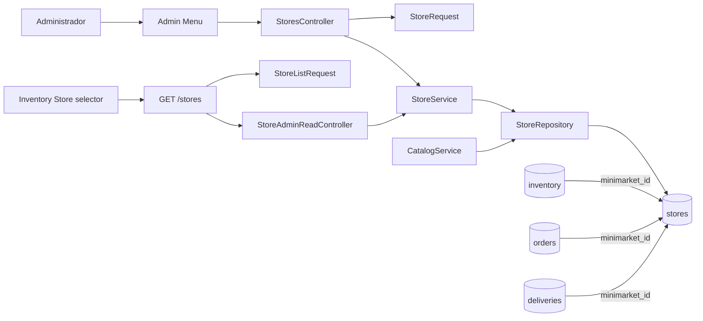
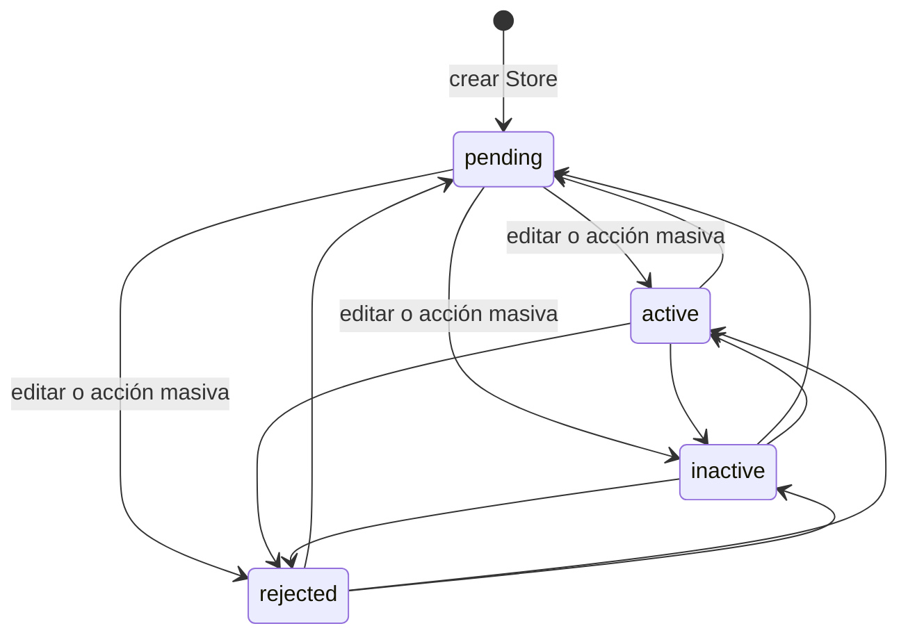
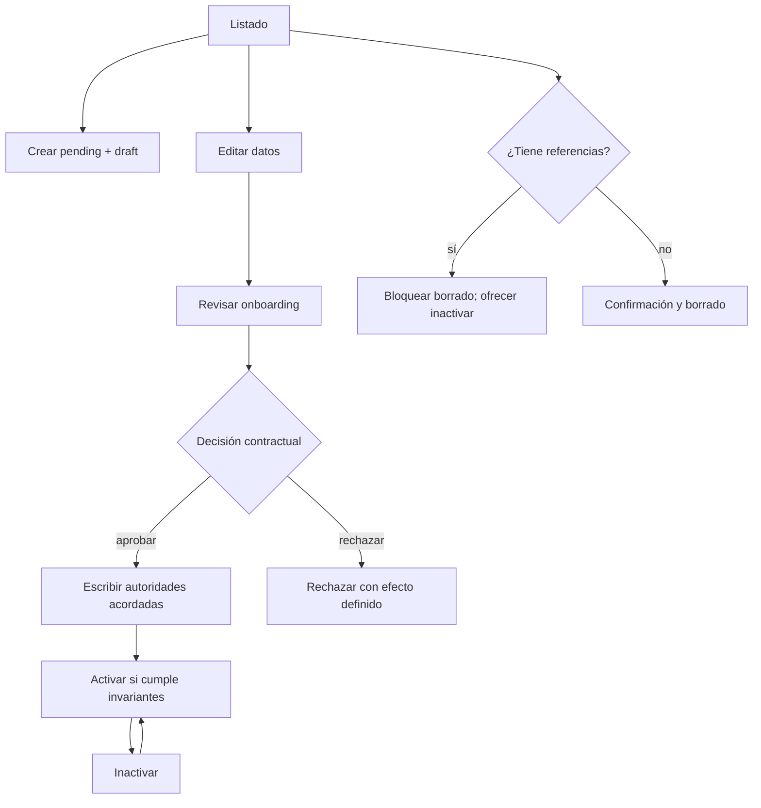

# Auditoría integral del módulo administrativo Store

## 1. Resumen ejecutivo

El módulo Store mantiene su autoridad durable en la tabla `stores`, identificada por el entero positivo `stores.id`. Dispone de un CRUD administrativo server-rendered, acciones masivas de estado y un endpoint REST administrativo de solo lectura consumido por el selector Store de Inventory. La identidad y los datos comerciales están centralizados, y el catálogo, carrito, Inventory, Orders, Delivery y Customer Panel conservan referencias durables mediante `minimarket_id`.

La principal conclusión es que Store posee tres dimensiones persistidas que hoy no forman un único flujo:

- `status` es la única dimensión operativa con escritores administrativos completos. Sus valores son `pending`, `active`, `inactive` y `rejected`.
- `onboarding_status` nace como `draft`, se expone en el DTO administrativo REST, pero no tiene escritor posterior localizado.
- `approved_at` existe y se expone, pero no tiene escritor localizado en el módulo Store.

El catálogo y el carrito consideran disponible una Store exclusivamente cuando `status = active`; no consultan onboarding ni aprobación. Por tanto, activar no equivale contractualmente a aprobar, aunque en la práctica habilita publicación y compra. Esta inconsistencia es la prioridad de diseño de la Serie 35.

Hay además un riesgo material de integridad: el administrador puede borrar físicamente una Store y el esquema no declara claves foráneas hacia Inventory, Orders, Reservations, Cart Items o Delivery. El borrado puede dejar referencias durables huérfanas. No debe ampliarse el CRUD antes de definir una política segura de eliminación.

La recomendación es comenzar con un diseño contractual de estados y aprobación, seguir con endurecimiento de eliminación e integridad, y después mejorar listado, formulario y dashboard como entregas separadas.

## 2. Alcance y metodología

La auditoría fue exclusivamente estática y de solo lectura. Se inspeccionaron:

- esquema, modelo, repositorio y servicio Store;
- menú, controlador, tablas y vistas administrativas;
- request de formulario y request REST de listado;
- ruta y controlador REST de solo lectura;
- escritores y lectores de `status`, `onboarding_status` y `approved_at`;
- referencias `minimarket_id` en Inventory, Cart, Reservations, Orders, Payments, Delivery y Customer Panel;
- contratos y pruebas manuales existentes;
- documentos arquitectónicos relacionados.

No se consultó ni modificó la base de datos. No se ejecutaron operaciones destructivas. Las afirmaciones de este documento derivan de archivos, métodos, esquemas y pruebas presentes en el repositorio.

## 3. Inventario arquitectónico

| Componente | Responsabilidad real | Dependencias principales |
|---|---|---|
| `app/Database/Tables/StoresTable.php` | Define la tabla durable `stores` | `TableBuilder` |
| `app/Modules/Stores/Models/Store.php` | Modelo dinámico de atributos Store | `Model` |
| `StoreRepository` | CRUD base, búsqueda, paginación, conteo, lectura pública activa y estado masivo | `BaseRepository`, `$wpdb` |
| `StoreService` | Fachada CRUD y validación del estado masivo | `StoreRepository`, `CrudService` |
| `StoreRequest` | Normaliza y valida POST administrativo de crear/editar | Nonce WordPress, sanitizadores WP |
| `StoreListRequest` | Valida query REST paginada | `StoreListValidationException` |
| `StoresController` | Orquesta listado, CRUD HTML y acciones masivas | `StoreService`, `StoreRequest`, `Flash` |
| `StoreAdminReadController` | Serializa el read model REST reducido | `StoreService` |
| `StoreRoutes` | Registra `GET /veciahorra/v1/stores` | REST API, `manage_options` |
| `app/Admin/Menu.php` | Registra páginas administrativas y oculta slugs internos | WordPress Admin Menu |
| `app/Admin/Tables/StoresTable.php` | Tabla WP, columnas, orden, paginación y acciones | `BaseListTable`, `StoreService` |
| `Views/index.php` | Navegación, filtros, búsqueda y tabla | WP List Table |
| `Views/form.php` | Formulario HTML de creación/edición | `Store` y helpers WP |
| `store-selector.js` | Combobox Store reutilizado por Inventory | `GET /stores`, DOM accesible |
| `inventory/api.js` | Cliente autenticado del listado Store | `fetch`, nonce REST |
| `InventoryReferenceValidator` | Verifica existencia y estado reconocido al crear Inventory | `StoreService` |
| `CatalogService` | Resuelve únicamente Stores activas para ofertas públicas | `StoreRepository::findActiveByIds()` |
| `CartRepository`/`CartService` | Resuelve y vuelve a validar Store activa | joins por `minimarket_id` |
| Orders/Reservations/Delivery | Congelan atribución durable a Store | columnas `minimarket_id` |
| Customer Panel | Proyecta nombre de Store para pedidos | join Orders → Stores |
| `store-admin-routes-test.php` | Cobertura REST, CRUD, filtros, permisos, DTO y estados | WordPress y base transaccional |
| Tests Inventory/Catalog/Cart/Checkout | Cobertura de referencia y visibilidad Store | repositorios y rutas reales |

`app/Modules/Stores/Module.php` no registra comportamiento; contiene sólo un marcador pendiente para 1.1. El registro efectivo ocurre en `Application.php` para REST y en `Admin/Menu.php` para las páginas HTML.

## 4. Autoridades y read models

### 4.1 Autoridades

| Concepto | Autoridad durable | Escritores verificados | Lectores relevantes |
|---|---|---|---|
| Identidad | `stores.id` | `BaseRepository::create()` | Todos los consumidores por `minimarket_id` |
| Nombre administrativo/público | `stores.business_name` | Crear y editar HTML | listado, selector, catálogo, Customer Panel |
| Estado operativo | `stores.status` | creación (`pending`), edición, acción masiva | Inventory, catálogo, carrito, REST admin |
| Onboarding | `stores.onboarding_status` | sólo creación (`draft`) | DTO REST administrativo; no se encontró regla operativa |
| Aprobación | `stores.approved_at` | ninguno localizado | DTO REST administrativo y pruebas |
| Datos legales/contacto | columnas de `stores` | crear y editar HTML | formulario/admin; no se exponen en DTO REST reducido |
| Ubicación | `commune`, `city`, `region` | crear y editar HTML | DTO REST decorativo del selector |

`selectedStore` en Inventory es decorativo. La autoridad durable de la asociación es `inventory.minimarket_id`. El nombre visible nunca debe usarse para persistir la relación.

### 4.2 Read models existentes

1. Modelo completo `Store`, hidratado desde `SELECT *`, usado por CRUD y servicios internos.
2. DTO REST administrativo reducido: `id`, `name`, `status`, `onboarding_status`, `approved_at`, `location`.
3. Read model público implícito de catálogo: mapa `store_id → business_name`, limitado a `status = active`.
4. Read model Cart: Inventory unido a Store, con `resolved_minimarket_id` y `minimarket_status`.
5. Proyección Customer Panel: Orders unidos a Store para obtener `minimarket_name`.

### 4.3 Consecuencias de estado

| Estado Store | Inventory existente | Crear Inventory | Catálogo/ofertas | Agregar/revalidar carrito | Administración |
|---|---|---|---|---|---|
| `pending` | permanece | permitido | excluido | rechazado como no disponible | editable/cambio masivo |
| `active` | permanece | permitido | incluido si Product/Inventory/precio/stock cumplen | permitido si demás invariantes cumplen | editable/cambio masivo |
| `inactive` | permanece | permitido | excluido | rechazado | editable/reactivable a `active` |
| `rejected` | permanece | permitido | excluido | rechazado | editable/cambio masivo |

`InventoryReferenceValidator` acepta los cuatro estados reconocidos. Esto permite preparar ofertas antes de la activación, pero no elimina ni suspende esas ofertas cuando Store deja de estar activa.

## 5. Contratos REST

### 5.1 `GET /wp-json/veciahorra/v1/stores`

| Aspecto | Contrato verificado |
|---|---|
| Método | GET |
| Permiso | `current_user_can('manage_options')` |
| Autenticación | Cookie WordPress; el consumidor Inventory envía `X-WP-Nonce` y `credentials: same-origin` |
| Caché | `Cache-Control: private, no-store` |
| `page` | entero 1..1.000.000; defecto 1 |
| `per_page` | entero 1..100; defecto 20 |
| `search` | texto opcional, trim/sanitize, máximo 100 caracteres |
| `status` | opcional: pending, active, inactive, rejected |
| `order_by` | business_name, id o status; defecto business_name |
| `direction` | ASC/DESC; defecto ASC |
| Búsqueda | business_name, owner_name, email o phone; LIKE escapado |
| Salida | `{success,data,meta}` con DTO reducido y metadata paginada |
| Error de entrada | 422 `validation_error`, con `details.field` |
| Error interno | 503 `store_admin_unavailable` sin detalle sensible |

El endpoint no escribe datos. La prueba `store-admin-routes-test.php` cubre permisos, ruta, paginación, empate determinista, búsqueda, filtro de cuatro estados, normalización, límites, DTO, privacidad, fallos de persistencia y CRUD de servicio.

Es un contrato administrativo reutilizable para consumidores con `manage_options`, no un endpoint público. Hoy su consumidor productivo directo es el selector Store de Inventory. Su DTO reducido y paginación lo hacen reutilizable para futuros controles administrativos, pero no sustituye un detalle de Store ni un API CRUD.

### 5.2 CRUD HTML

Crear, editar, borrar y acciones masivas no son contratos REST. Operan mediante páginas `admin.php` y POST/GET protegidos por capacidades y nonces. No existe REST Store de escritura.

## 6. Análisis del listado administrativo

### 6.1 Flujo actual

- Acceso: VeciAhorra → Minimarkets, capability `manage_options`.
- Crear: enlace `+ Nuevo Minimarket` a página interna oculta.
- Editar y eliminar: enlaces por fila.
- Buscar: caja WP por nombre comercial, propietario, email o teléfono.
- Filtrar: enlaces Todos/Pending/Active/Inactive/Rejected.
- Ordenar: ID y Nombre; el repositorio también soporta owner_name/status.
- Paginar: WP List Table, con `perPage = 2` fijo.
- Acciones masivas: marcar pendiente, activar, desactivar o rechazar.

### 6.2 Columnas y presentación

Columnas: checkbox, ID, Nombre, Propietario, Estado y Acciones. Los valores se escapan como texto. No existen badges semánticos ni columna de onboarding/aprobación. El estado se muestra como código crudo.

### 6.3 Estados UI

WP List Table provee tabla, paginación y estado sin filas. Los mensajes de éxito/error usan `Flash`. No hay estado de carga porque el render es síncrono. Los fallos controlados redirigen con flash; no existe recuperación inline ni persistencia completa de orden/página tras acciones. La acción masiva conserva `status` y búsqueda, pero no `paged`, `orderby` o `order`.

### 6.4 Accesibilidad y responsive

Se reutiliza la semántica base de WordPress para tabla, búsqueda y formularios. Los inputs tienen labels. Las brechas verificadas son:

- checkbox de cabecera sin texto accesible explícito en el HTML propio;
- confirmación de borrado mediante atributo inline `onclick` y diálogo nativo;
- estados como texto inglés sin explicación operativa;
- no hay CSS Store específico ni diseño responsive propio; se depende del admin de WordPress;
- dirección usa `style="width:500px"`, que puede desbordar en pantallas estrechas.

### 6.5 Clasificación

- Defecto operativo: paginación fija de dos filas, impropia de un listado productivo.
- Riesgo funcional: eliminar está disponible sin comprobar referencias.
- Brecha operativa: no se muestran onboarding ni aprobación.
- Refinamiento opcional: badges y traducción consistente de estados.

## 7. Creación y edición

| Campo | Requerido UI/backend | Normalización/validación | Mutable | Exposición/uso |
|---|---|---|---|---|
| business_name | sí/sí | text, trim implícito al validar, máx. 150 | sí | admin, selector, catálogo, Customer Panel |
| legal_name | no/no | text, máx. 150 | sí | sólo admin localizado |
| owner_name | sí/sí | text, máx. 150 | sí | admin; también searchable |
| rut | no/no | text, máx. 20 | sí | admin |
| email | sí/sí | `sanitize_email`, `is_email`, máx. 150 | sí | admin; searchable |
| phone | no/no | text, máx. 30 | sí | admin; searchable |
| mobile | no/no | text, máx. 30 | sí | admin |
| address | no/no | text, máx. 255 | sí | admin |
| commune/city/region | no/no | text y límites 120 | sí | admin y DTO REST reducido |
| status | no en create; sí en edit | enum de cuatro estados | sí en edit/masivo | autoridad operativa |
| onboarding_status | no visible | create fuerza `draft` | sin escritor posterior | DTO REST |
| approved_at | no visible | no se escribe | sin escritor localizado | DTO REST |
| created_at/updated_at | automáticos | `current_time('mysql')` | updated_at automático | auditoría interna |

La creación fija `pending + draft`. La edición envía todos los campos editables y `status`, pero no onboarding ni aprobación. No hay validación de unicidad para RUT/email localizada en Store ni índices únicos declarados en el esquema. Legal name, RUT, teléfono y dirección existen como datos durables aunque varios carecen de consumidores operativos fuera del admin.

Los errores de validación se convierten en flash y redirección. El formulario no repuebla explícitamente los valores POST rechazados, por lo que una creación inválida puede obligar a reingresar datos.

## 8. Matriz de estados y transiciones

### 8.1 Flujo implementado y ejecutable

Todas las transiciones entre los cuatro estados son ejecutables, individuales o masivas, sin guardas adicionales. Son reversibles. `rejected` no es terminal. “Suspender” no existe como valor; la aproximación actual sería `inactive`. “Reactivar” equivale técnicamente a escribir `active`, no a una transición contractual separada.

### 8.2 Onboarding y aprobación

| Dimensión | Datos representables | Escritor actual | Transiciones ejecutables |
|---|---|---|---|
| operativo | pending/active/inactive/rejected | formulario y masivo | cualquiera → cualquiera |
| onboarding | string, defecto draft | creación | sólo nacimiento en draft |
| aprobación | datetime nullable | ninguno localizado | ninguna |

No existe invariante que impida `status=active`, `onboarding_status=draft`, `approved_at=null`. Tampoco se limpia o fija `approved_at` al rechazar/reactivar.

### 8.3 Flujo deseado versus existente

El flujo deseado “revisar → aprobar/rechazar → activar” no puede presentarse como implementado. Antes debe decidirse si aprobar:

1. cambia `status` a active;
2. completa onboarding;
3. escribe `approved_at`;
4. ejecuta una combinación atómica de las tres.

Esa decisión es contractual y debe preceder a cualquier UI nueva.

## 9. Permisos y seguridad

- Todas las páginas se registran con `manage_options`.
- El REST GET usa `permission_callback` con `manage_options`.
- Crear/editar usan `check_admin_referer('veciahorra_store')`.
- Borrar usa `check_admin_referer('veciahorra_delete_store')`.
- Masivos verifican nonce dedicado y `manage_options` explícito.
- IDs se convierten a entero/`absint`; editar/borrar rechazan ID no positivo.
- El DTO REST excluye legal_name, owner_name, RUT, email, teléfonos, dirección y timestamps.
- El endpoint devuelve 422 para query inválida y 503 genérico para fallos internos.
- Los formularios escapan valores y el listado escapa celdas.

Riesgos:

- borrado es GET con nonce, no POST/DELETE; aunque protegido contra CSRF, no es semánticamente idempotente ni seguro;
- no existe autorización más granular que `manage_options`;
- el bulk update no verifica existencia individual: reporta filas afectadas y tolera IDs inexistentes;
- el CRUD HTML no tiene códigos HTTP/errores estructurados comparables al REST;
- no se comprueban referencias antes de borrar.

## 10. Relaciones e integridad

| Módulo/tabla | Relación durable | Comportamiento ante Store no activa o ausente |
|---|---|---|
| Inventory | `inventory.minimarket_id` | registro permanece; catálogo lo oculta si Store no activa/ausente |
| Catalog | resuelve Inventory y `findActiveByIds()` | sólo Store active publica |
| Cart | `cart_items.minimarket_id` + Inventory | revalida identidad y status active; referencia obsoleta falla |
| Reservations | `reservations.minimarket_id` | snapshot durable, sin FK declarada |
| Orders | `orders.minimarket_id` | atribución principal de pedido |
| Order Items | `inventory_id`/`product_id` | Store se atribuye por Order |
| Checkout | agrupa por `minimarket_id` | genera un Order por Store |
| Payments | payment_orders → orders | atribución indirecta inequívoca por Order |
| Delivery | `deliveries.minimarket_id` | valida coherencia con Order en servicios |
| Customer Panel | Orders LEFT JOIN Stores | puede caer a nombre genérico si falta Store |

No se observan claves foráneas en los esquemas examinados; hay índices, pero no cascadas ni restricciones referenciales DB. `StoreService::delete()` ejecuta borrado físico genérico. Inventory puede quedar huérfano; Orders y Delivery históricos pueden conservar IDs sin Store resoluble. La eliminación actual no es segura cuando existen dependencias.

Desactivar o rechazar no modifica Inventory. Esta decisión preserva ofertas para eventual reactivación y el catálogo las excluye dinámicamente. Es consistente para operación reversible, pero requiere comunicar que Inventory sigue existiendo.

Product no referencia Store directamente: la relación se materializa por Inventory. Payment referencia Store indirectamente mediante Orders. No se verificó una autoridad Store propia en Payment.

## 11. Viabilidad del dashboard

| Métrica | Fuente durable/atribución | Viabilidad | Limitaciones |
|---|---|---|---|
| Productos distintos asociados | `COUNT(DISTINCT inventory.product_id)` por minimarket_id | alta | incluye Inventory inactivo salvo filtro explícito |
| Inventarios totales | Inventory por minimarket_id | alta | huérfanos y estados históricos cuentan |
| Inventarios activos | Inventory status=active | alta | no implica publicación |
| Ofertas publicables | Product active + Inventory active + stock>0 + price>0 + Store active | alta como read model | definición debe reutilizar CatalogService para evitar divergencia |
| Stock agregado | SUM inventory.stock | alta | debe decidir total versus sólo publicable; stock no equivale a unidades vendibles reservadas |
| Pedidos | Orders por minimarket_id | alta | definir si todos o por estado/periodo |
| Unidades vendidas | Orders → Order Items, SUM quantity | media-alta | requiere definir estados que constituyen venta |
| Ventas brutas | SUM orders.total | media-alta | “bruta” debe definir estados incluidos y moneda |
| Ventas pagadas | Orders status=paid o evidencia Payment vinculada | media | elegir autoridad: estado Order versus payment/payment_orders; evitar doble conteo |
| Canceladas/fallidas | Orders y/o Checkout/Payment statuses | media-baja | múltiples máquinas de estado; “fallida” no es una categoría Store inequívoca sin definición |

El dashboard es viable como read model sin nuevas columnas para conteos operativos básicos. Métricas financieras requieren una definición de negocio y una consulta que parta de `orders.minimarket_id`, enlace `payment_orders` y respete la autoridad financiera confirmada. No debe inferirse venta pagada sólo de Delivery o Checkout.

## 12. Fortalezas

1. Identidad durable simple y usada consistentemente mediante `minimarket_id`.
2. Búsqueda/paginación REST administrativa validada, acotada y privada.
3. DTO REST reducido que no expone datos personales o legales innecesarios.
4. Consultas preparadas, allowlists de orden y escape de LIKE.
5. Catálogo y carrito revalidan Store activa; una desactivación corta publicación y compra sin reescribir Inventory.
6. Nonces y capability administrativa cubren CRUD y masivos.
7. Inventory conserva Store inmutable al editar.
8. Relaciones de Orders y Delivery permiten atribución durable para read models futuros.
9. Pruebas amplias de ruta Store, selector Inventory, integridad, catálogo y carrito.

## 13. Inconsistencias y defectos funcionales

| Severidad | Hallazgo | Evidencia | Consecuencia |
|---|---|---|---|
| alta | Borrado físico sin guardas referenciales | `StoresController::delete()`, CRUD base, esquemas sin FK | referencias huérfanas e historia incompleta |
| alta | Active no exige onboarding ni aprobación | escritores separados/ausentes; catálogo sólo lee status | Store draft/no aprobada puede publicarse |
| media | Onboarding y aprobación sin flujo ejecutable | sólo create escribe draft; ningún escritor de approved_at | datos estancados y UI futura sin autoridad |
| media | Paginación administrativa fija en 2 | `StoresTable::prepare_items()` | operación ineficiente |
| media | Formulario pierde valores tras error | flash + redirect sin repoblado | retrabajo y riesgo de errores de carga |
| baja | Estado sin badges/traducción y onboarding invisible | tabla/vista | difícil lectura operativa |
| baja | Dirección con ancho inline rígido | `form.php` | posible desborde responsive |

## 14. Deuda técnica, de pruebas y documental

### 14.1 Técnica

- `StoreService` hereda CRUD genérico sin invariantes de dominio para update/delete.
- `Store` es un modelo sin constantes ni máquina de estados.
- Estados se duplican en request, servicio, controlador, read controller, list request, vista y pruebas.
- CRUD HTML y listado REST implementan dos read paths con defaults distintos (`id DESC` frente a `business_name ASC`).
- `StoreRepository::search()` puede cargar todos los registros cuando no hay término; el selector usa correctamente `paginate()`.
- `Module.php` no representa el registro real del módulo.
- Formulario y controlador contienen formato/indentación irregular, sin implicar por sí mismo defecto funcional.

### 14.2 Pruebas

- Hay cobertura sólida del REST administrativo y Store selector.
- Falta un harness de navegador específico del listado/formulario Store.
- No hay prueba que certifique una política de borrado con Inventory/Orders asociados.
- No hay pruebas de transición coordinada onboarding/aprobación porque esa transición no existe.
- No hay prueba responsive/accesible dedicada al formulario Store.
- No existe cobertura de dashboard porque no hay read model de dashboard.

### 14.3 Documental

- No existe contrato único de significado para pending/active/inactive/rejected.
- No está documentado si rejected es terminal o reversible; el código lo hace reversible.
- No se define relación normativa entre active, onboarding draft y approved_at.
- No se define retención histórica ni política de eliminación.

## 15. Flujo administrativo ideal

### 15.1 Solución mínima recomendada

1. **Listado:** mostrar estado operativo, onboarding y aprobación; conservar búsqueda/filtros; paginación configurable razonable.
2. **Crear:** capturar datos administrativos y crear `pending + draft`; conservar valores ante error.
3. **Editar datos:** permitir corregir información sin mezclar implícitamente aprobación.
4. **Revisar onboarding:** pantalla/acción explícita sólo después de definir estados permitidos de onboarding.
5. **Aprobar/rechazar:** transición atómica definida documentalmente; no asumir que equivale sólo a `status`.
6. **Activar/inactivar:** permitir sólo transiciones compatibles con la decisión de aprobación.
7. **Eliminar:** bloquear si existen referencias; preferir inactivación. Definir archivo/soft delete sólo en un hito posterior si negocio lo aprueba.

### 15.2 Acciones por estado, sujetas a decisión contractual

| Estado | Acción mínima segura hoy | Acción que requiere diseño |
|---|---|---|
| pending | editar, inactivar, rechazar | aprobar/completar onboarding |
| active | editar, inactivar | suspender como concepto separado |
| inactive | editar, activar sólo si se define guardia | reactivar con auditoría |
| rejected | editar, volver a pending sólo si negocio lo permite | reabrir onboarding/aprobar |

Mensajes deben explicar el efecto: activar publica ofertas elegibles; inactivar/rechazar oculta ofertas y bloquea compras nuevas, pero no elimina Inventory ni pedidos históricos. Acciones masivas incompatibles deben rechazarse de forma determinista y reportar filas afectadas.

### 15.3 Mejoras posteriores

- detalle administrativo con métricas;
- historial/auditoría de transiciones;
- capacidades más granulares;
- read model materializado sólo si medición demuestra que las consultas agregadas no bastan;
- soft delete o archivo, tras decisión de retención.

### 15.4 Alcances que requieren nueva autoridad

- documentos/evidencias de onboarding;
- quién aprobó/rechazó y motivo;
- suspensión distinta de inactive;
- historial de transiciones;
- conciliación financiera por Store;
- propietarios Store con acceso administrativo propio.

## 16. Propuesta detallada de la Serie 35

### 35.1 Diseño contractual de Store

- **35.1.1:** definición documental de `status`, onboarding y aprobación.
- **35.1.2:** matriz de transiciones, invariantes y efectos sobre catálogo/carrito.
- **35.1.3:** política de eliminación, retención e integridad histórica.
- **Cierre:** decisión explícita sobre active versus approved; ninguna implementación antes de resolverla.

### 35.2 Integridad y listado administrativo

- **35.2.1:** read check de dependencias Store en Inventory/Orders/Delivery.
- **35.2.2:** bloquear borrado referenciado con mensaje y pruebas; sin cascadas.
- **35.2.3:** paginación configurable, filtros/orden/contexto persistentes.
- **35.2.4:** columnas/badges y acciones compatibles, con accesibilidad y navegador.

### 35.3 Formulario, estados y revisión

- **35.3.1:** centralizar allowlist/transiciones operativas según 35.1.
- **35.3.2:** contrato campo por campo y recuperación de errores.
- **35.3.3:** formulario responsive y revisión/aprobación sólo si 35.1 autoriza escritores concretos.
- **35.3.4:** certificar CRUD, permisos, CSRF, transiciones y efectos públicos.

### 35.4 Dashboard Store

- **35.4.1:** diseño semántico de métricas y estados financieros incluidos.
- **35.4.2:** read model básico de Inventory/productos/stock/publicables.
- **35.4.3:** read model Orders/unidades/ventas con atribución por minimarket_id.
- **35.4.4:** UI del dashboard y pruebas de consistencia con fuentes durables.

### 35.5 Certificación y cierre

- regresión Inventory selector;
- catálogo, ficha, carrito y checkout;
- Orders, Delivery y Customer Panel;
- permisos, nonces, borrado bloqueado y estados;
- auditoría de contratos, migraciones y Git.

Cada microhito debe cerrar con pruebas específicas, diff acotado y ausencia de cambios ajenos. El dashboard depende de 35.1 y 35.2; no debe precederlos.

## 17. Riesgos y decisiones pendientes

1. ¿`active` requiere `approved_at` y onboarding completo?
2. ¿Qué valores válidos tendrá onboarding y quién los escribe?
3. ¿Rechazo es terminal, revisable o reversible?
4. ¿Inactive significa suspensión, cierre voluntario o pausa operativa?
5. ¿Se permite crear Inventory para Store no activa? El código actual sí.
6. ¿Qué sucede con carritos, reservas y pedidos cuando Store se inactiva?
7. ¿Borrado se elimina, se bloquea o evoluciona a archivo/soft delete?
8. ¿Qué estado exacto define pedido vendido, cancelado y fallido para métricas?
9. ¿Se necesita actor, motivo y timestamp para cada transición?
10. ¿RUT/email requieren unicidad contractual?

## 18. Conclusión y recomendación

Store ya tiene una base funcional útil: identidad durable, CRUD administrativo, listado REST seguro, selección en Inventory y gating público por estado activo. No necesita una reescritura general.

La Serie 35 debe resolver primero la ambigüedad entre estado operativo, onboarding y aprobación, y proteger la integridad frente al borrado físico. Sólo después conviene mejorar listado/formulario y construir métricas. Implementar aprobación, suspensión o dashboard antes de esas decisiones crearía autoridades paralelas y resultados financieros ambiguos.

La secuencia recomendada es: contrato de estados → integridad/eliminación → listado → formulario/revisión → dashboard → certificación integral.
