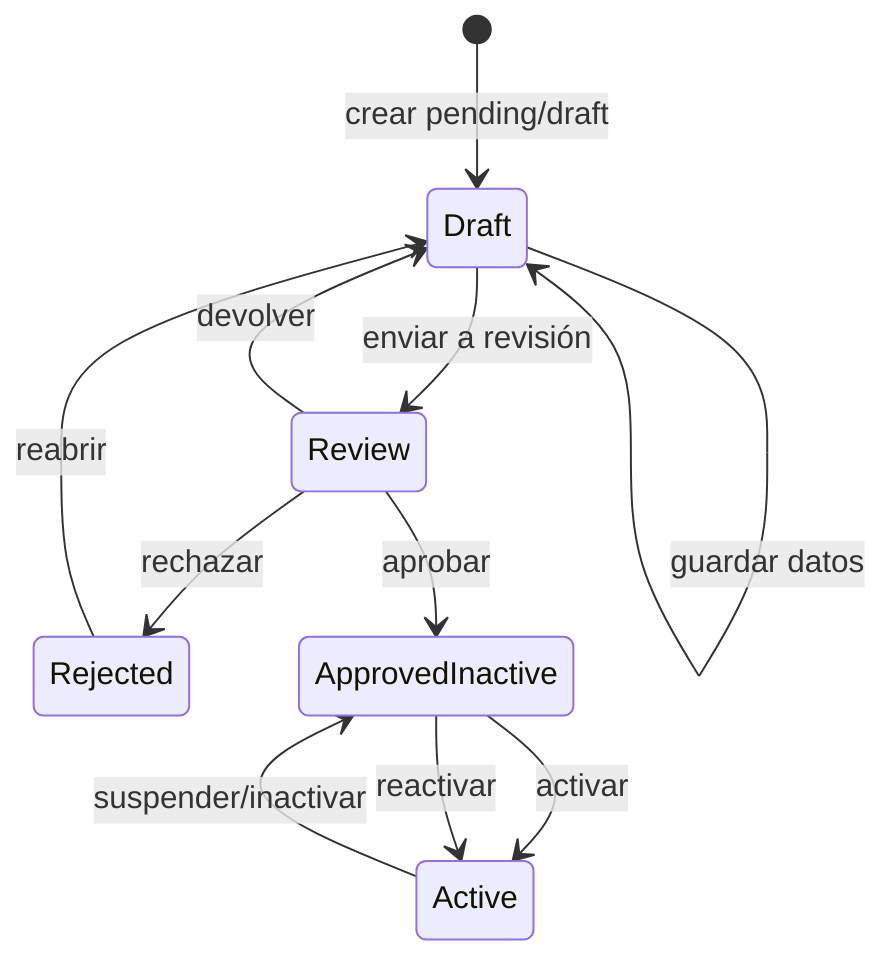
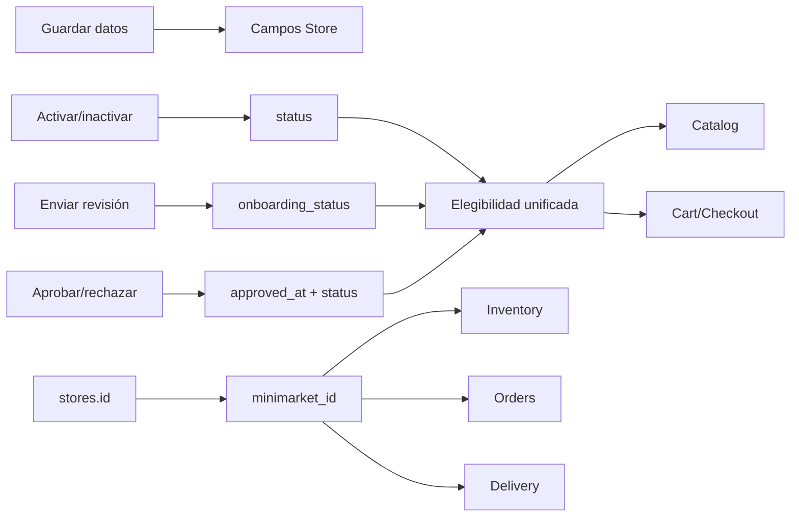
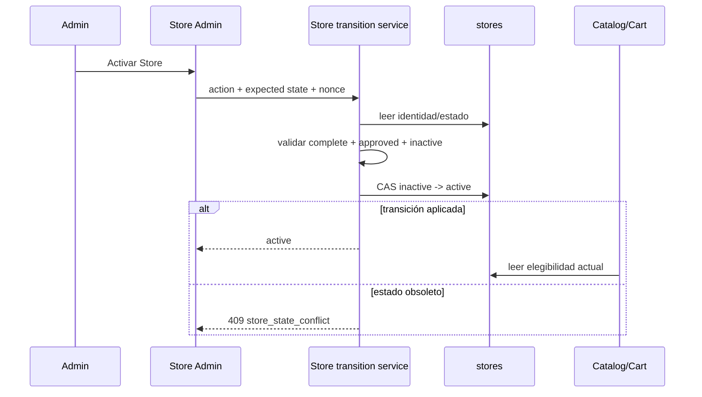

# Diseño contractual del ciclo de vida administrativo Store

## 1. Resumen ejecutivo

Este diseño define un ciclo ejecutable usando exclusivamente las autoridades durables actuales:

- `stores.id`: identidad;
- `stores.status`: disponibilidad operativa;
- `stores.onboarding_status`: completitud del expediente;
- `stores.approved_at`: evidencia de aprobación administrativa;
- `stores.business_name`: nombre administrativo y público;
- `minimarket_id`: referencia durable desde otros módulos.

No se requieren columnas, tablas ni estados nuevos para un flujo mínimo coherente. Los valores de onboarding observados en el repositorio son `draft` y `complete`; los estados operativos existentes son `pending`, `active`, `inactive` y `rejected`.

El modelo recomendado separa cuatro acciones que hoy están mezcladas:

1. guardar datos no cambia el ciclo de vida;
2. enviar a revisión cambia onboarding de `draft` a `complete` y conserva `pending`;
3. aprobar escribe `approved_at` y deja la Store `inactive`;
4. activar cambia únicamente `status` de `inactive` a `active` cuando onboarding y aprobación cumplen sus invariantes.

`inactive` representa indisponibilidad operativa reversible. No puede distinguir “suspensión”, “pausa” y “retiro” porque no existe autoridad durable para el motivo. `rejected` representa exclusivamente un resultado negativo de revisión anterior a aprobación; una Store aprobada no se rechaza, se inactiva. `approved_at` es evidencia histórica y no se limpia mediante transiciones ordinarias.

La eliminación física se permite sólo para Stores sin ninguna referencia durable. En cualquier otro caso debe bloquearse y ofrecer inactivación. Inventory y las operaciones históricas se conservan en todas las transiciones.

## 2. Autoridades y semántica

### 2.1 Mapa contractual

| Autoridad | Semántica exacta | Valores válidos verificados | Escritor actual | Escritor objetivo | Lectores | Edición directa |
|---|---|---|---|---|---|---|
| `stores.id` | identidad durable e inmutable | entero positivo | repositorio al crear | repositorio al crear | todos por `minimarket_id` | no |
| `stores.business_name` | nombre legible administrativo y público | texto no vacío, máx. 150 | formulario Store | edición de datos | admin, selector, catálogo, Customer Panel | sí, como dato |
| `stores.onboarding_status` | completitud administrativa del expediente; no aprobación | `draft`, `complete` observados | create fija `draft`; no hay escritor posterior | servicio de transición | admin/read model; no gobierna hoy catálogo | no; sólo acción dedicada |
| `stores.approved_at` | instante de la primera aprobación administrativa válida | null o datetime | ninguno localizado | acción aprobar | admin/read model | no |
| `stores.status` | disponibilidad operativa y resultado de revisión | pending, active, inactive, rejected | create, edit y masivos | servicio de transición | Inventory, Catalog, Cart, admin | no en edición ordinaria |
| `minimarket_id` | atribución durable a Store | ID Store positivo | módulos propietarios de cada relación | sin cambio | Inventory, Cart, Reservations, Orders, Delivery | según contrato del módulo; inmutable en Inventory edit |

### 2.2 Relaciones entre autoridades

- `draft` significa que el expediente puede editarse y todavía no se declara completo.
- `complete` significa que los datos mínimos fueron validados y enviados a revisión. No significa aprobado.
- `approved_at IS NOT NULL` prueba que un administrador aprobó el expediente en ese instante. No prueba que la Store esté activa ahora.
- `pending` significa no habilitada operativamente y pendiente de decisión/revisión.
- `active` significa habilitada para nuevas operaciones y publicación, sujeto a las reglas propias de Product e Inventory.
- `inactive` significa previamente aprobada pero no disponible para nuevas operaciones.
- `rejected` significa revisión negativa de una Store no aprobada.

### 2.3 Invariantes de combinación

Las combinaciones canónicas son:

| Fase | onboarding | approved_at | status |
|---|---|---|---|
| borrador | draft | null | pending |
| en revisión | complete | null | pending |
| rechazada | complete | null | rejected |
| aprobada, aún no activa | complete | datetime | inactive |
| activa | complete | datetime | active |
| suspendida/inactiva | complete | datetime | inactive |

Cualquier otra combinación es inconsistente y debe bloquear transiciones hasta una corrección administrativa controlada. No se diseña en este microhito una reparación automática de datos preexistentes.

### 2.4 Edición de datos

Una edición ordinaria puede escribir datos comerciales, legales, contacto y ubicación, además de `updated_at`. No puede escribir `status`, `onboarding_status` ni `approved_at`. Cambiar `business_name` no cambia identidad ni referencias.

## 3. Modelo de estados

### 3.1 Onboarding

| Valor | Significado | Entrada | Salida | Actor | Datos mínimos | Reversible | Impacto operativo |
|---|---|---|---|---|---|---|---|
| draft | expediente editable no presentado | creación o devolución explícita desde rejected | enviar a revisión | `manage_options` | campos válidos de creación para guardar; checklist completo para enviar | sí mientras no aprobado | no publica ni permite nuevas compras |
| complete | expediente declarado completo y revisable | enviar a revisión | aprobar o rechazar | `manage_options` | business_name, owner_name, email válido y todos los requisitos de negocio que 35.1.1 concrete | sólo rejected puede volver a draft | por sí solo no habilita operación |

`complete` aparece en pruebas y datos de soporte, aunque carece de escritor productivo actual. El contrato objetivo lo adopta porque `draft` por sí solo no representa “expediente presentado” y `complete` ya pertenece al vocabulario existente. No se introduce `in_review`: `status=pending + onboarding=complete + approved_at=null` representa revisión.

### 3.2 Aprobación

`approved_at` prueba que una acción administrativa de aprobación culminó satisfactoriamente para la Store identificada. Reglas:

- se escribe con hora del servidor en la transición aprobar;
- sólo `manage_options` puede escribirlo inicialmente;
- requiere onboarding `complete`, status `pending` y `approved_at=null`;
- aprobar deja `status=inactive`, no active;
- no se limpia al inactivar, suspender o reactivar;
- no se sobrescribe al reactivar;
- una Store con `approved_at` no puede pasar a `rejected` ni `draft`;
- el rechazo se representa mediante `status=rejected` con `approved_at=null`;
- un cambio/caducidad de aprobación necesitaría motivo, actor e historia: autoridades inexistentes, decisión pendiente.

La fecha es evidencia de primera aprobación, no historial completo. Si negocio necesita reaprobación, vencimiento o revocación, el esquema actual es insuficiente y deberá diseñarse una autoridad adicional antes de implementarlo.

### 3.3 Estado operativo

| Status | Significado contractual | Inventory | Catalog/nuevas compras | Históricos | Modificador objetivo |
|---|---|---|---|---|---|
| pending | no habilitada, expediente draft o en revisión | se conserva; creación puede mantenerse por compatibilidad inicial | no publica/no compra | sin cambio | acciones de revisión |
| inactive | aprobada pero indisponible operativamente | se conserva y sigue editable | no publica/no compra | Orders/Payments/Delivery continúan | suspender/inactivar o aprobar |
| active | habilitada operativamente | se conserva y editable | publica ofertas elegibles y permite nuevas compras | sin cambio | activar/reactivar |
| rejected | revisión rechazada, nunca aprobada | se conserva; nueva creación de Inventory debe evaluarse en implementación | no publica/no compra | sin cambio | rechazar/devolver a draft |

Precondiciones de activar/reactivar: onboarding complete, `approved_at` válido, status inactive y datos requeridos válidos. La activación desde pending o rejected se rechaza.

## 4. Invariantes

### 4.1 Invariantes objetivo obligatorios

1. `status=active` implica `onboarding_status=complete`.
2. `status=active` implica `approved_at IS NOT NULL`.
3. `status=rejected` implica `approved_at IS NULL`.
4. Una Store rejected no puede activarse; debe volver a draft, completar y aprobarse.
5. `approved_at IS NOT NULL` implica onboarding complete y status active/inactive.
6. Suspender/inactivar conserva onboarding, aprobación, Store, Inventory y referencias.
7. Ninguna transición de Store modifica ni elimina Orders, Payments, Reservations o Deliveries históricos.
8. Ninguna transición masiva elude las mismas precondiciones del flujo individual.
9. Catalog y Cart deben reutilizar una misma definición de elegibilidad Store: active y, tras la migración contractual, complete + approved.
10. Inventory conserva `minimarket_id`; cambiar estado Store nunca reasigna ofertas.
11. El backend valida toda transición independientemente del frontend.
12. Las transiciones son atómicas y comparan el estado esperado para impedir escrituras perdidas.
13. `approved_at` no se borra ni reescribe mediante transiciones ordinarias.
14. Borrar físicamente requiere cero referencias en todas las relaciones conocidas.

### 4.2 Cobertura actual versus futura

| Invariante | Existe hoy | Trabajo posterior |
|---|---:|---|
| sólo Store active publica | sí | extender a complete + approved de forma coordinada |
| Cart rechaza Store no active/ausente | sí | alinear con definición central |
| Inventory conserva asociación | sí | mantener regresión |
| transiciones no alteran históricos | de hecho, sí | certificar explícitamente |
| active exige onboarding complete | no | servicio de transición + readers |
| active exige approved_at | no | servicio de transición + readers |
| rejected no activa | no | matriz backend |
| approved_at se conserva | no hay escritor | implementar sólo mediante transición |
| borrado referenciado bloqueado | no | comprobación de dependencias |
| concurrencia optimista | no | compare-and-set con estado esperado |

## 5. Matriz de transiciones

Todos los cambios requieren `manage_options`, nonce válido en HTML o autenticación/nonce REST, y confirmación sólo cuando se indique. El código interno sugerido usa 409 para conflictos de estado y 422 para datos/precondiciones semánticas.

| Estado inicial | Acción | Onboarding resultante | approved_at | Status resultante | Validación/confirmación | Efecto Inventory/Catalog | Reversible |
|---|---|---|---|---|---|---|---|
| inexistente | crear borrador | draft | null | pending | datos requeridos válidos; sin confirmación | no Inventory afectado; no publica | sí mediante edición |
| cualquiera existente | guardar edición | sin cambio | sin cambio | sin cambio | campos válidos; sin confirmación | Inventory/publicación no cambian | sí con nueva edición |
| pending+draft | enviar a revisión | complete | null | pending | checklist completo; confirmar envío | conserva Inventory; no publica | mediante devolución autorizada antes de aprobar |
| pending+complete | aprobar | complete | now | inactive | aprobación explícita y estado esperado; confirmar | conserva Inventory; aún no publica | aprobación no se revierte con autoridad actual |
| pending+complete | rechazar | complete | null | rejected | motivo sería deseable pero no es durable hoy; confirmar | conserva Inventory; no publica | sí, devolver a draft |
| inactive+complete+approved | activar/reactivar | complete | conserva | active | datos válidos y Store no rechazada; confirmar efecto público | Inventory elegible vuelve a publicar automáticamente | sí, inactivar |
| active | suspender/inactivar | complete | conserva | inactive | confirmar interrupción de nuevas operaciones | conserva Inventory; deja de publicar/comprar inmediatamente | sí, reactivar |
| rejected+complete+unapproved | devolver a borrador | draft | null | pending | confirmar reapertura | conserva Inventory; no publica | sí, nuevo envío |
| pending+complete | devolver a borrador | draft | null | pending | sólo antes de aprobación; confirmar si revisión comenzó | conserva Inventory; no publica | sí |
| inactive | retirar administrativamente | sin cambio | conserva | inactive | **no representable como cambio durable distinto** | ya no publica; históricos intactos | indistinguible de inactivar |
| Store sin referencias | eliminar físicamente | n/a | n/a | inexistente | comprobación atómica de dependencias + confirmación reforzada | no debe existir Inventory; no impacto histórico | no |
| Store referenciada | eliminar físicamente | sin cambio | conserva | sin cambio | bloquear | ninguno | n/a |

### 5.1 Acciones bloqueadas

- activar desde pending, rejected o draft;
- rechazar una Store aprobada;
- devolver a draft una Store aprobada;
- aprobar un expediente draft;
- aprobar dos veces;
- activar una Store ya active;
- inactivar una Store ya inactive;
- borrar una Store referenciada;
- distinguir retiro permanente de suspensión usando sólo inactive;
- revocar aprobación o registrar motivo/actor sin nuevas autoridades.

### 5.2 Semántica de Inventory

Por compatibilidad y preservación de trabajo, las transiciones no cambian Inventory. La creación de Inventory para pending/inactive/rejected hoy está permitida. La recomendación incremental es:

- permitir crear/editar Inventory para draft, pending e inactive mientras se define operación interna;
- bloquear nueva Inventory para rejected como endurecimiento posterior, si negocio confirma que un rechazo cierra preparación;
- nunca reactivar Inventory masivamente: al activar Store, las Inventory ya active y elegibles reaparecen automáticamente por read model;
- no cambiar `inventory.status` al inactivar Store.

## 6. Flujo administrativo objetivo



### 6.1 Navegación y vistas

1. **Listado:** búsqueda, filtros y badges separados para Operación, Onboarding y Aprobación.
2. **Crear Store:** guarda borrador y vuelve a detalle/edición con mensaje de éxito.
3. **Detalle/edición:** secciones Datos, Ciclo de vida, Dependencias y Acciones.
4. **Revisión:** puede ser un modo de detalle, no necesariamente una página nueva.
5. **Retorno:** listado conserva búsqueda, filtros, orden y página mediante contexto explícito validado.

### 6.2 Acciones por fase

| Fase | Primaria | Secundarias |
|---|---|---|
| draft | Guardar datos | Enviar a revisión, volver al listado |
| review | Aprobar | Rechazar, devolver a borrador, editar datos sin transición |
| rejected | Volver a borrador | editar datos, volver al listado |
| approved inactive | Activar | editar datos, eliminar sólo si no tiene referencias |
| active | Guardar datos | Suspender/inactivar |
| inactive | Reactivar | editar datos; borrado normalmente bloqueado por referencias |

### 6.3 Reglas UX

- guardar datos y transicionar son submits/botones diferentes;
- no mostrar selector libre de status en edición ordinaria;
- acciones incompatibles no se renderizan y el backend igualmente las rechaza;
- dobles envíos se previenen deshabilitando el control y con compare-and-set backend;
- ante 422 se conservan valores, foco y mensajes por campo;
- ante 409 se recarga la autoridad durable y se explica el cambio concurrente;
- las confirmaciones describen efecto en catálogo/nuevas compras, no sólo el nombre de la acción;
- badges tienen texto además de color;
- mensajes usan regiones accesibles; foco va al resumen de error;
- controles nativos, labels, teclado completo y foco visible;
- no usar atributos inline para confirmaciones;
- éxito de transición muestra estado resultante y conserva contexto de listado.

## 7. Política de eliminación e integridad referencial

### 7.1 Alternativas

| Alternativa | Integridad/trazabilidad | Compatibilidad | Complejidad | Riesgo | Evaluación |
|---|---|---|---|---|---|
| físico sin restricciones | rompe referencias e historia | coincide con CRUD actual | baja | crítico | rechazada |
| físico bloqueado si hay referencias | preserva historia | compatible; endurece delete | media | bajo si check es completo | recomendada para Stores vírgenes |
| retiro lógico con inactive | preserva todo | usa estado actual | baja | no distingue motivo/retiro | recomendada para Stores operadas |
| combinación | conserva historia y limpia borradores nunca usados | compatible | media | carrera entre check/delete | recomendación final con transacción/CAS |

### 7.2 Política recomendada

1. La acción administrativa normal es inactivar, no borrar.
2. El borrado físico sólo está disponible si Store nunca fue referenciada.
3. Antes de borrar se consultan explícitamente, al menos: Inventory, Cart Items, Reservations, Orders y Delivery. Checkout y Payments se atribuyen mediante Orders; deben incluirse en la revisión de dependencias, aunque la existencia de Order ya bloquee.
4. Check y delete deben ejecutarse atómicamente o con protección contra carrera.
5. Si hay cualquier referencia, responder `store_referenced` y mostrar conteos no sensibles.
6. No aplicar cascadas ni borrar relaciones.
7. La ausencia de FK obliga a validar en servicio; una migración de FK queda fuera hasta auditar datos huérfanos.

`inactive` no prueba retiro permanente. Mostrar una acción “Retirar” que sólo escribe inactive sería engañoso. Se puede ofrecer “Inactivar” y dejar retiro como decisión pendiente.

## 8. Contratos de error

Formato recomendado coherente con APIs existentes:

```json
{
  "success": false,
  "error": {
    "code": "store_invalid_transition",
    "message": "La Store no puede activarse desde su estado actual.",
    "details": {
      "field": "status",
      "reason": "store_rejected"
    }
  }
}
```

| Caso | HTTP | code | field | reason | Mensaje administrativo | Reintento |
|---|---:|---|---|---|---|---|
| inexistente | 404 | store_not_found | store_id | store_not_found | No se encontró el minimarket. | no sin cambiar ID |
| transición inválida | 409 | store_invalid_transition | status | invalid_source_state | La acción no está permitida desde el estado actual. | tras recargar/cambiar estado |
| onboarding incompleto | 422 | store_onboarding_incomplete | onboarding_status | required_data_missing | Complete los datos requeridos antes de enviar o aprobar. | sí, corrigiendo |
| no aprobada | 422 | store_not_approved | approved_at | approval_required | Apruebe el minimarket antes de activarlo. | sí, aprobando |
| rechazada | 409 | store_rejected | status | rejected_requires_draft | Devuelva el minimarket a borrador antes de reiniciar la revisión. | sí, otra transición |
| ya activa | 409 | store_already_active | status | already_active | El minimarket ya está activo. | no |
| ya inactiva | 409 | store_already_inactive | status | already_inactive | El minimarket ya está inactivo. | no |
| referenciada | 409 | store_referenced | store_id | durable_references_exist | No puede eliminarse porque conserva relaciones operativas o históricas. | no; inactivar |
| concurrencia | 409 | store_state_conflict | null | stale_state | Otro proceso modificó el minimarket. Recargue antes de continuar. | sí |
| datos inválidos | 422 | validation_error | campo concreto | invalid_value/required/too_long | Corrija los campos indicados. | sí |
| sin permisos | 403 | rest_forbidden | null | insufficient_capability | No tiene permisos para realizar esta acción. | no con mismo usuario |
| nonce/sesión | 403 | invalid_nonce | null | csrf_or_expired_session | La solicitud expiró. Recargue e inténtelo nuevamente. | sí tras recarga |

Una caída de persistencia no debe convertirse en transición inválida: usar 503 `store_admin_unavailable`, mensaje genérico y `retryable=true` cuando corresponda.

## 9. Permisos

### 9.1 Contrato de esta serie

`manage_options` continúa siendo la única capability implementada y es suficiente para la primera Serie 35 porque todas las acciones actuales ya dependen de ella. Debe exigirse en:

- listar y ver detalle;
- crear y editar datos;
- enviar/devolver onboarding;
- aprobar/rechazar;
- activar/inactivar/reactivar;
- eliminar.

Cada ruta/página debe validar capability en el punto de operación, no depender sólo de que el menú esté oculto.

### 9.2 Separación futura

Separar `manage_stores`, `review_stores`, `operate_stores` y `delete_stores` puede ser deseable, pero exige definir roles, migración y ownership. Se documenta como decisión futura; no se implementa ni se presupone.

## 10. Impacto en Inventory y Catalog

| Fase Store | Crear Inventory | Editar Inventory | Publicar Catalog | Nuevas compras | Históricos |
|---|---|---|---|---|---|
| draft/pending | permitido inicialmente por compatibilidad | sí | no | no | intactos |
| review/pending | permitido inicialmente | sí | no | no | intactos |
| rejected | recomendación: bloquear nueva creación tras microhito específico | sí para preservar/corregir datos | no | no | intactos |
| approved/inactive | sí | sí | no | no | intactos |
| active | sí | sí | sí, si Product/Inventory/precio/stock cumplen | sí | intactos |
| suspended/inactive | sí para preparación interna | sí | no | no | intactos |

### 10.1 Definición unificada de elegibilidad

Después de introducir transiciones y sanear datos, una Store es operativamente elegible si:

```text
status = active
AND onboarding_status = complete
AND approved_at IS NOT NULL
```

Catalog y Cart deben consumir la misma regla de dominio/read model. El cambio no puede desplegarse antes de auditar Stores active inconsistentes, porque hoy Catalog sólo exige status active.

### 10.2 Reacción a transiciones

- aprobar no publica: queda inactive;
- activar vuelve publicables automáticamente las Inventory elegibles;
- inactivar oculta ofertas y bloquea nuevas compras inmediatamente;
- reactivar no cambia Inventory y recupera publicación automática;
- rechazar conserva Inventory pero la oculta;
- ninguna transición cancela Orders, Payments, Reservations o Deliveries ya creados;
- carritos existentes se revalidan y pueden informar Store no disponible;
- no hay reactivación masiva de Inventory ni escrituras destructivas derivadas.

## 11. Diagramas de autoridad y secuencia





## 12. Decisiones adoptadas

1. No agregar columnas ni tablas para el flujo mínimo.
2. Adoptar sólo onboarding `draft` y `complete`, ambos observados.
3. Representar revisión como pending + complete + approved_at null.
4. Aprobar escribe `approved_at` y produce inactive, no active.
5. Activación es una acción explícita posterior.
6. Rejected es rechazo preaprobación y no activa directamente.
7. Inactive es indisponibilidad reversible; conserva aprobación.
8. `approved_at` no se limpia mediante transiciones ordinarias.
9. Cambios de ciclo de vida no modifican Inventory ni históricos.
10. Eliminación física sólo para Store sin referencias; las demás se inactivan.
11. Backend es autoridad de transición; frontend sólo guía.
12. Catalog y Cart deben converger en una regla de elegibilidad común.
13. La edición de datos no puede cambiar ciclo de vida implícitamente.

## 13. Decisiones pendientes

1. Checklist exacto para considerar onboarding complete más allá de los tres campos requeridos actuales.
2. Si nueva Inventory debe bloquearse también para draft/pending/inactive o sólo rejected.
3. Necesidad de guardar actor y motivo de aprobación/rechazo/suspensión.
4. Reaprobación, vencimiento o revocación; no representables con un solo approved_at histórico.
5. Distinción durable entre suspensión, pausa voluntaria, cierre y retiro.
6. Capabilities Store específicas y roles responsables.
7. Estrategia CAS: comparar `updated_at` o introducir versión; una columna nueva requeriría microhito/migración explícitos.
8. Tratamiento inicial de Stores active con draft o approved_at null antes de endurecer Catalog.
9. Unicidad contractual de RUT/email.
10. Conteos exactos que se mostrarán al bloquear eliminación.

## 14. Plan incremental de implementación

### 35.1.1 — Contrato backend de estados

- **Objetivo:** centralizar vocabulario, combinaciones canónicas y validador puro.
- **Capas:** modelo/DTO de dominio Store, servicio de ciclo de vida, excepciones.
- **Dependencias:** decisiones 1, 7 y 8 pendientes resueltas para su alcance.
- **Aceptación:** edición genérica no escribe ciclo; transiciones inválidas fallan; sin REST aún.
- **Regresiones:** CRUD Store, Store selector, Inventory reference.
- **Negativo:** sin UI, migración ni cambio público.

### 35.1.2 — Transiciones y concurrencia

- **Objetivo:** implementar enviar, devolver, aprobar, rechazar, activar e inactivar/reactivar con compare-and-set.
- **Capas:** StoreService, StoreRepository, contratos de error.
- **Dependencias:** 35.1.1 y estrategia CAS.
- **Aceptación:** matriz completa, atomicidad y approved_at preservado.
- **Regresiones:** acciones masivas y CRUD.
- **Negativo:** sin listado/formulario.

### 35.1.3 — Integridad de eliminación

- **Objetivo:** detectar relaciones y bloquear delete referenciado.
- **Capas:** read service/repository de dependencias, StoreService, controlador HTML.
- **Dependencias:** inventario exhaustivo de relaciones.
- **Aceptación:** cero cascadas; Store virgen eliminable; Store referenciada intacta.
- **Regresiones:** Inventory, Cart, Orders, Reservations, Delivery, Customer Panel.
- **Negativo:** sin FK ni soft delete.

### 35.1.4 — Exposición REST de detalle/transiciones

- **Objetivo:** contratos administrativos autenticados para detalle y acciones explícitas.
- **Capas:** routes, request, controller, serializer, nonce/capability.
- **Dependencias:** 35.1.2/35.1.3.
- **Aceptación:** HTTP/códigos/reason según sección 8; DTO sin datos sensibles innecesarios.
- **Regresiones:** `GET /stores` del selector permanece compatible.
- **Negativo:** sin UI.

### 35.2.1 — Diseño e implementación del listado

- **Objetivo:** mostrar las tres autoridades y acciones válidas.
- **Capas:** WP List Table/vista o cliente admin decidido, CSS acotado.
- **Dependencias:** REST/transiciones estables.
- **Aceptación:** badges accesibles, paginación razonable, filtros/contexto persistentes.
- **Regresiones:** selector Inventory y menú Store.
- **Negativo:** sin dashboard.

### 35.2.2 — Formulario de datos robusto

- **Objetivo:** separar guardado de transiciones y conservar valores/errores.
- **Capas:** StoreRequest, controlador/vista, validación accesible.
- **Dependencias:** 35.1.1.
- **Aceptación:** no hay transición implícita; responsive; doble submit prevenido.
- **Regresiones:** create/edit y nonces.
- **Negativo:** sin revisión todavía.

### 35.2.3 — Acciones de revisión y operación

- **Objetivo:** integrar enviar/aprobar/rechazar/activar/inactivar/reactivar.
- **Capas:** detalle/formulario, API/acciones, mensajes y confirmaciones.
- **Dependencias:** 35.1.4 y 35.2.2.
- **Aceptación:** sólo acciones válidas visibles; 409 recuperable; foco y live regions.
- **Regresiones:** Catalog, ficha, Cart y Checkout.
- **Negativo:** sin nuevas capabilities ni historial.

### 35.2.4 — Elegibilidad unificada y saneamiento controlado

- **Objetivo:** alinear Catalog/Cart con complete + approved + active.
- **Capas:** regla de dominio/read model, CatalogService, CartService.
- **Dependencias:** auditoría y tratamiento explícito de datos inconsistentes.
- **Aceptación:** misma matriz en Catalog/Cart; ninguna publicación accidental; sin cambios destructivos de Inventory.
- **Regresiones:** catálogo, ofertas, carrito, checkout.
- **Negativo:** sin corrección automática no aprobada.

### 35.2.5 — Pruebas y certificación

- **Objetivo:** certificar ciclo completo y eliminación.
- **Capas:** pruebas PHP/WordPress y navegador.
- **Dependencias:** todos los anteriores.
- **Aceptación:** matriz de transición, concurrencia, permisos, CSRF, integridad y efectos públicos en verde.
- **Regresiones:** Product→Inventory, Orders, Payment, Delivery y Customer Panel.
- **Negativo:** sin dashboard ni refactor ajeno.

## 15. Criterios de certificación

La implementación futura no se considera cerrada hasta demostrar:

1. creación produce exactamente pending/draft/null;
2. guardar datos no cambia autoridades de ciclo;
3. enviar revisión produce pending/complete/null;
4. aprobar produce inactive/complete/datetime;
5. activar exige complete + approved e informa impacto público;
6. rejected no activa y puede volver a draft de forma explícita;
7. inactivar/reactivar conserva approved_at e Inventory;
8. Catalog y Cart aplican la misma elegibilidad;
9. ninguna transición modifica históricos;
10. delete referenciado devuelve 409 y no borra nada;
11. delete de Store virgen es atómico y confirmado;
12. concurrencia obsoleta devuelve 409 sin escritura perdida;
13. `manage_options` y nonce se verifican por operación;
14. el endpoint `GET /stores` mantiene DTO, paginación y selector Inventory;
15. errores 404/409/422/403/503 conservan su semántica;
16. formularios conservan valores y anuncian errores;
17. listado conserva filtros y muestra badges accesibles;
18. regresiones Inventory, Catalog, Cart, Checkout, Orders, Delivery y Customer Panel pasan;
19. no existen cascadas, borrados masivos ni reasignaciones implícitas;
20. diff, lint, pruebas y auditoría Git quedan limpios.
