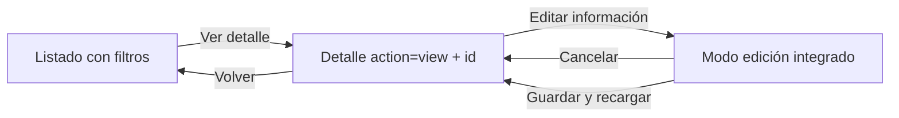
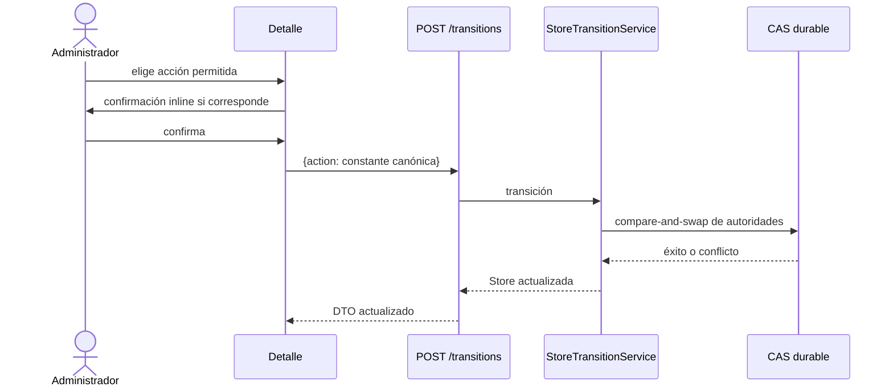
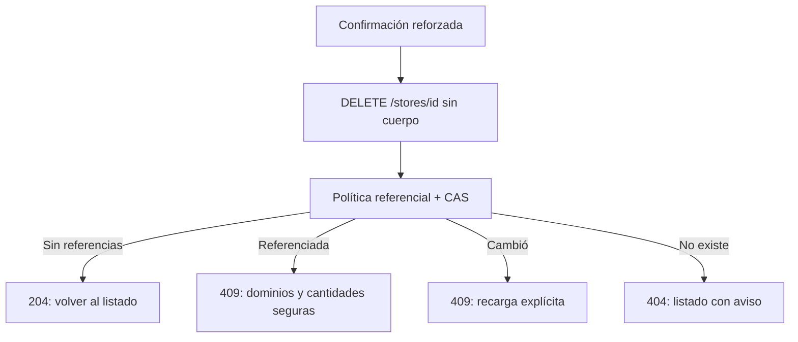
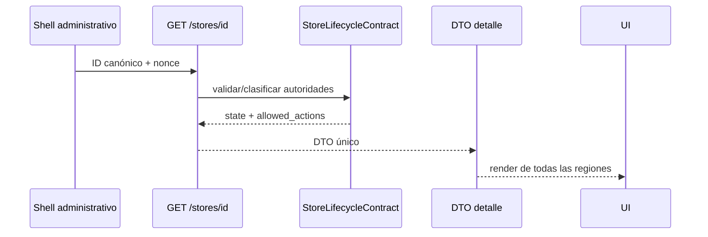
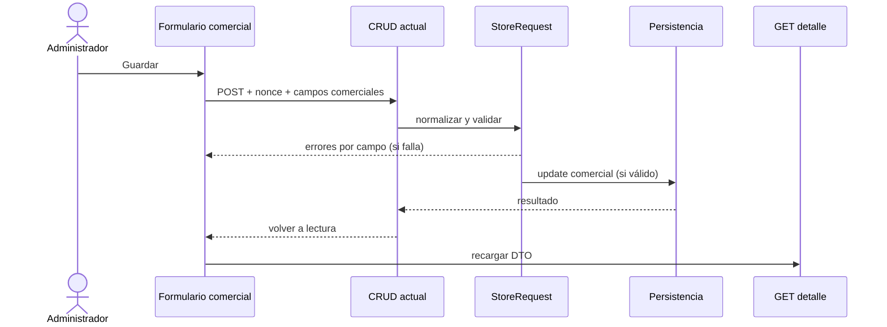
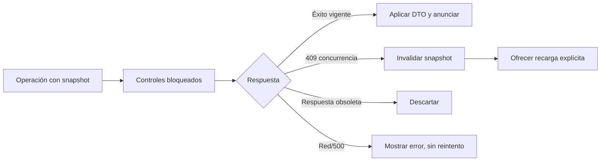
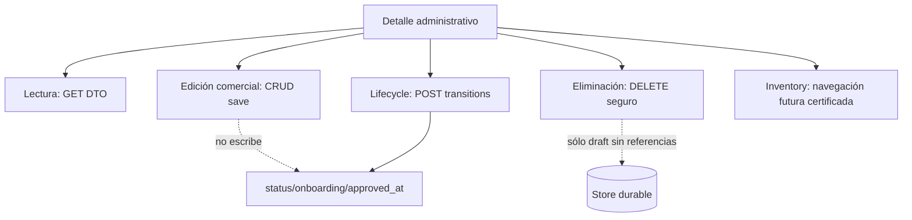

# Diseño de la vista individual operativa de Store

## 1. Propósito, alcance y fuentes

Este documento define, sin implementar, la vista individual administrativa de Store. La pantalla identifica inequívocamente el minimarket, separa lectura, edición comercial, lifecycle, eliminación física y navegación a Inventory, y trata las combinaciones inconsistentes sin corregirlas automáticamente.

La propuesta se basa en `store-admin-audit.md`, `store-admin-lifecycle-design.md`, `inventory-store-selector-design.md`; en los commits `0c8e591`, `aad7590`, `7965897`, `dc0d9a1` y `5a48084`; y en la inspección de las vistas, controladores, servicios, contrato, request, rutas, assets Store y patrones Product/Inventory actuales. Los commits establecieron, respectivamente, el contrato lifecycle, transiciones atómicas, borrado seguro, REST administrativo de detalle/transición/borrado y listado operativo.

Autoridades existentes:

- Store durable: identidad, datos comerciales/legales/contacto, `status`, `onboarding_status`, `approved_at` y timestamps.
- `StoreLifecycleContract`: clasificación y `allowed_actions`.
- REST administrativo: DTO único de detalle y resultados contractuales.
- UI: etiquetas, orden visual, confirmaciones y estado transitorio; nunca decide transiciones ni repara datos.

## 2. Diagnóstico de la pantalla actual

El listado canónico es `admin.php?page=veciahorra-stores`. Se renderiza un shell PHP y `assets/admin/js/modules/stores/app.js` carga `GET /stores?context=admin_list`. Sus filtros son `search`, `lifecycle_state`, `status`, `sort` y `paged`; History API los conserva. “Ver detalle” añade `store_id` a esa misma URL y sólo puede mostrar el elemento si está en la página ya cargada. “Editar” abre la página oculta `admin.php?page=veciahorra-store-edit&id={id}`. Por tanto, hoy no conducen a la misma pantalla, pero el detalle no es una ruta individual ni obtiene `GET /stores/{id}`.

Crear usa `admin.php?page=veciahorra-store-create`; editar usa la misma vista `app/Modules/Stores/Views/form.php`. El POST se despacha por `action=veciahorra_store_create` o `veciahorra_store_update`, nonce `veciahorra_store`, `StoreRequest` y CRUD server-rendered. Crear fuerza `status=pending`, `onboarding_status=draft`; editar ya no recibe lifecycle desde `StoreRequest`, aunque la vista aún muestra el selector heredado `status`, autoridad que no debe permanecer. Guardar redirige con `Flash`; los errores no conservan con fiabilidad todos los valores introducidos. No hay botón Cancelar ni enlace Volver explícito en el formulario.

El borrado HTML heredado sigue registrado en `veciahorra-store-delete`, protegido por nonce pero ejecutado como navegación y mediante el CRUD genérico. El contrato seguro nuevo es `DELETE /stores/{id}`, sin cuerpo, respaldado por `StoreDeletionService`. Las acciones masivas heredadas cambian `status` directamente; pertenecen al listado y no son lifecycle contractual. No deben trasladarse al detalle.

Los assets Store (`stores.css` y un `app.js` monolítico) sólo se cargan en el hook del listado, no en crear/editar. El formulario depende de PHP/HTML, no de JavaScript; incluye un ancho inline de 500 px para dirección. Product posee módulos separados de API, navegación, store y view; Inventory separa API, estado, vista, contexto y selectores. Ese patrón modular es apropiado para el detalle.

| Elemento actual | Comportamiento | Problema | Decisión propuesta |
|---|---|---|---|
| Listado | Shell + REST, filtros y History API | Correcto, pero el detalle es embebido | Mantener listado; enlazar a ruta individual |
| Ver detalle | `store_id` en el listado; busca sólo en página actual | No es canónico ni recargable de forma independiente | `action=view&id={id}` y `GET /stores/{id}` |
| Editar | Página oculta separada | Pierde contexto y mezcla `status` visual heredado | Integrar modo edición comercial en detalle |
| Crear | Página oculta y formulario PHP | Sin cancelar/retorno explícito | Mantener ruta actual; fuera del rediseño inmediato |
| Formulario | Once campos comerciales y selector `status` al editar | Lifecycle aparece como campo CRUD | Retirar `status` del modo edición |
| Guardar | POST CRUD, nonce y redirect/flash | Errores poco granulares y retorno pobre | Reutilizar CRUD; volver a lectura y recargar DTO |
| Cancelar/volver | No existe en formulario | Riesgo de pérdida y navegación confusa | Cancelación explícita al detalle; volver con filtros |
| Eliminar | Página oculta/GET y CRUD genérico | Semántica y política antiguas | Sólo zona sensible + `DELETE /stores/{id}` |
| Masivos | Escriben `status` directamente | No respetan transiciones contractuales | No exponerlos en detalle; evolución separada |
| Mensajes | Flash server-rendered; error REST genérico en lista | Canales inconexos | Regiones de formulario, lifecycle y destrucción |
| Assets | Sólo hook del listado | No cubren página individual | Carga condicionada por `action=view` |

## 3. Arquitectura de navegación

### 3.1 Alternativas

| Criterio | A: detalle y edición integrados | B: `view` y `edit` separados |
|---|---|---|
| Simplicidad mental | Una identidad y retorno | Dos destinos y dos shells |
| Accesibilidad | Cambio de modo anunciado y foco controlable | Navegación completa, algo más predecible |
| Estado | Un DTO y un estado de pantalla | Sincronización entre pantallas |
| Filtros de retorno | Un único contexto cerrado | Debe propagarse dos veces |
| Separación de mutaciones | Clara si el formulario es una región/mode | Clara por URL |
| Compatibilidad CRUD | Requiere adaptar el POST existente | Reutiliza más directamente la página antigua |
| Riesgo | Puede mezclar controles si la jerarquía es deficiente | Divergencia y duplicación de presentación |
| Esfuerzo | Medio | Medio-alto |

**Decisión:** alternativa A. La ruta canónica será `admin.php?page=veciahorra-stores&action=view&id={id}`. El modo inicial siempre es lectura; “Editar información” cambia únicamente la región comercial a formulario. No se crea `action=edit`. El modo no se codifica en URL y una recarga vuelve a lectura, evitando enlaces que abran accidentalmente una mutación.

La creación mantiene `admin.php?page=veciahorra-store-create`; no es un modo del detalle. El listado mantiene su ruta. La edición comercial no usa `action=edit`: es estado local dentro de `action=view`. Las seis acciones lifecycle son mutaciones REST, no valores de `action` administrativo. El parámetro transitorio actual `store_id` de los enlaces “Ver detalle” queda como legado a reemplazar por `action=view&id`; no es alias permanente del detalle. Las páginas ocultas actuales de crear/editar pueden coexistir durante la migración y sus redirects deben dirigirse gradualmente al detalle con el retorno cerrado, sin cambiar la ruta canónica.

### 3.2 Retorno seguro

Se usará una **query string explícita y cerrada**, no `return_url`, sesión ni dependencia de History API. El detalle acepta únicamente `return_search`, `return_lifecycle_state`, `return_status`, `return_sort` y `return_paged`. El servidor/cliente reconstruye siempre sobre `admin.php?page=veciahorra-stores`; rechaza duplicados, sintaxis de array y valores fuera de los enums/rangos actuales. La búsqueda se sanea y limita igual que el listado. Nunca se acepta esquema, host, path ni URL arbitraria.

Ejemplo de entrada:

`admin.php?page=veciahorra-stores&action=view&id=42&return_search=sur&return_lifecycle_state=active&return_status=active&return_sort=updated&return_paged=3`

El enlace Volver se reconstruye como:

`admin.php?page=veciahorra-stores&search=sur&lifecycle_state=active&status=active&sort=updated&paged=3`

Los vacíos y defaults se omiten. Si algún retorno es inválido, se descarta sólo ese valor; el destino sigue siendo el listado. Funciona sin JavaScript. Tras borrar, el mismo conjunto cerrado viaja en estado de navegación o POST/flash seguro, nunca como URL arbitraria.

No se preservan `action`, `id`, `store_id` ni parámetros desconocidos al volver. Los valores se transportan al detalle con el prefijo `return_` para no colisionar con sus parámetros canónicos; la reconstrucción elimina ese prefijo y fija siempre `page=veciahorra-stores`. No se aceptan rutas, hosts, esquemas ni fragmentos.

## 4. Estructura visual y jerarquía

La página tendrá `h1` único y cinco regiones semánticas:

1. Cabecera: “Volver a minimarkets”, nombre comercial, badge lifecycle, `ID {id}` y RUT como identificación secundaria, y acción principal contextual derivada del DTO.
2. Resumen administrativo: razón social, RUT, correo, teléfonos, comuna/ciudad, creación, actualización y aprobación si existe.
3. Lifecycle: estado contractual, `status`, onboarding, aprobación, explicación y acciones permitidas.
4. Información comercial: lectura jerarquizada o formulario en modo edición.
5. Inventory y zona sensible: navegación contextual certificada cuando exista; borrado físicamente separado al final.

Siempre visibles: nombre comercial, lifecycle, RUT (o “Sin RUT”), comuna/ciudad, correo como contacto principal y acción principal. Secundarios: razón social, teléfono/celular, timestamps, onboarding y `approved_at`. En la sección comercial específica: dirección completa, propietario/representante, región y demás campos. No se usa una tabla plana única.

Datos visibles del DTO: `id`, `business_name`, `legal_name`, `owner_name`, `rut`, `email`, `phone`, `mobile`, `address`, `commune`, `city`, `region`, las tres autoridades lifecycle, estado derivado, acciones permitidas y timestamps. No se agregan métricas ni conteos.

## 5. Lifecycle y edición comercial

Las acciones visibles se obtienen **exclusivamente** de `allowed_actions`. La UI puede ordenar y traducir esa lista, pero no calcularla con `lifecycle_state`, `status` u otras condiciones. `save` pertenece al CRUD: no se envía a `/transitions` y jamás cambia `status`, `onboarding_status` ni `approved_at`.

### 5.1 Matriz lifecycle/UI

| Lifecycle | Etiqueta | Mensaje | Acción principal | Otras acciones | Edición comercial |
|---|---|---|---|---|---|
| `draft` | Borrador | Datos preparatorios; aún no está en revisión | Enviar a revisión | Editar; eliminar en zona sensible | Sí |
| `in_review` | En revisión | Espera decisión administrativa | Aprobar | Rechazar; editar | Sí, porque `allowed_actions` contiene `save` |
| `rejected` | Rechazado | Lifecycle rechazado; no existe motivo durable | Volver a borrador | Editar | Sí, porque `allowed_actions` contiene `save` |
| `approved_inactive` | Aprobado e inactivo | Aprobado, aún fuera de operación | Activar | Editar | Sí |
| `active` | Activo | Operativo y visible según reglas de catálogo | Editar información | Desactivar | Sí |
| `invalid` | Estado inconsistente | Autoridades durables no forman una combinación contractual | Recargar | — | No |

La acción principal contextual respeta `allowed_actions`; cuando `save` esté disponible se presenta “Editar información”. En `in_review`, `approve` tiene primacía; en `rejected`, `return_to_draft`; en `invalid`, Recargar es una acción local, no contractual.

### 5.2 Permisos de edición

| Estado | ¿Editar? | Razón |
|---|---:|---|
| `draft` | Sí | Completar/corregir preparación |
| `in_review` | Sí | El contrato vigente incluye `save`; la UI no añade una prohibición manual aunque editar durante revisión implique coordinación administrativa |
| `rejected` | Sí | Permite corregir datos tras rechazo sin inventar motivo durable ni exigir una transición previa que el contrato no exige |
| `approved_inactive` | Sí | Mantener datos administrativos/comerciales sin alterar aprobación |
| `active` | Sí | Contacto y ubicación requieren mantenimiento operativo |
| `invalid` | No | No realizar mutaciones laterales sobre estado inconsistente |

La regla contractual práctica es simple: el modo de edición sólo aparece si `allowed_actions` contiene exactamente `save`; así permanece alineado con el contrato actual. Hoy eso habilita edición en los cinco estados válidos (`draft`, `in_review`, `rejected`, `approved_inactive`, `active`) y la niega en `invalid`. La matriz anterior explica el resultado, pero no constituye una segunda fuente de permisos. Todos los campos comerciales existentes son editables en esos estados: `business_name`, `legal_name`, `rut`, `owner_name`, `email`, `phone`, `mobile`, `address`, `commune`, `city`, `region`. Ninguna autoridad lifecycle es un campo. El sistema actual no distingue datos críticos/no críticos y no se inventará revisión posterior a aprobación; esa granularidad sería un contrato futuro.

`status`, `onboarding_status`, `approved_at`, `lifecycle_state`, `allowed_actions`, `created_at` y `updated_at` son siempre de sólo lectura. En creación, `StoreRequest::validatedForCreate()` añade `status=pending`, `onboarding_status=draft` y `created_at`; en edición, `validatedForUpdate()` acepta exclusivamente los once campos comerciales y añade `updated_at`. El diseño no documenta ni transporta otros campos.

## 6. Acciones lifecycle y confirmaciones

| Acción contractual | Etiqueta UI | Disponibilidad y endpoint | Confirmación | Resultado/actualización | Conflicto y foco |
|---|---|---|---|---|---|
| `submit_for_review` | Enviar a revisión | Sólo en `allowed_actions`; POST `/transitions` | No; acción directa de bajo riesgo | DTO `in_review` | Error en lifecycle; éxito enfoca encabezado lifecycle |
| `return_to_draft` | Volver a borrador | Sólo en `allowed_actions`; POST `/transitions` | Inline | DTO `draft` | 409 exige recarga; éxito enfoca lifecycle |
| `approve` | Aprobar minimarket | Sólo en `allowed_actions`; POST `/transitions` | Inline | DTO `approved_inactive`, fija aprobación | 409 exige recarga; éxito enfoca lifecycle |
| `reject` | Rechazar minimarket | Sólo en `allowed_actions`; POST `/transitions` | Inline | DTO `rejected`, sin motivo durable | 409 exige recarga; éxito enfoca lifecycle |
| `activate` | Activar minimarket | Sólo en `allowed_actions`; POST `/transitions` | Inline | DTO `active` | 409 exige recarga; éxito enfoca lifecycle |
| `deactivate` | Desactivar minimarket | Sólo en `allowed_actions`; POST `/transitions` | Inline | DTO `approved_inactive` | 409 exige recarga; éxito enfoca lifecycle |
| `delete_if_unreferenced` | Eliminar minimarket | Sólo en `allowed_actions`; DELETE `/stores/{id}` | Inline reforzada, doble paso | HTTP 204 y salida | Resultado en zona sensible o foco en notice del listado |

Se recomienda una solución única: **panel inline accesible de confirmación**, no `window.confirm` ni modal. Lifecycle usa un panel dentro de su propia sección; la zona sensible usa un panel independiente dentro de esa zona, pero el coordinador permite sólo una confirmación abierta en toda la pantalla. Cada panel es una región etiquetada. Al abrirlo muestra título de acción, nombre e ID de Store, consecuencia y reversibilidad; ofrece Confirmar y Cancelar, y enfoca Cancelar como opción segura. Escape cancela antes del envío y devuelve foco al disparador. Durante el envío bloquea ambos botones y anuncia “Procesando…”. Un error permanece en el panel con `role=alert`, permite cancelar o volver a intentar sólo mediante una nueva decisión manual; tras éxito el panel se cierra y el foco sigue la regla de la operación.

| Acción | ¿Confirma? | Texto esencial |
|---|---:|---|
| Enviar a revisión | No | El cambio esperado se explica junto al botón |
| Volver a borrador | Sí | Permite volver a editar; reversible enviando otra vez |
| Aprobar | Sí | Registra aprobación y deja inactivo; no activa automáticamente |
| Rechazar | Sí | Cambia sólo lifecycle; no guarda motivo |
| Activar | Sí | Puede hacer visibles/comprables ofertas que cumplan reglas |
| Desactivar | Sí | Oculta operación; conserva Inventory y aprobación |
| Eliminar | Sí, reforzada | Irreversible; referencias pueden impedirla; no borra dependencias |

Cada una de las otras seis acciones (`submit_for_review`, `return_to_draft`, `approve`, `reject`, `activate`, `deactivate`) se envía mediante POST a `/veciahorra/v1/stores/{id}/transitions` con el objeto JSON cerrado `{ "action": "constante_canónica" }`. `save` usa el CRUD y `delete_if_unreferenced` usa DELETE; no se envían a `/transitions`. No hay aliases: palabras como `submit`, `reopen`, `enable`, `disable` o `delete` no son valores contractuales. Las etiquetas traducidas son sólo presentación. Tras éxito, el DTO de respuesta sustituye el snapshot sólo si pertenece a la operación vigente; se cierra la confirmación, se anuncia el resultado, se renderiza el nuevo estado y el foco va al encabezado de lifecycle. Ejemplos: “Minimarket aprobado. Permanece inactivo.” y “Minimarket desactivado. Sus ofertas se conservan, pero no están operativas.”

Rechazar no muestra textarea, nota, historial, correo ni falsa promesa de persistencia. El panel dice: “Esta acción sólo cambia el estado lifecycle a Rechazado; no registra un motivo.” Un motivo durable queda como evolución futura fuera de este alcance.

## 7. Eliminación física segura

`delete_if_unreferenced` aparece sólo si está literalmente en `allowed_actions`; por contrato eso ocurre en `draft`. Se ubica al final, en “Zona sensible”, nunca junto a las transiciones ordinarias. Ejecuta exactamente `DELETE /veciahorra/v1/stores/{id}` sin cuerpo, payload, `force`, parámetros alternativos, cambios previos de estado, borrado de relaciones, cascadas ni reintentos.

La confirmación reforzada muestra nombre, ID, irreversibilidad y que Inventory, pedidos u otras referencias pueden impedir la operación. El segundo botón debe decir “Sí, eliminar {nombre}”, no un genérico “Aceptar”.

- Éxito HTTP 204: navegar al listado reconstruido y mostrar “Minimarket eliminado.”; conservar filtros cuando sea posible.
- `store_referenced` 409: mantener Store; mostrar sólo dominios y cantidades seguras devueltas por el contrato, sin IDs ni personas. Ofrecer navegación sólo para dominios que ya tengan una ruta contextual certificada; actualmente no la hay para Store → Inventory.
- `concurrent_modification` 409: indicar que estado o referencias cambiaron; invalidar snapshot y ofrecer “Recargar detalle”. Cero reintentos.
- `store_not_found` 404: volver al listado con aviso “El minimarket ya no existe.”
- `action_not_allowed` 409: mantener el detalle, cerrar la intención destructiva y exigir recarga antes de volver a evaluar `allowed_actions`.
- `persistence_failure` 500: mantener la Store y mostrar un error destructivo genérico; no afirmar que se eliminó ni reintentar automáticamente.

## 8. Estado `invalid`

La carga de detalle actual usa `validate()` y puede responder `invalid_combination` 422 sin DTO; el listado, en cambio, clasifica como `invalid` y entrega `allowed_actions=[]`. La pantalla debe manejar ambos formatos: si hay DTO inválido, mostrar sus datos seguros; si el endpoint sólo entrega error, mantener la identidad disponible desde la URL/listado y una alerta global.

Mensaje: “La combinación de estado operativo, estado de incorporación y aprobación es inconsistente. No se realizó ninguna corrección.” Se pueden mostrar únicamente `lifecycle_state=invalid`, las autoridades persistidas `status` y `onboarding_status`, presencia/ausencia y valor administrativo seguro de `approved_at`, código contractual y campo señalado si vienen en respuesta. `allowed_actions` se presenta vacío. No se muestran excepciones, SQL, tabla, stack ni valores internos adicionales. No hay transición, eliminación ni edición; sí Recargar, Volver y orientación para solicitar revisión técnica con el ID de Store y el código contractual. No se infiere qué autoridad debe cambiar ni se recomienda editar columnas manualmente; `invalid` no equivale a `draft`, `rejected` o `inactive`.

## 9. Carga REST y guardado comercial

### 9.1 Lectura única

El PHP inicial valida `manage_options`, `action=view`, ID entero positivo y parámetros de retorno, y renderiza un shell con configuración JSON escapada: URL REST base, nonce, URL administrativa base, ID y retorno normalizado. La única autoridad de lectura de datos es `GET /veciahorra/v1/stores/{id}`. No se relee el listado, no se busca allí la Store, no se usa el DTO reducido del selector ni `context=admin_list`, no se hidrata además el Store completo en PHP y no se hace una petición por sección.

No se carga Inventory por defecto, no hay polling ni refresco periódico. La edición usa los valores del mismo DTO; no realiza una segunda lectura.

### 9.2 Guardado

Al entrar en edición se conserva un snapshot inmutable de los once valores originales para Cancelar, dirty state y asociación segura de la respuesta. La implementación posterior debe reutilizar el CRUD HTML existente (`StoresController`, `StoreRequest`, `StoreService`) y nonce `veciahorra_store`, retirando `status` del formulario. Antes del envío, el navegador aplica sólo ayuda mínima (`required`, tipo email y longitudes); el backend sigue siendo autoridad. No se crea endpoint REST de escritura en este microhito de diseño. El mecanismo debe preservar el ID y retorno cerrados, ejecutar validación backend como autoridad y devolver/redirigir al detalle.

Errores de campo se asocian a los inputs y conservan el payload saneado; errores globales se muestran antes del formulario. JavaScript puede validar `required`, tipos y longitudes para ayuda inmediata, pero no duplicar todas las reglas comerciales.

Después de guardar con éxito se vuelve obligatoriamente a lectura, se muestra “Información comercial actualizada”, se recarga `GET /veciahorra/v1/stores/{id}` y el foco va al aviso de éxito antes de continuar con el encabezado. No se parchea localmente el DTO: la recarga confirma timestamps, lifecycle concurrente y representación canónica. Cancelar restaura el snapshot, vuelve a lectura sin petición y enfoca “Editar información”; si hay cambios, usa el mismo patrón de panel inline para confirmar descarte.

## 10. Concurrencia y estado cliente

El bootstrap usa una guardia `data-initialized` para no registrar listeners ni cargar dos veces. El cliente mantiene `mode`, `detail`, `operation`, `requestSequence`, `AbortController` de lectura y snapshot `{storeId, action, lifecycle_state}`. Sólo una mutación lifecycle/borrado/guardado está activa; se deshabilitan controles relacionados y el contenedor lleva `aria-busy=true`. Doble clic no genera otra petición.

Cada lectura incrementa una secuencia monotónica. La respuesta se aplica sólo si coincide con el ID y secuencia actuales y la vista sigue conectada/activa. `AbortController` reduce trabajo cliente, pero no garantiza que el servidor haya cancelado el transporte o una mutación. Una transición no se aborta como mecanismo de cancelación una vez enviada: se ignora una respuesta obsoleta y se recarga explícitamente antes de otra acción. Al abandonar la vista se marca destruida, se abortan lecturas y ningún callback posterior actualiza DOM. Al navegar durante una mutación se advierte; no se afirma cancelación del servidor.

- Transición concurrente: 409, bloquear acciones del snapshot y pedir recarga.
- Store eliminada: 404, salida al listado.
- Cambio comercial concurrente: el CRUD actual no tiene versión/CAS; no puede detectar pérdida de actualización. Se documenta la limitación y se recarga después de guardar; no se inventa control optimista.
- Referencia concurrente al borrar: `StoreDeletionService` responde conflicto; no reintentar.
- Respuesta REST obsoleta: descartar por secuencia/snapshot.

## 11. Mensajes y errores

| REST/condición | Presentación UI | Recuperación/foco |
|---|---|---|
| Cargando | Esqueleto/texto “Cargando minimarket…” | `aria-busy`; sin mover foco al iniciar |
| Shell inicial | Cabecera mínima, Volver y región de carga | Sólo Volver; foco permanece en navegación/h1 |
| Detalle correcto | Todas las regiones desde un DTO | Controles según `allowed_actions`; sin mover foco |
| ID inválido | Notice de solicitud inválida en el shell | Sólo Volver; foco en notice; no llamar REST |
| Guardado correcto | Notice positiva global | Lectura recargada; foco en notice |
| Transición correcta | Notice lifecycle | Foco en encabezado lifecycle |
| Eliminación 204 | Notice en listado | Foco en notice del listado |
| `action_not_allowed` 409 | Acción ya no permitida | Recargar; foco en alerta |
| `invalid_combination` 422 | Alerta crítica de inconsistencia | Sin mutaciones; Recargar/Volver |
| `concurrent_modification` 409 | Estado cambió concurrentemente | Recarga explícita |
| `store_referenced` 409 | Resultado destructivo con dominios/conteos | Mantener detalle |
| Validación CRUD | Error junto al campo y resumen | Primer campo inválido |
| `persistence_failure`/500 | Error global genérico | Reintento manual seguro |
| 401/403 permiso o nonce | Sesión/permisos no válidos | Recargar página; no repetir mutación |
| `store_not_found` 404 | Store no existe | Listado con aviso |
| Red/JSON inválido | No fue posible completar/cargar | Botón Reintentar sólo para lectura |

Los errores se separan en: resumen/errores de campo dentro del formulario; alerta global de shell/carga/persistencia/permisos/nonce/red; advertencia permanente lifecycle; resultado de eliminación dentro de zona sensible. Una acción lifecycle exitosa se anuncia en la sección lifecycle; una eliminación exitosa sólo se anuncia después de navegar al listado. Cada fila de la matriz fija región, controles, foco y recuperación; cuando exige recarga se indica expresamente. Nunca se muestran SQL, stack traces, excepciones, tablas o IDs de referencias.

## 12. Accesibilidad

- `h1` es el nombre comercial; “Detalle de minimarket” puede ser texto contextual visible.
- `header`, `main`, secciones con `aria-labelledby` y `aside`/sección de zona sensible.
- Enlaces navegan; botones cambian modo o mutan. Una tarjeta nunca es el único control.
- Orden: volver, encabezado/acción principal, resumen, lifecycle, comercial, Inventory, zona sensible.
- Tras carga correcta no se roba foco; si fue recarga solicitada, foco al `h1`. Tras error, al resumen con `role=alert`; tras cancelar, al botón Editar.
- Región de estado con `aria-live=polite`; errores críticos `role=alert`. `aria-busy` refleja solicitudes.
- Confirmación inline recibe foco en su encabezado/botón Cancelar; Escape cancela si no hay operación; el foco vuelve al disparador.
- Controles deshabilitados durante mutación y estado textual “Procesando…”. Targets mínimos de 44 px en móvil.
- Campos obligatorios se marcan en texto y `required`; errores usan `aria-invalid` y `aria-describedby`.
- Badges incluyen texto y descripción, no dependen sólo del color. Todo funciona por teclado.

## 13. Responsive

| Región | Escritorio | Tablet | Móvil ~375 px |
|---|---|---|---|
| Cabecera | Nombre/estado y acción alineados | Dos filas si falta espacio | Apilada; lifecycle y acción principal visibles |
| Resumen | Grid 2–3 columnas | Dos columnas | Una columna |
| Lifecycle | Estado y acciones en dos áreas | Acciones envuelven | Una columna; botón ancho completo cuando ayude |
| Formulario | Dos columnas sólo para pares breves | Una/dos según ancho | Una columna, inputs `width:100%`, sin anchos rígidos |
| Confirmación | Panel contenido | Panel ancho disponible | Texto y botones apilados, foco intacto |
| Inventory | Enlaces en línea | Envoltura | Enlaces/botones apilados |
| Zona sensible | Separada con margen/borde | Igual | Al final, separación visual fuerte |

No se ocultan lifecycle, acción principal ni advertencias en ningún breakpoint. No se crea tabla horizontal para los datos.

## 14. Estructura de CSS y JavaScript

| Archivo probable | Responsabilidad |
|---|---|
| `app/Modules/Stores/Views/detail.php` | Shell semántico, configuración segura y fallback sin JS |
| `assets/admin/css/stores.css` | Tokens/componentes ya usados: badges, notices, botones y base Store |
| `assets/admin/css/stores-detail.css` | Layout exclusivo, formulario, confirmación, zona sensible y responsive |
| `assets/admin/js/modules/stores/detail-app.js` | Bootstrap, coordinación y ciclo de vida de pantalla |
| `detail-api.js` | GET, transiciones, DELETE, headers, normalización de errores |
| `detail-store.js` | Estado, secuencias, snapshots y reglas de operación |
| `detail-view.js` | DOM seguro, regiones, foco y mensajes |
| `detail-actions.js` | Orden/etiquetas y panel de confirmación; filtra sólo contra `allowed_actions` |
| `detail-form.js` | Modo comercial, dirty state y asociación de errores |
| `detail-navigation.js` | Parseo/reconstrucción del retorno cerrado |

Se reutilizan clases de badges/notices de `stores.css` y la configuración global (REST base, nonce, admin URL). No se reutiliza directamente el `app.js` actual porque está acoplado al listado; puede extraerse más adelante un normalizador DTO pequeño. La estructura sigue los patrones modulares de Product e Inventory y evita un archivo monolítico.

## 15. Seguridad

- Página, REST y mutaciones requieren `manage_options`.
- REST usa cookie same-origin, `credentials: same-origin` y `X-WP-Nonce`; CRUD conserva nonce `veciahorra_store`.
- ID canónico: una sola ocurrencia, decimal positivo, entero seguro/PHP válido; no `absint` permisivo sobre texto ambiguo.
- Todos los textos server-rendered se escapan; el JS construye DOM con `textContent`, atributos controlados y URLs mediante `URL`.
- Bases de URL vienen de WordPress/configuración; el retorno sólo admite campos conocidos y jamás host/path arbitrario.
- DELETE rechaza cualquier cuerpo; no existe `force`.
- Transiciones aceptan sólo `{action}` con la constante canónica exacta.
- No se guardan datos legales/personales en parámetros de retorno ni logs. La búsqueda del listado puede ir en URL por contrato existente, pero el detalle no añade RUT, correo, dirección o teléfono.
- El DTO de detalle y sus snapshots viven sólo en memoria de la página; no se persisten en `localStorage`, `sessionStorage`, cookies ni History state.
- No se exponen secretos, SQL, clases internas o referencias individuales.

## 16. Navegación hacia Inventory

La auditoría distingue dos capacidades:

- El REST/list request de Inventory **sí** admite `minimarket_id` como filtro técnico.
- La aplicación administrativa y `context.js` **sólo** reconocen contexto `product_id` y opcional `action=create`; bloquean Product, no Store. Product → Inventory está probado/certificado. Store → Inventory no lo está.

Por ello 35.3.2–35.3.7 no mostrarán “Ver ofertas” ni “Crear oferta” como enlaces activos. La sección explica “La navegación contextual de ofertas aún no está disponible” sin realizar consultas. Un microhito posterior a esta serie deberá definir y probar `admin.php?page=veciahorra-inventory&minimarket_id={id}` y `...&minimarket_id={id}&action=create`, el filtro `minimarket_id` del listado, bloqueo del selector Store, convivencia/rechazo de contextos múltiples, cancelación y navegación inversa. Sólo después podrán activarse ambos enlaces. No se inventan endpoints ni N+1.

## 17. Datos derivados y límites del read model

| Dato | Fuente |
|---|---|
| Identidad y comercio/legal/contacto | Store durable vía DTO detalle |
| `status`, onboarding, aprobación, timestamps | Store durable |
| lifecycle y acciones | `StoreLifecycleContract` serializado por REST |
| Etiquetas, tono, explicaciones, confirmación | UI |

No se añaden cantidades de productos/ofertas, ventas, pedidos, reservas, entregas, stock, métricas, última venta ni estado financiero. Requerirían read models adicionales y cambiarían el costo/contrato de lectura.

## 18. Diagrama de separación de responsabilidades

## 19. Alcance negativo

| Excluido | Motivo |
|---|---|
| Implementación, código productivo, pruebas y assets | Este microhito es sólo diseño |
| Cambios REST, endpoints, esquema, migraciones e índices | Contratos existentes son la base |
| Historial lifecycle, motivos, notas, comentarios, adjuntos | No existe persistencia durable |
| Correos, notificaciones y dashboard | Flujos independientes |
| Métricas/conteos Inventory, ventas, pedidos, reservas, Delivery | Requieren read models adicionales |
| Bulk lifecycle y edición inline del listado | Riesgo y alcance distintos |
| Frontend público y nuevas capabilities | Fuera del admin Store |
| Reparación automática de `invalid` | Prohibida por diseño conservador |
| Enlaces Store → Inventory no certificados | La UI contextual aún no los soporta |

## 20. Plan posterior de implementación

### 35.3.2 — Ruta y shell

- Objetivo: resolver `action=view&id`, validar ID y retorno cerrado, renderizar el shell y cargar assets sólo en listado/detalle según corresponda.
- Archivos probables: `Menu.php`, `StoresController.php`, nueva `Views/detail.php`, configuración JSON, `stores-detail.css` y bootstrap mínimo `detail-app.js`.
- Dependencias: slug/listado de `5a48084` y reglas de seguridad de este diseño.
- Pruebas: capability, `action=view`, ID único/canónico, coexistencia con crear/editar, retorno sin open redirect, fallback sin JS y carga selectiva de assets.
- Excluye: consumo/render REST, formulario, transiciones, DELETE e Inventory contextual.
- Criterio de cierre: una URL válida muestra el shell accesible y Volver correcto; entradas inválidas fallan de forma segura sin solicitar datos.

### 35.3.3 — Lectura y render del detalle

- Objetivo: ejecutar un único `GET /veciahorra/v1/stores/{id}`, normalizar el DTO y renderizar cabecera, resumen, lifecycle, comercio, timestamps y acciones visibles.
- Archivos probables: `detail-api.js`, `detail-store.js`, `detail-view.js`, `detail-navigation.js` y CSS de estados.
- Dependencias: 35.3.2 y REST de `dc0d9a1`.
- Pruebas: carga/éxito, 404/422/403/nonce/red/500, `invalid`, respuesta obsoleta, DOM seguro, foco, `aria-busy` y guardia de inicialización.
- Excluye: entrada a edición y toda mutación; las acciones se muestran informativamente pero permanecen inactivas.
- Criterio de cierre: todas las regiones proceden del mismo DTO y la pantalla recupera o vuelve con seguridad desde cada fallo de lectura.

### 35.3.4 — Edición comercial integrada

- Objetivo: modo edición, snapshot original, once campos sin autoridades lifecycle, CRUD, validación, errores, cancelación y recarga del DTO.
- Archivos probables: `form.php` o parcial nuevo, `StoresController`, `StoreRequest` sólo si requiere retorno, `detail-form.js`, estado y CSS.
- Dependencias: 35.3.3 y CRUD actual.
- Pruebas: acceso sólo por `allowed_actions.includes('save')`, nonce, required/longitudes/email, conservación de valores, dirty/cancelar, foco, recarga y autoridades invariantes.
- Excluye: transiciones, DELETE, CAS comercial, revisión de cambios aprobados y nuevo endpoint REST.
- Criterio de cierre: guardar/cancelar regresan a lectura con foco correcto, y ninguna ruta de formulario puede escribir lifecycle o timestamps.

### 35.3.5 — Acciones lifecycle

- Objetivo: panel inline lifecycle, seis POST canónicos, DTO actualizado y estrategia completa de concurrencia frontend.
- Archivos probables: `detail-actions.js`, `detail-api.js`, `detail-store.js`, `detail-view.js` y CSS del panel.
- Dependencias: 35.3.3, contrato y transición atómica de `aad7590`/`dc0d9a1`.
- Pruebas: seis acciones, orden desde `allowed_actions`, payload cerrado, confirmaciones, 409/422/404/500, operación única, doble clic, abandono, respuesta obsoleta y teclado/foco.
- Excluye: eliminación, aliases, motivos, historial y bulk.
- Criterio de cierre: ninguna acción no permitida puede enviarse o convertirse en éxito; conflicto obliga a recarga explícita y no hay reintentos automáticos.

### 35.3.6 — Eliminación segura

- Objetivo: zona sensible independiente, confirmación reforzada, DELETE sin cuerpo, resultados referenciales y retorno al listado.
- Archivos probables: módulos de detalle, CSS de zona sensible, controlador/shell sólo para aviso de retorno y pruebas de navegación.
- Dependencias: 35.3.3, retorno de 35.3.2 y borrado seguro de `7965897`.
- Pruebas: visibilidad sólo por `delete_if_unreferenced`, HTTP 204, `store_referenced`, concurrencia, inexistente, acción no permitida, persistencia, cuerpo ausente y filtros preservados.
- Excluye: `force`, payload, cascadas, borrado de relaciones y enlaces Store → Inventory.
- Criterio de cierre: sólo una Store draft no referenciada puede desaparecer y todo otro resultado conserva datos y ofrece recuperación segura.

### 35.3.7 — Refinamiento y certificación

- Objetivo: revisión visual, responsive, accesibilidad, E2E y regresión completa de 35.3.2–35.3.6.
- Archivos probables: CSS Store, harnesses browser/manuales y documentación de certificación.
- Dependencias: 35.3.2–35.3.6.
- Pruebas: escritorio/tablet/375 px, teclado, lector/ARIA, contraste, permisos, red, concurrencia, rutas, CRUD, listado y eliminación.
- Excluye: Store → Inventory, métricas y nuevas funciones de negocio.
- Criterio de cierre: matrices responsive/accesible y flujos felices/de error quedan certificados sin regresiones conocidas.

Store → Inventory se planificará después de 35.3.7 como microhito independiente; no forma parte de la implementación de esta serie.

## 21. Decisiones cerradas

- Ruta de detalle: `admin.php?page=veciahorra-stores&action=view&id={id}`.
- Arquitectura: detalle y edición comercial integrados; entrada siempre en lectura.
- Retorno: conjunto cerrado de parámetros reconstruido sobre el listado, sin `return_url` arbitraria.
- Visibilidad/edición: todos los campos del DTO son legibles; los once comerciales son editables sólo cuando `allowed_actions` contiene `save`.
- Lifecycle: región propia, controles derivados únicamente de `allowed_actions`, constantes canónicas.
- Confirmación: panel inline accesible; todas las acciones sensibles confirman salvo `submit_for_review`.
- Rejected: sin motivo durable; permite edición porque el contrato entrega `save`, sin exigir volver a draft.
- Invalid: alerta, cero mutaciones, recarga/volver y ninguna reparación automática.
- Eliminación: sólo acción permitida, draft, zona sensible, DELETE sin cuerpo y manejo referencial.
- Lectura: un `GET /stores/{id}`; sin consultas por sección, polling ni Inventory automático.
- Guardado: CRUD existente, vuelta a lectura y recarga completa del DTO.
- Inventory: enlaces inactivos hasta certificar Store → Inventory en un microhito propio.
- Assets: módulos separados y CSS de detalle que reutiliza la base Store.
- Responsive: jerarquía apilada sin ocultar lifecycle ni acción principal.
